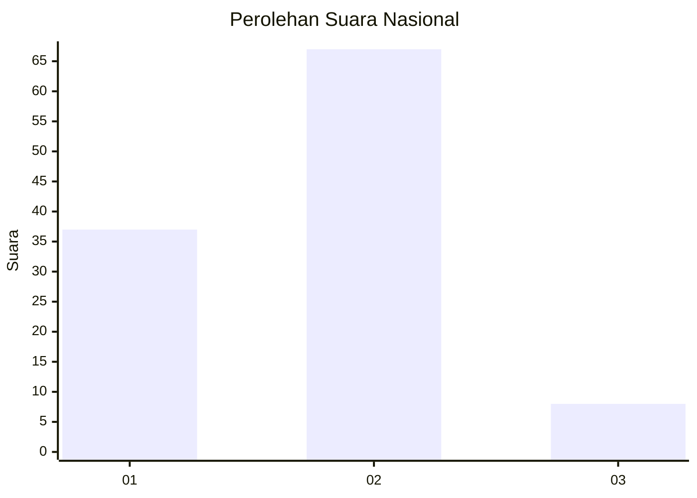
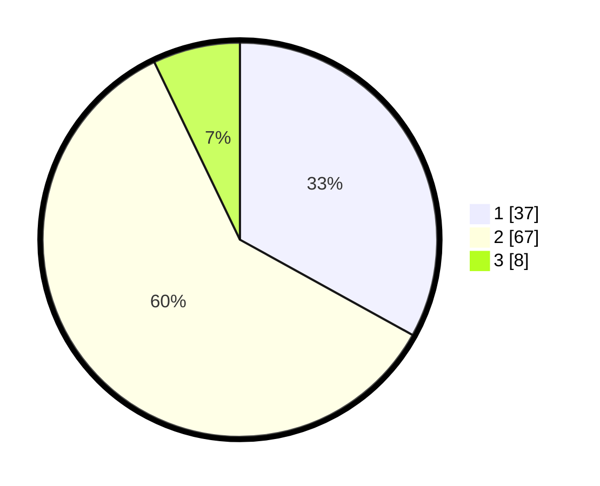

# Hasil

## Grafik

## Tabel

| No. | Nama Paslon    | Suara | Suara (raw) | Persentase |
|:--- |:-------------- | -----:| -----------:| ----------:|
| 1   | ANIES MUHAIMIN | 37    | [37][p-1]   | 33,04      |
| 2   | PRABOWO GIBRAN | 67    | [67][p-2]   | 59,82      |
| 3   | GANJAR MAHFUD  | 8     | [8][p-3]    | 7,14       |

[p-1]: https://github.com/gigit-pemilu/pemilu-2024/blob/main/pilpres/hitung-suara/sub/11-aceh/sub/16-aceh-tamiang/sub/04-seruway/sub/2021-sungai-kuruk-i/sub/001-tps/sub/paslon-1.txt
[p-2]: https://github.com/gigit-pemilu/pemilu-2024/blob/main/pilpres/hitung-suara/sub/11-aceh/sub/16-aceh-tamiang/sub/04-seruway/sub/2021-sungai-kuruk-i/sub/001-tps/sub/paslon-2.txt
[p-3]: https://github.com/gigit-pemilu/pemilu-2024/blob/main/pilpres/hitung-suara/sub/11-aceh/sub/16-aceh-tamiang/sub/04-seruway/sub/2021-sungai-kuruk-i/sub/001-tps/sub/paslon-3.txt

## Foto C Plano

https://sirekap-obj-formc.kpu.go.id/0006/pemilu/ppwp/11/16/04/20/21/1116042021001-20240215-051832--2c290707-9bb4-423a-9af0-fc632e712013.jpg

https://sirekap-obj-formc.kpu.go.id/0006/pemilu/ppwp/11/16/04/20/21/1116042021001-20240214-202607--543ab182-d200-4960-94a0-0ceb6542ca03.jpg

## Metadata

| Key        | Value               |
| ---------- | ------------------- |
| Time Stamp | 2024-02-15 19:30:26 |

