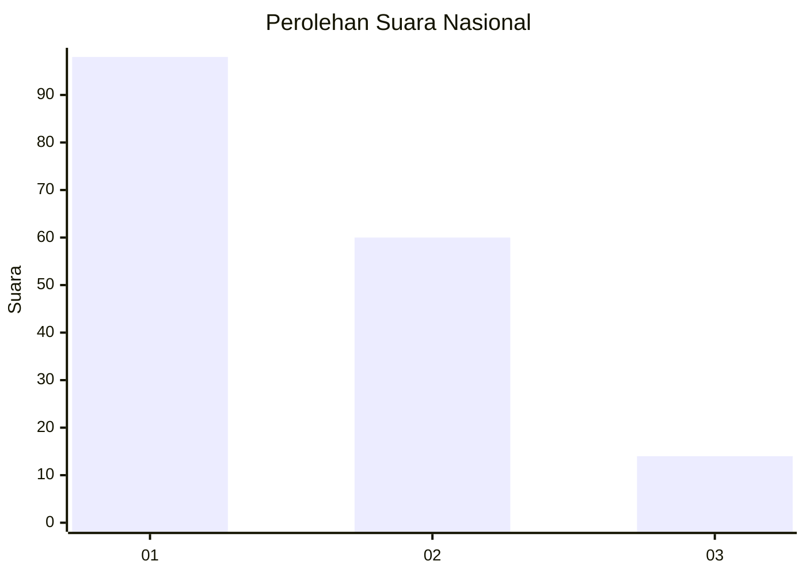
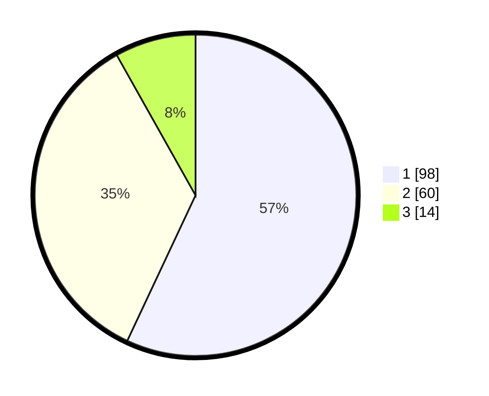

# Hasil

## Grafik

## Tabel

| No. | Nama Paslon    | Suara | Suara (raw) | Persentase |
|:--- |:-------------- | -----:| -----------:| ----------:|
| 1   | ANIES MUHAIMIN | 98    | [98][p-1]   | 56,98      |
| 2   | PRABOWO GIBRAN | 60    | [60][p-2]   | 34,88      |
| 3   | GANJAR MAHFUD  | 14    | [14][p-3]   | 8,14       |

[p-1]: https://github.com/gigit-pemilu/pemilu-2024/blob/main/pilpres/hitung-suara/sub/11-aceh/sub/16-aceh-tamiang/sub/05-kota-kualasinpang/sub/2001-kota-kualasimpang/sub/001-tps/sub/paslon-1.txt
[p-2]: https://github.com/gigit-pemilu/pemilu-2024/blob/main/pilpres/hitung-suara/sub/11-aceh/sub/16-aceh-tamiang/sub/05-kota-kualasinpang/sub/2001-kota-kualasimpang/sub/001-tps/sub/paslon-2.txt
[p-3]: https://github.com/gigit-pemilu/pemilu-2024/blob/main/pilpres/hitung-suara/sub/11-aceh/sub/16-aceh-tamiang/sub/05-kota-kualasinpang/sub/2001-kota-kualasimpang/sub/001-tps/sub/paslon-3.txt

## Foto C Plano

https://sirekap-obj-formc.kpu.go.id/b095/pemilu/ppwp/11/16/05/20/01/1116052001001-20240215-095234--497828b2-01ac-45e7-aeb5-c31b046a9b4f.jpg

https://sirekap-obj-formc.kpu.go.id/b095/pemilu/ppwp/11/16/05/20/01/1116052001001-20240214-192500--f240e7a4-f09f-405a-bc58-87a35b83ceb2.jpg

https://sirekap-obj-formc.kpu.go.id/b095/pemilu/ppwp/11/16/05/20/01/1116052001001-20240214-192653--36889f15-1105-46f5-a2ea-2eb0a5e03cf5.jpg

## Metadata

| Key        | Value               |
| ---------- | ------------------- |
| Time Stamp | 2024-02-15 12:00:28 |

## DATA PEMILIH TETAP

Jumlah pemilih dalam DPT: **281**.
 * L: **131**.
 * P: **150**.

## DATA PENGGUNA HAK PILIH

Jumlah pengguna hak pilih dalam DPT: **175**.
 * L: **79**.
 * P: **96**.

Jumlah pengguna hak pilih dalam DPTb: **1**.
 * L: **0**.
 * P: **1**.

Jumlah pengguna hak pilih dalam DPK: **1**.
 * L: **1**.
 * P: **0**.

Jumlah pengguna hak pilih: **177**.
 * L: **80**.
 * P: **97**.

## JUMLAH SUARA SAH DAN TIDAK SAH

JUMLAH SELURUH SUARA SAH: **172**.

JUMLAH SUARA TIDAK SAH: **5**.

JUMLAH SELURUH SUARA SAH DAN SUARA TIDAK SAH: **177**.

