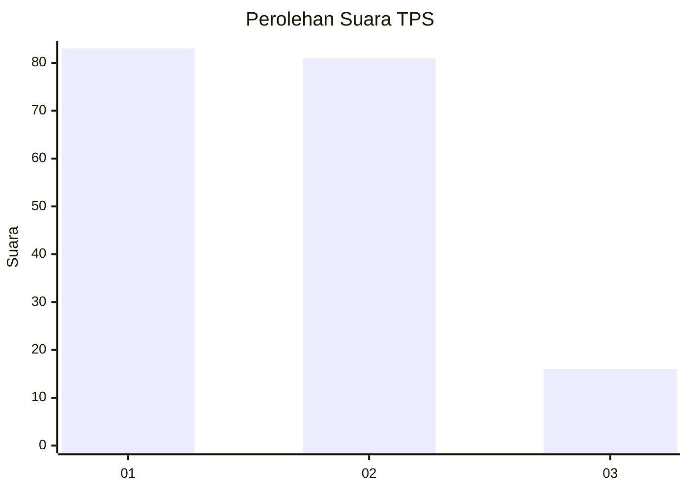
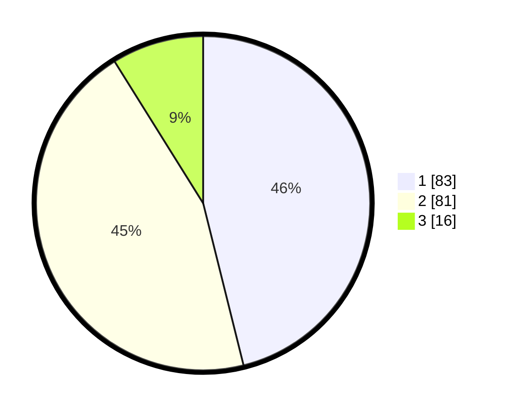

# Hasil

## Grafik

## Tabel

| No. | Nama Paslon    | Suara | Suara (raw) | Persentase |
|:--- |:-------------- | -----:| -----------:| ----------:|
| 1   | ANIES MUHAIMIN | 83    | [83][p-1]   | 46,11      |
| 2   | PRABOWO GIBRAN | 81    | [81][p-2]   | 45,00      |
| 3   | GANJAR MAHFUD  | 16    | [16][p-3]   | 8,89       |

[p-1]: https://github.com/gigit-pemilu/pemilu-2024-11-aceh/blob/main/pilpres/hitung-suara/sub/11-aceh/sub/16-aceh-tamiang/sub/05-kota-kualasinpang/sub/2001-kota-kualasimpang/sub/002-tps/sub/paslon-1.txt
[p-2]: https://github.com/gigit-pemilu/pemilu-2024-11-aceh/blob/main/pilpres/hitung-suara/sub/11-aceh/sub/16-aceh-tamiang/sub/05-kota-kualasinpang/sub/2001-kota-kualasimpang/sub/002-tps/sub/paslon-2.txt
[p-3]: https://github.com/gigit-pemilu/pemilu-2024-11-aceh/blob/main/pilpres/hitung-suara/sub/11-aceh/sub/16-aceh-tamiang/sub/05-kota-kualasinpang/sub/2001-kota-kualasimpang/sub/002-tps/sub/paslon-3.txt

## Foto C Plano

https://sirekap-obj-formc.kpu.go.id/dd87/pemilu/ppwp/11/16/05/20/01/1116052001002-20240217-114058--59c501a4-c0a0-4ed0-a743-8f31d6bb4c28.jpg

https://sirekap-obj-formc.kpu.go.id/dd87/pemilu/ppwp/11/16/05/20/01/1116052001002-20240217-114100--7983cbd7-b73e-40e6-b79e-1608cffe2636.jpg

https://sirekap-obj-formc.kpu.go.id/dd87/pemilu/ppwp/11/16/05/20/01/1116052001002-20240217-114059--adbd1013-91a6-4182-99db-e03bf601957b.jpg

## Metadata

| Key        | Value               |
| ---------- | ------------------- |
| Time Stamp | 2024-02-17 12:00:00 |

## DATA PEMILIH TETAP

Jumlah pemilih dalam DPT: **281**.
 * L: **145**.
 * P: **136**.

## DATA PENGGUNA HAK PILIH

Jumlah pengguna hak pilih dalam DPT: **183**.
 * L: **97**.
 * P: **86**.

Jumlah pengguna hak pilih dalam DPTb: **0**.
 * L: **0**.
 * P: **0**.

Jumlah pengguna hak pilih dalam DPK: **1**.
 * L: **1**.
 * P: **0**.

Jumlah pengguna hak pilih: **184**.
 * L: **98**.
 * P: **86**.

## JUMLAH SUARA SAH DAN TIDAK SAH

JUMLAH SELURUH SUARA SAH: **180**.

JUMLAH SUARA TIDAK SAH: **4**.

JUMLAH SELURUH SUARA SAH DAN SUARA TIDAK SAH: **184**.

