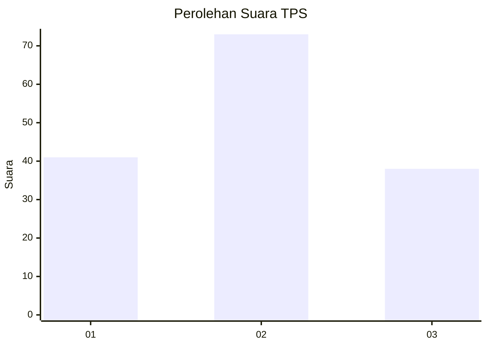
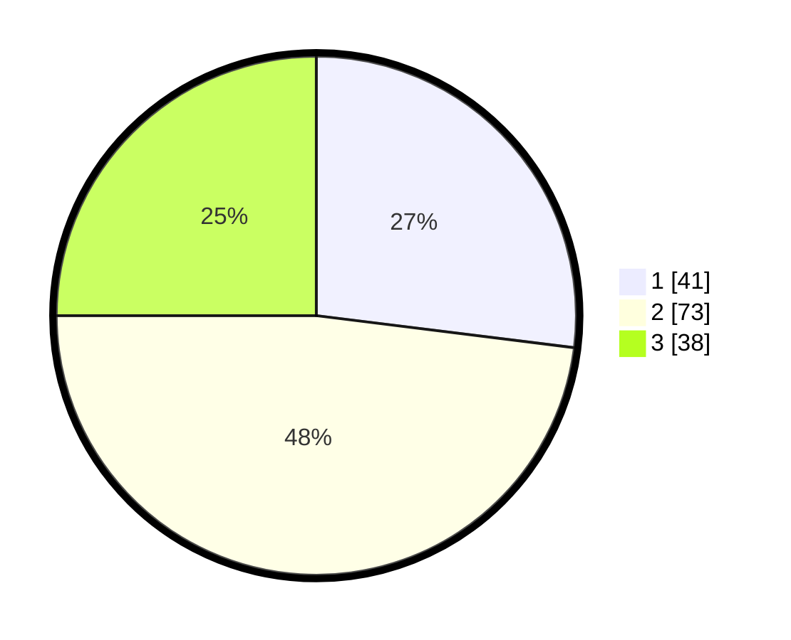

# Hasil

## Grafik

## Tabel

| No. | Nama Paslon    | Suara | Suara (raw) | Persentase |
|:--- |:-------------- | -----:| -----------:| ----------:|
| 1   | ANIES MUHAIMIN | 41    | [41][p-1]   | 26,97      |
| 2   | PRABOWO GIBRAN | 73    | [73][p-2]   | 48,03      |
| 3   | GANJAR MAHFUD  | 38    | [38][p-3]   | 25,00      |

[p-1]: https://github.com/gigit-pemilu/pemilu-2024-11-aceh/blob/main/pilpres/hitung-suara/sub/11-aceh/sub/16-aceh-tamiang/sub/05-kota-kualasinpang/sub/2001-kota-kualasimpang/sub/003-tps/sub/paslon-1.txt
[p-2]: https://github.com/gigit-pemilu/pemilu-2024-11-aceh/blob/main/pilpres/hitung-suara/sub/11-aceh/sub/16-aceh-tamiang/sub/05-kota-kualasinpang/sub/2001-kota-kualasimpang/sub/003-tps/sub/paslon-2.txt
[p-3]: https://github.com/gigit-pemilu/pemilu-2024-11-aceh/blob/main/pilpres/hitung-suara/sub/11-aceh/sub/16-aceh-tamiang/sub/05-kota-kualasinpang/sub/2001-kota-kualasimpang/sub/003-tps/sub/paslon-3.txt

## Foto C Plano

https://sirekap-obj-formc.kpu.go.id/4e7e/pemilu/ppwp/11/16/05/20/01/1116052001003-20240224-100208--98872a1b-5907-46f5-9fce-9dbdbcbd83e6.jpg

https://sirekap-obj-formc.kpu.go.id/4e7e/pemilu/ppwp/11/16/05/20/01/1116052001003-20240224-100455--35da343c-03f4-47bb-b736-8f8d9056319d.jpg

https://sirekap-obj-formc.kpu.go.id/4e7e/pemilu/ppwp/11/16/05/20/01/1116052001003-20240224-100610--ffb5db99-1b1a-416c-84af-b1ec731779e1.jpg

## Metadata

| Key        | Value               |
| ---------- | ------------------- |
| Time Stamp | 2024-02-24 22:31:28 |

## DATA PEMILIH TETAP

Jumlah pemilih dalam DPT: **294**.
 * L: **136**.
 * P: **158**.

## DATA PENGGUNA HAK PILIH

Jumlah pengguna hak pilih dalam DPT: **152**.
 * L: **75**.
 * P: **77**.

Jumlah pengguna hak pilih dalam DPTb: **2**.
 * L: **1**.
 * P: **1**.

Jumlah pengguna hak pilih dalam DPK: **0**.
 * L: **0**.
 * P: **0**.

Jumlah pengguna hak pilih: **154**.
 * L: **76**.
 * P: **78**.

## JUMLAH SUARA SAH DAN TIDAK SAH

JUMLAH SELURUH SUARA SAH: **152**.

JUMLAH SUARA TIDAK SAH: **2**.

JUMLAH SELURUH SUARA SAH DAN SUARA TIDAK SAH: **154**.

