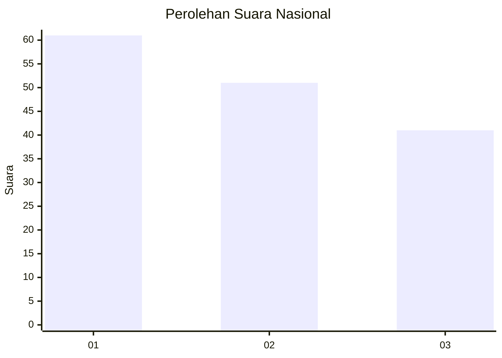
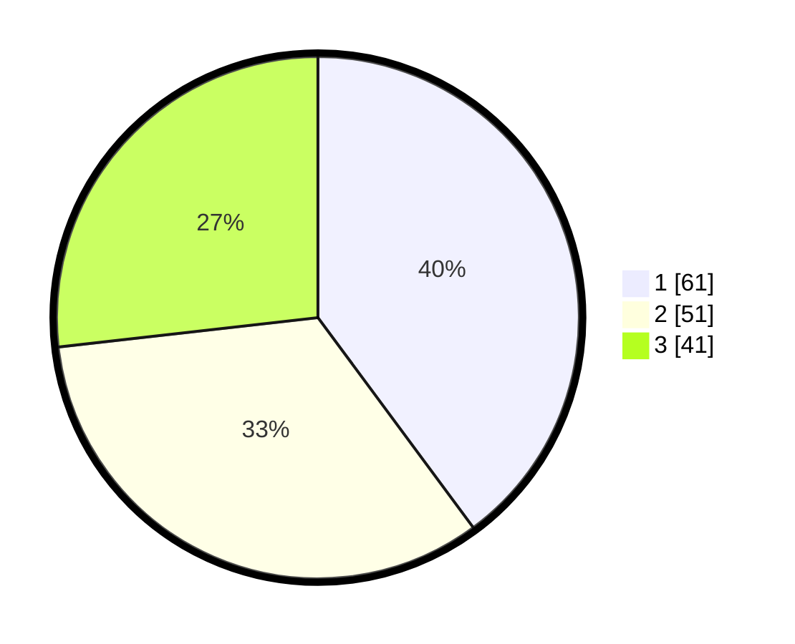

# Hasil

## Grafik

## Tabel

| No. | Nama Paslon    | Suara | Suara (raw) | Persentase |
|:--- |:-------------- | -----:| -----------:| ----------:|
| 1   | ANIES MUHAIMIN | 61    | [61][p-1]   | 39,87      |
| 2   | PRABOWO GIBRAN | 51    | [51][p-2]   | 33,33      |
| 3   | GANJAR MAHFUD  | 41    | [41][p-3]   | 26,80      |

[p-1]: https://github.com/gigit-pemilu/pemilu-2024/blob/main/pilpres/hitung-suara/sub/11-aceh/sub/16-aceh-tamiang/sub/05-kota-kualasinpang/sub/2001-kota-kualasimpang/sub/004-tps/sub/paslon-1.txt
[p-2]: https://github.com/gigit-pemilu/pemilu-2024/blob/main/pilpres/hitung-suara/sub/11-aceh/sub/16-aceh-tamiang/sub/05-kota-kualasinpang/sub/2001-kota-kualasimpang/sub/004-tps/sub/paslon-2.txt
[p-3]: https://github.com/gigit-pemilu/pemilu-2024/blob/main/pilpres/hitung-suara/sub/11-aceh/sub/16-aceh-tamiang/sub/05-kota-kualasinpang/sub/2001-kota-kualasimpang/sub/004-tps/sub/paslon-3.txt

## Foto C Plano

https://sirekap-obj-formc.kpu.go.id/7a6f/pemilu/ppwp/11/16/05/20/01/1116052001004-20240216-154415--f2290129-5b63-4568-995e-be856a3153a6.jpg

https://sirekap-obj-formc.kpu.go.id/7a6f/pemilu/ppwp/11/16/05/20/01/1116052001004-20240216-154416--9b2ed165-4e71-44ad-8051-20a3f1ac53d7.jpg

https://sirekap-obj-formc.kpu.go.id/7a6f/pemilu/ppwp/11/16/05/20/01/1116052001004-20240216-154416--5eff3128-9e58-49bb-8af7-f1fcc3cbb133.jpg

## Metadata

| Key        | Value               |
| ---------- | ------------------- |
| Time Stamp | 2024-02-16 21:01:00 |

## DATA PEMILIH TETAP

Jumlah pemilih dalam DPT: **290**.
 * L: **140**.
 * P: **150**.

## DATA PENGGUNA HAK PILIH

Jumlah pengguna hak pilih dalam DPT: **157**.
 * L: **83**.
 * P: **74**.

Jumlah pengguna hak pilih dalam DPTb: **0**.
 * L: **0**.
 * P: **0**.

Jumlah pengguna hak pilih dalam DPK: **0**.
 * L: **0**.
 * P: **0**.

Jumlah pengguna hak pilih: **157**.
 * L: **83**.
 * P: **74**.

## JUMLAH SUARA SAH DAN TIDAK SAH

JUMLAH SELURUH SUARA SAH: **153**.

JUMLAH SUARA TIDAK SAH: **4**.

JUMLAH SELURUH SUARA SAH DAN SUARA TIDAK SAH: **157**.

