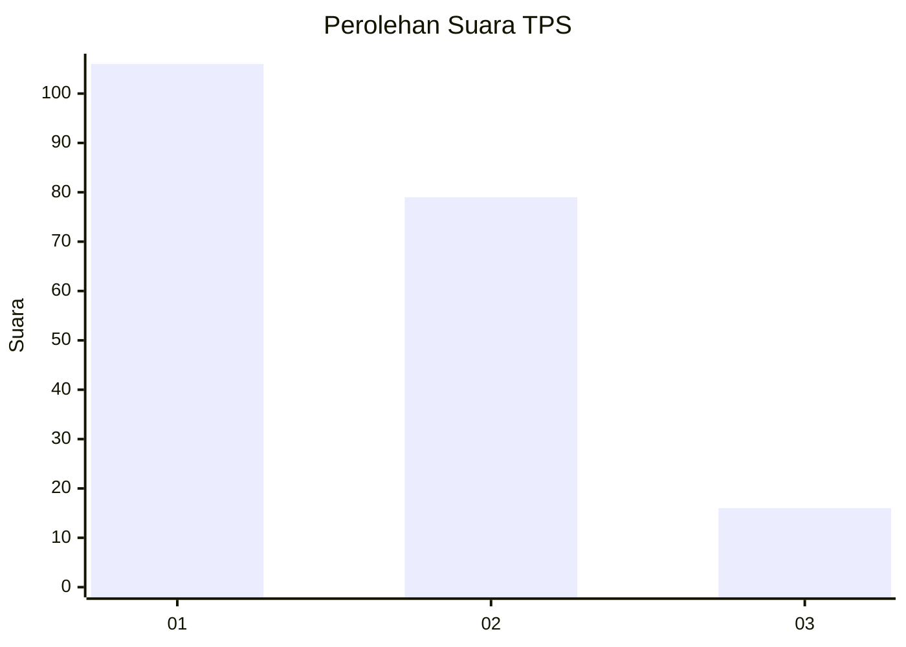
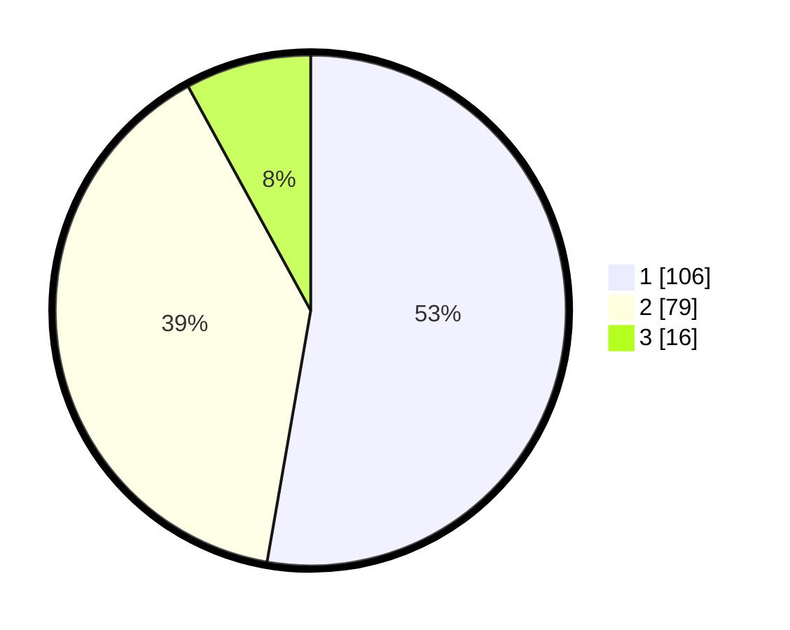

# Hasil

## Grafik

## Tabel

| No. | Nama Paslon    | Suara | Suara (raw) | Persentase |
|:--- |:-------------- | -----:| -----------:| ----------:|
| 1   | ANIES MUHAIMIN | 106   | [106][p-1]  | 52,74      |
| 2   | PRABOWO GIBRAN | 79    | [79][p-2]   | 39,30      |
| 3   | GANJAR MAHFUD  | 16    | [16][p-3]   | 7,96       |

[p-1]: https://github.com/gigit-pemilu/pemilu-2024-11-aceh/blob/main/pilpres/hitung-suara/sub/11-aceh/sub/16-aceh-tamiang/sub/05-kota-kualasinpang/sub/2001-kota-kualasimpang/sub/005-tps/sub/paslon-1.txt
[p-2]: https://github.com/gigit-pemilu/pemilu-2024-11-aceh/blob/main/pilpres/hitung-suara/sub/11-aceh/sub/16-aceh-tamiang/sub/05-kota-kualasinpang/sub/2001-kota-kualasimpang/sub/005-tps/sub/paslon-2.txt
[p-3]: https://github.com/gigit-pemilu/pemilu-2024-11-aceh/blob/main/pilpres/hitung-suara/sub/11-aceh/sub/16-aceh-tamiang/sub/05-kota-kualasinpang/sub/2001-kota-kualasimpang/sub/005-tps/sub/paslon-3.txt

## Foto C Plano

https://sirekap-obj-formc.kpu.go.id/6ee6/pemilu/ppwp/11/16/05/20/01/1116052001005-20240216-155936--c8c31421-4ee2-4d27-8882-4ff3a9bf346d.jpg

https://sirekap-obj-formc.kpu.go.id/6ee6/pemilu/ppwp/11/16/05/20/01/1116052001005-20240216-163154--ff5e0988-9291-4443-b229-76cd4eb11bc5.jpg

https://sirekap-obj-formc.kpu.go.id/6ee6/pemilu/ppwp/11/16/05/20/01/1116052001005-20240216-155937--6f114f04-8c52-4a2f-8d12-0aad7feec087.jpg

## Metadata

| Key        | Value               |
| ---------- | ------------------- |
| Time Stamp | 2024-02-16 21:01:00 |

## DATA PEMILIH TETAP

Jumlah pemilih dalam DPT: **286**.
 * L: **139**.
 * P: **147**.

## DATA PENGGUNA HAK PILIH

Jumlah pengguna hak pilih dalam DPT: **203**.
 * L: **91**.
 * P: **112**.

Jumlah pengguna hak pilih dalam DPTb: **1**.
 * L: **1**.
 * P: **0**.

Jumlah pengguna hak pilih dalam DPK: **0**.
 * L: **0**.
 * P: **0**.

Jumlah pengguna hak pilih: **204**.
 * L: **92**.
 * P: **112**.

## JUMLAH SUARA SAH DAN TIDAK SAH

JUMLAH SELURUH SUARA SAH: **201**.

JUMLAH SUARA TIDAK SAH: **3**.

JUMLAH SELURUH SUARA SAH DAN SUARA TIDAK SAH: **204**.

