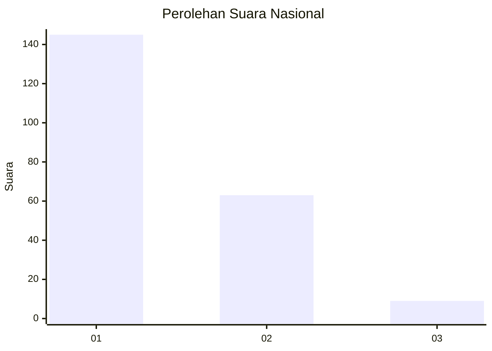
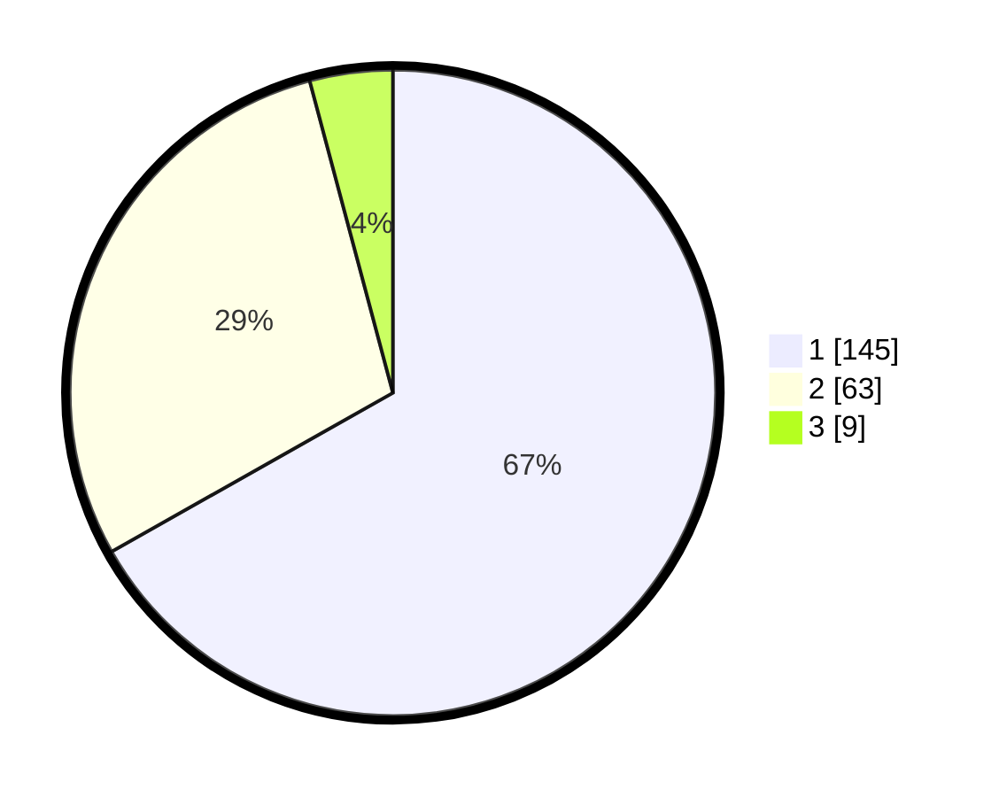

# Hasil

## Grafik

## Tabel

| No. | Nama Paslon    | Suara | Suara (raw) | Persentase |
|:--- |:-------------- | -----:| -----------:| ----------:|
| 1   | ANIES MUHAIMIN | 145   | [145][p-1]  | 66,82      |
| 2   | PRABOWO GIBRAN | 63    | [63][p-2]   | 29,03      |
| 3   | GANJAR MAHFUD  | 9     | [9][p-3]    | 4,15       |

[p-1]: https://github.com/gigit-pemilu/pemilu-2024/blob/main/pilpres/hitung-suara/sub/11-aceh/sub/16-aceh-tamiang/sub/05-kota-kualasinpang/sub/2002-perdamaian/sub/003-tps/sub/paslon-1.txt
[p-2]: https://github.com/gigit-pemilu/pemilu-2024/blob/main/pilpres/hitung-suara/sub/11-aceh/sub/16-aceh-tamiang/sub/05-kota-kualasinpang/sub/2002-perdamaian/sub/003-tps/sub/paslon-2.txt
[p-3]: https://github.com/gigit-pemilu/pemilu-2024/blob/main/pilpres/hitung-suara/sub/11-aceh/sub/16-aceh-tamiang/sub/05-kota-kualasinpang/sub/2002-perdamaian/sub/003-tps/sub/paslon-3.txt

## Foto C Plano

https://sirekap-obj-formc.kpu.go.id/09ef/pemilu/ppwp/11/16/05/20/02/1116052002003-20240224-102607--a7b1e43a-8f50-42fc-8693-e3da1ac69aba.jpg

https://sirekap-obj-formc.kpu.go.id/09ef/pemilu/ppwp/11/16/05/20/02/1116052002003-20240224-103440--978c7d78-04b8-4750-a8a7-320dca60f560.jpg

https://sirekap-obj-formc.kpu.go.id/09ef/pemilu/ppwp/11/16/05/20/02/1116052002003-20240224-104010--46e32c57-a401-45ef-87db-08ddb7b7af14.jpg

## Metadata

| Key        | Value               |
| ---------- | ------------------- |
| Time Stamp | 2024-02-24 22:31:28 |

