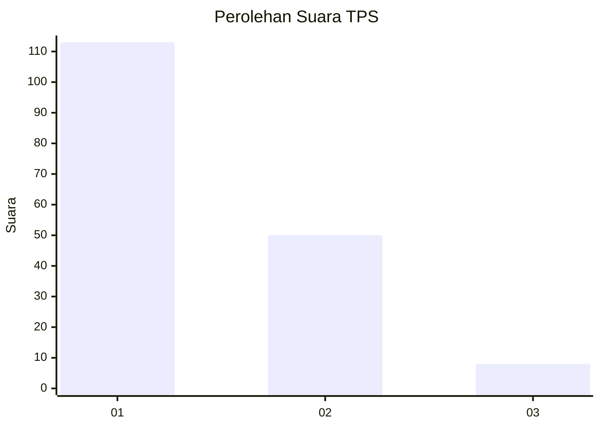
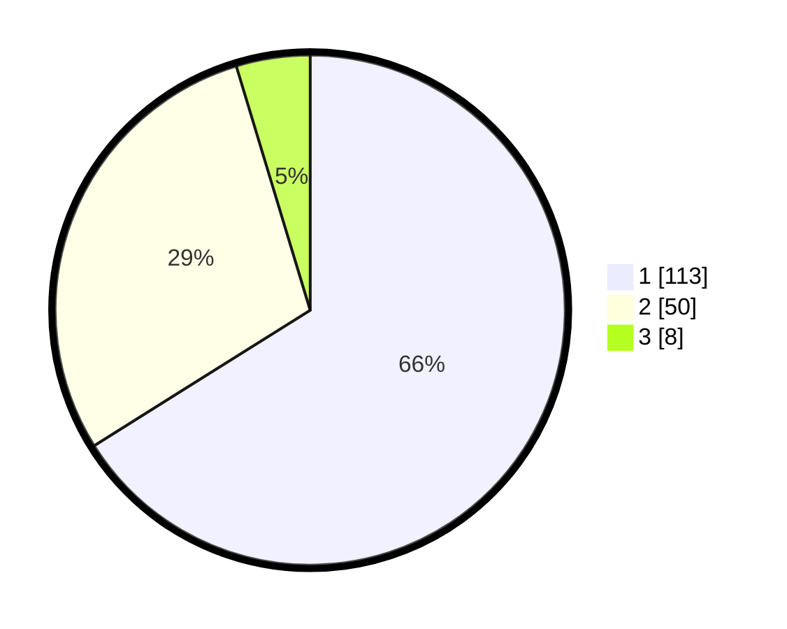

# Hasil

## Grafik

## Tabel

| No. | Nama Paslon    | Suara | Suara (raw) | Persentase |
|:--- |:-------------- | -----:| -----------:| ----------:|
| 1   | ANIES MUHAIMIN | 113   | [113][p-1]  | 66,08      |
| 2   | PRABOWO GIBRAN | 50    | [50][p-2]   | 29,24      |
| 3   | GANJAR MAHFUD  | 8     | [8][p-3]    | 4,68       |

[p-1]: https://github.com/gigit-pemilu/pemilu-2024-11-aceh/blob/main/pilpres/hitung-suara/sub/11-aceh/sub/16-aceh-tamiang/sub/05-kota-kualasinpang/sub/2004-bukit-tempurung/sub/003-tps/sub/paslon-1.txt
[p-2]: https://github.com/gigit-pemilu/pemilu-2024-11-aceh/blob/main/pilpres/hitung-suara/sub/11-aceh/sub/16-aceh-tamiang/sub/05-kota-kualasinpang/sub/2004-bukit-tempurung/sub/003-tps/sub/paslon-2.txt
[p-3]: https://github.com/gigit-pemilu/pemilu-2024-11-aceh/blob/main/pilpres/hitung-suara/sub/11-aceh/sub/16-aceh-tamiang/sub/05-kota-kualasinpang/sub/2004-bukit-tempurung/sub/003-tps/sub/paslon-3.txt

## Foto C Plano

https://sirekap-obj-formc.kpu.go.id/754b/pemilu/ppwp/11/16/05/20/04/1116052004003-20240217-122701--9db74ed6-5b86-4855-b62d-6f6048036f84.jpg

https://sirekap-obj-formc.kpu.go.id/754b/pemilu/ppwp/11/16/05/20/04/1116052004003-20240217-122426--22405fee-97fa-4c6b-be90-b46e609507ee.jpg

https://sirekap-obj-formc.kpu.go.id/754b/pemilu/ppwp/11/16/05/20/04/1116052004003-20240217-122533--8687cb43-354d-4262-b002-49945bae21f1.jpg

## Metadata

| Key        | Value               |
| ---------- | ------------------- |
| Time Stamp | 2024-02-19 06:16:00 |

