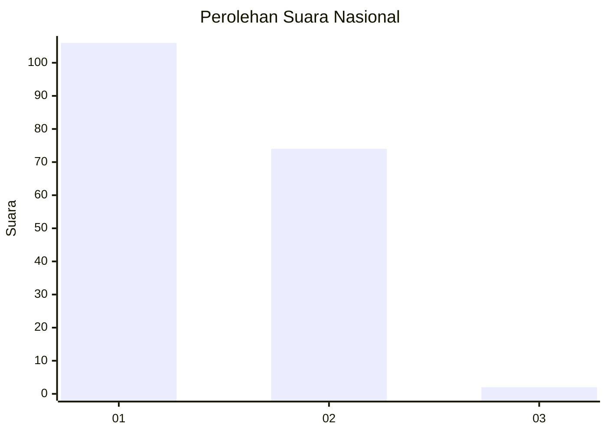
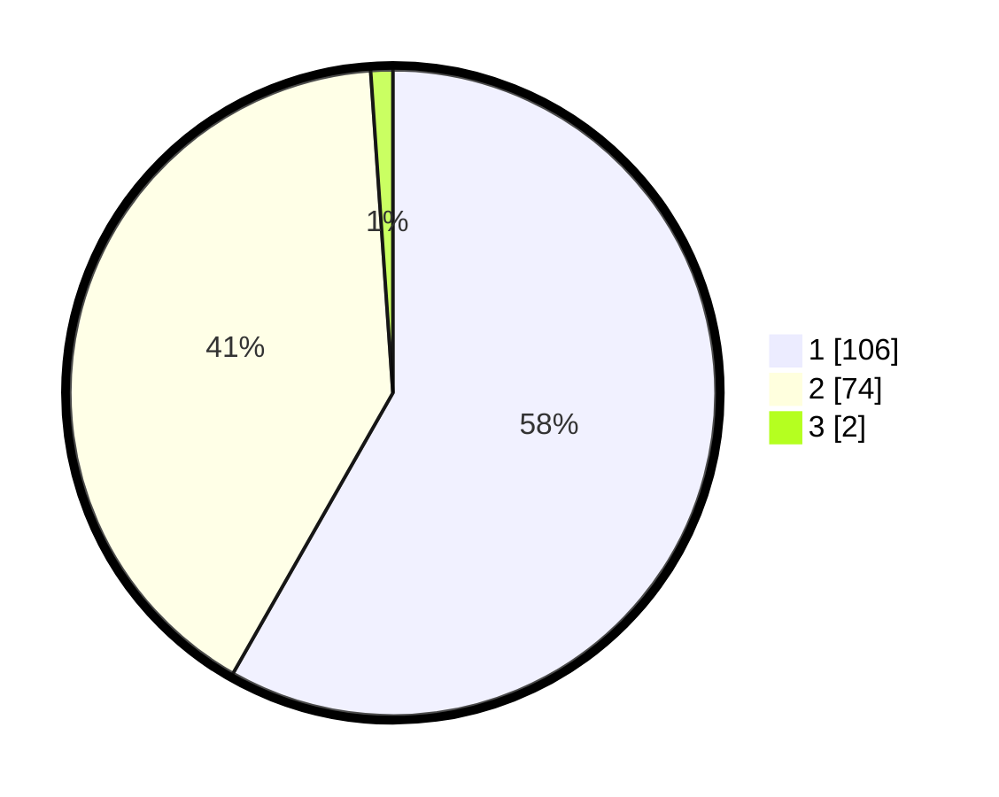

# Hasil

## Grafik

## Tabel

| No. | Nama Paslon    | Suara | Suara (raw) | Persentase |
|:--- |:-------------- | -----:| -----------:| ----------:|
| 1   | ANIES MUHAIMIN | 106   | [106][p-1]  | 58,24      |
| 2   | PRABOWO GIBRAN | 74    | [74][p-2]   | 40,66      |
| 3   | GANJAR MAHFUD  | 2     | [2][p-3]    | 1,10       |

[p-1]: https://github.com/gigit-pemilu/pemilu-2024/blob/main/pilpres/hitung-suara/sub/11-aceh/sub/16-aceh-tamiang/sub/05-kota-kualasinpang/sub/2005-kota-lintang/sub/002-tps/sub/paslon-1.txt
[p-2]: https://github.com/gigit-pemilu/pemilu-2024/blob/main/pilpres/hitung-suara/sub/11-aceh/sub/16-aceh-tamiang/sub/05-kota-kualasinpang/sub/2005-kota-lintang/sub/002-tps/sub/paslon-2.txt
[p-3]: https://github.com/gigit-pemilu/pemilu-2024/blob/main/pilpres/hitung-suara/sub/11-aceh/sub/16-aceh-tamiang/sub/05-kota-kualasinpang/sub/2005-kota-lintang/sub/002-tps/sub/paslon-3.txt

## Foto C Plano

https://sirekap-obj-formc.kpu.go.id/a0ff/pemilu/ppwp/11/16/05/20/05/1116052005002-20240222-204609--5d9151b0-08e4-435f-8ac8-a5d5056ef5bd.jpg

https://sirekap-obj-formc.kpu.go.id/a0ff/pemilu/ppwp/11/16/05/20/05/1116052005002-20240214-214337--82d43a02-3614-43bc-bdbb-05a086002ef9.jpg

https://sirekap-obj-formc.kpu.go.id/a0ff/pemilu/ppwp/11/16/05/20/05/1116052005002-20240214-214500--a76523d7-5e61-4d91-b00b-3e6115970f86.jpg

## Metadata

| Key        | Value               |
| ---------- | ------------------- |
| Time Stamp | 2024-02-22 21:00:00 |

