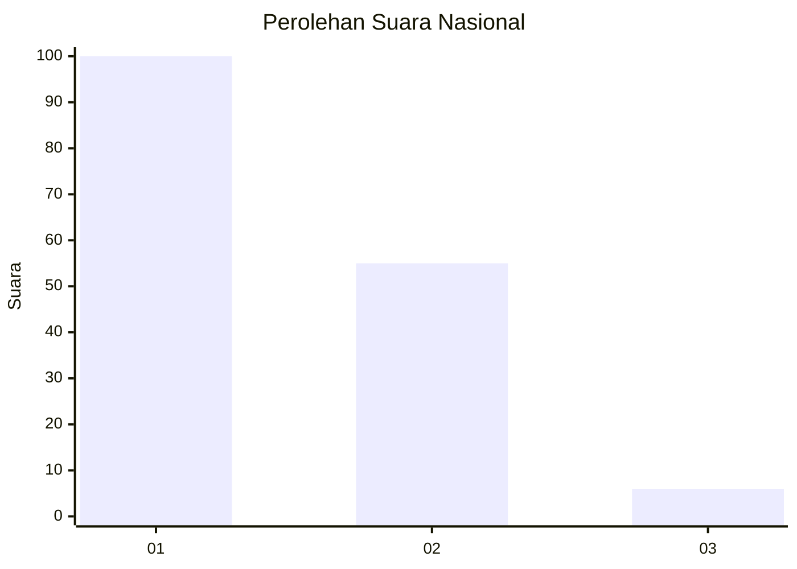
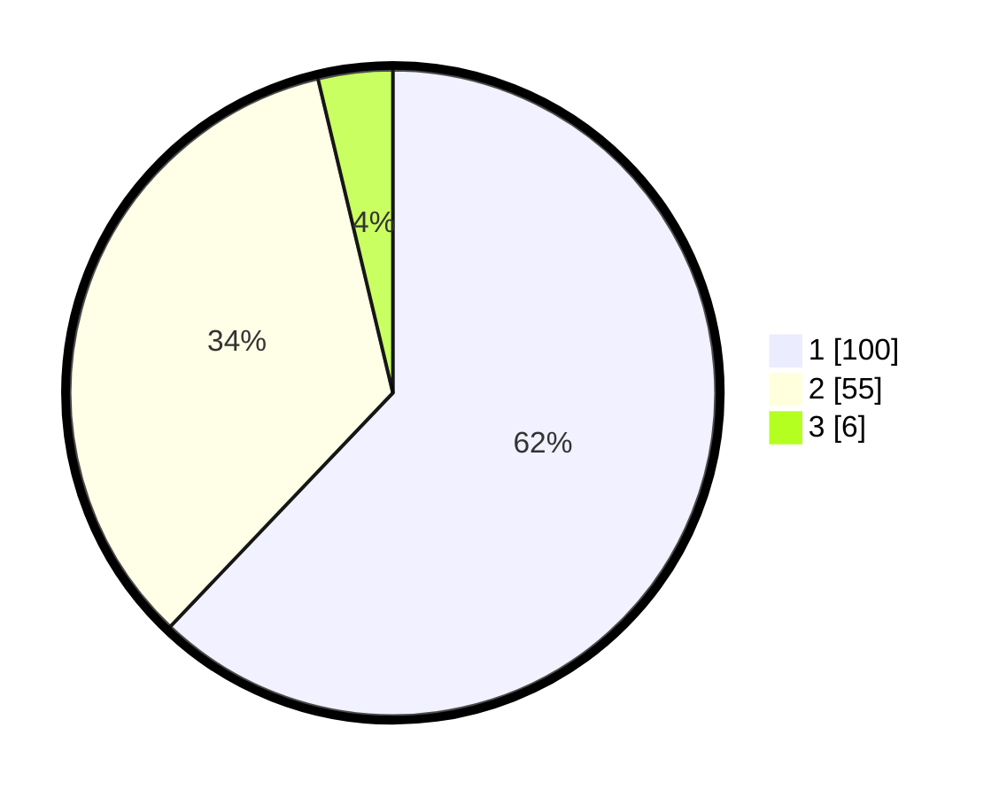

# Hasil

## Grafik

## Tabel

| No. | Nama Paslon    | Suara | Suara (raw) | Persentase |
|:--- |:-------------- | -----:| -----------:| ----------:|
| 1   | ANIES MUHAIMIN | 100   | [100][p-1]  | 62,11      |
| 2   | PRABOWO GIBRAN | 55    | [55][p-2]   | 34,16      |
| 3   | GANJAR MAHFUD  | 6     | [6][p-3]    | 3,73       |

[p-1]: https://github.com/gigit-pemilu/pemilu-2024/blob/main/pilpres/hitung-suara/sub/11-aceh/sub/16-aceh-tamiang/sub/06-kejuruan-muda/sub/2001-bukit-rata/sub/002-tps/sub/paslon-1.txt
[p-2]: https://github.com/gigit-pemilu/pemilu-2024/blob/main/pilpres/hitung-suara/sub/11-aceh/sub/16-aceh-tamiang/sub/06-kejuruan-muda/sub/2001-bukit-rata/sub/002-tps/sub/paslon-2.txt
[p-3]: https://github.com/gigit-pemilu/pemilu-2024/blob/main/pilpres/hitung-suara/sub/11-aceh/sub/16-aceh-tamiang/sub/06-kejuruan-muda/sub/2001-bukit-rata/sub/002-tps/sub/paslon-3.txt

## Foto C Plano

https://sirekap-obj-formc.kpu.go.id/c674/pemilu/ppwp/11/16/06/20/01/1116062001002-20240218-155522--5a807cf4-ae97-4515-bd01-caff53bd4078.jpg

https://sirekap-obj-formc.kpu.go.id/c674/pemilu/ppwp/11/16/06/20/01/1116062001002-20240218-155524--5fcef04d-50c9-4875-ba7c-5eff63201380.jpg

https://sirekap-obj-formc.kpu.go.id/c674/pemilu/ppwp/11/16/06/20/01/1116062001002-20240218-155523--93f1141e-0bc5-4fea-9fd1-e2d1609e700d.jpg

## Metadata

| Key        | Value               |
| ---------- | ------------------- |
| Time Stamp | 2024-02-19 06:16:00 |

## DATA PEMILIH TETAP

Jumlah pemilih dalam DPT: **225**.
 * L: **107**.
 * P: **118**.

## DATA PENGGUNA HAK PILIH

Jumlah pengguna hak pilih dalam DPT: **158**.
 * L: **76**.
 * P: **82**.

Jumlah pengguna hak pilih dalam DPTb: **0**.
 * L: **0**.
 * P: **0**.

Jumlah pengguna hak pilih dalam DPK: **4**.
 * L: **3**.
 * P: **1**.

Jumlah pengguna hak pilih: **162**.
 * L: **79**.
 * P: **83**.

## JUMLAH SUARA SAH DAN TIDAK SAH

JUMLAH SELURUH SUARA SAH: **161**.

JUMLAH SUARA TIDAK SAH: **1**.

JUMLAH SELURUH SUARA SAH DAN SUARA TIDAK SAH: **162**.

