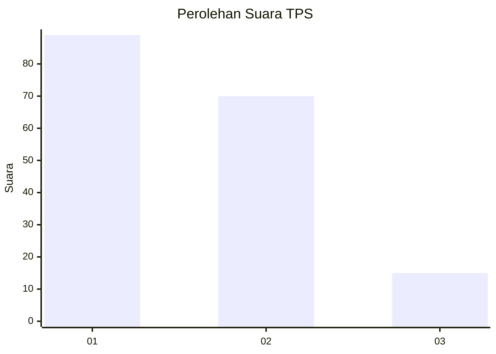
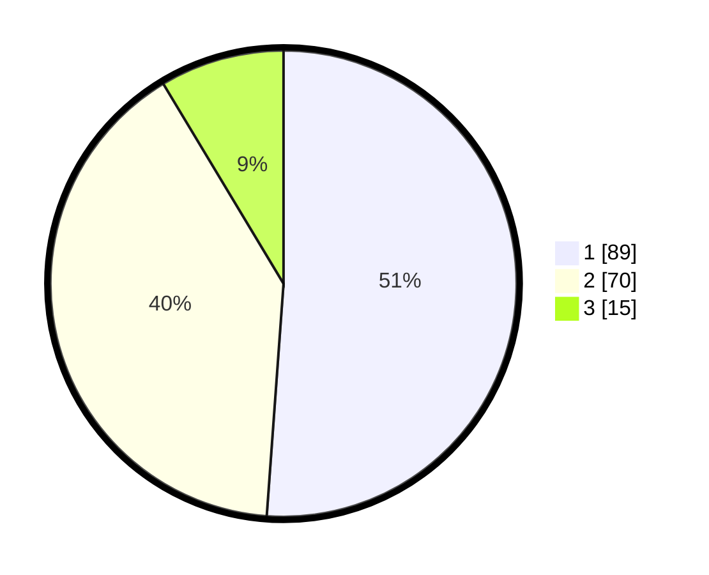

# Hasil

## Grafik

## Tabel

| No. | Nama Paslon    | Suara | Suara (raw) | Persentase |
|:--- |:-------------- | -----:| -----------:| ----------:|
| 1   | ANIES MUHAIMIN | 89    | [89][p-1]   | 51,15      |
| 2   | PRABOWO GIBRAN | 70    | [70][p-2]   | 40,23      |
| 3   | GANJAR MAHFUD  | 15    | [15][p-3]   | 8,62       |

[p-1]: https://github.com/gigit-pemilu/pemilu-2024-11-aceh/blob/main/pilpres/hitung-suara/sub/11-aceh/sub/16-aceh-tamiang/sub/06-kejuruan-muda/sub/2001-bukit-rata/sub/004-tps/sub/paslon-1.txt
[p-2]: https://github.com/gigit-pemilu/pemilu-2024-11-aceh/blob/main/pilpres/hitung-suara/sub/11-aceh/sub/16-aceh-tamiang/sub/06-kejuruan-muda/sub/2001-bukit-rata/sub/004-tps/sub/paslon-2.txt
[p-3]: https://github.com/gigit-pemilu/pemilu-2024-11-aceh/blob/main/pilpres/hitung-suara/sub/11-aceh/sub/16-aceh-tamiang/sub/06-kejuruan-muda/sub/2001-bukit-rata/sub/004-tps/sub/paslon-3.txt

## Foto C Plano

https://sirekap-obj-formc.kpu.go.id/ad8b/pemilu/ppwp/11/16/06/20/01/1116062001004-20240215-225516--a9248669-0fb5-44a1-9715-066d4841b0a6.jpg

https://sirekap-obj-formc.kpu.go.id/ad8b/pemilu/ppwp/11/16/06/20/01/1116062001004-20240215-225519--24630999-31ef-4797-a71f-9eefac2c87c7.jpg

https://sirekap-obj-formc.kpu.go.id/ad8b/pemilu/ppwp/11/16/06/20/01/1116062001004-20240215-225517--98881f1b-7a5f-40d3-9b43-b899e364b620.jpg

## Metadata

| Key        | Value               |
| ---------- | ------------------- |
| Time Stamp | 2024-02-16 10:00:28 |

## DATA PEMILIH TETAP

Jumlah pemilih dalam DPT: **219**.
 * L: **107**.
 * P: **112**.

## DATA PENGGUNA HAK PILIH

Jumlah pengguna hak pilih dalam DPT: **170**.
 * L: **86**.
 * P: **84**.

Jumlah pengguna hak pilih dalam DPTb: **0**.
 * L: **0**.
 * P: **0**.

Jumlah pengguna hak pilih dalam DPK: **4**.
 * L: **1**.
 * P: **3**.

Jumlah pengguna hak pilih: **174**.
 * L: **87**.
 * P: **87**.

## JUMLAH SUARA SAH DAN TIDAK SAH

JUMLAH SELURUH SUARA SAH: **174**.

JUMLAH SUARA TIDAK SAH: **0**.

JUMLAH SELURUH SUARA SAH DAN SUARA TIDAK SAH: **174**.

