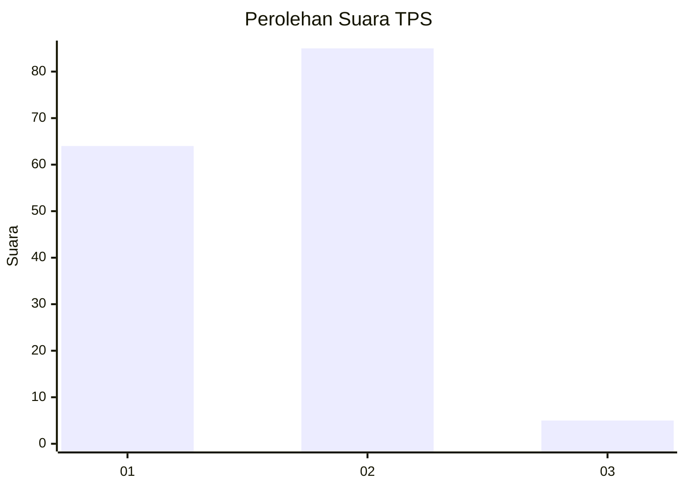
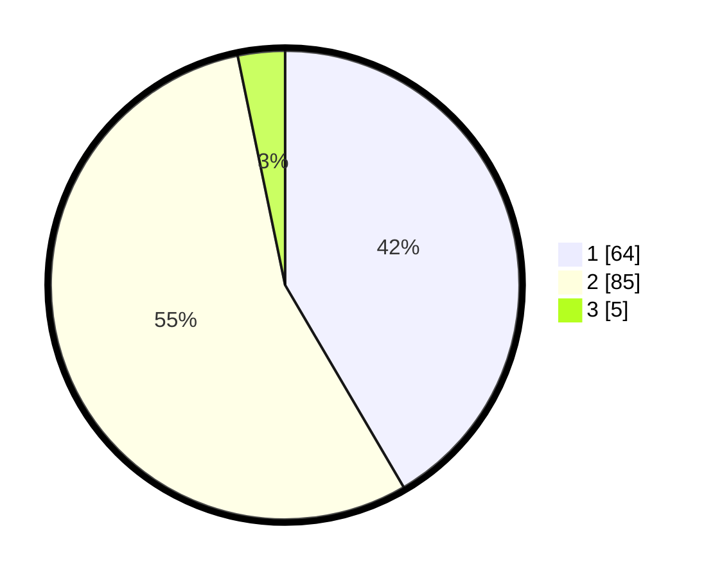

# Hasil

## Grafik

## Tabel

| No. | Nama Paslon    | Suara | Suara (raw) | Persentase |
|:--- |:-------------- | -----:| -----------:| ----------:|
| 1   | ANIES MUHAIMIN | 64    | [64][p-1]   | 41,56      |
| 2   | PRABOWO GIBRAN | 85    | [85][p-2]   | 55,19      |
| 3   | GANJAR MAHFUD  | 5     | [5][p-3]    | 3,25       |

[p-1]: https://github.com/gigit-pemilu/pemilu-2024-11-aceh/blob/main/pilpres/hitung-suara/sub/11-aceh/sub/16-aceh-tamiang/sub/07-tamiang-hulu/sub/2001-alur-tani-satu/sub/001-tps/sub/paslon-1.txt
[p-2]: https://github.com/gigit-pemilu/pemilu-2024-11-aceh/blob/main/pilpres/hitung-suara/sub/11-aceh/sub/16-aceh-tamiang/sub/07-tamiang-hulu/sub/2001-alur-tani-satu/sub/001-tps/sub/paslon-2.txt
[p-3]: https://github.com/gigit-pemilu/pemilu-2024-11-aceh/blob/main/pilpres/hitung-suara/sub/11-aceh/sub/16-aceh-tamiang/sub/07-tamiang-hulu/sub/2001-alur-tani-satu/sub/001-tps/sub/paslon-3.txt

## Foto C Plano

https://sirekap-obj-formc.kpu.go.id/4050/pemilu/ppwp/11/16/07/20/01/1116072001001-20240218-174247--df4ea16a-3d39-4477-8c05-d928cf8e57ad.jpg

https://sirekap-obj-formc.kpu.go.id/4050/pemilu/ppwp/11/16/07/20/01/1116072001001-20240218-174249--822d6020-7a1e-48af-af61-ef2dd7a72932.jpg

https://sirekap-obj-formc.kpu.go.id/4050/pemilu/ppwp/11/16/07/20/01/1116072001001-20240218-174248--243fe288-a2be-48d0-9ba7-3e51036bd94a.jpg

## Metadata

| Key        | Value               |
| ---------- | ------------------- |
| Time Stamp | 2024-02-19 06:16:00 |

## DATA PEMILIH TETAP

Jumlah pemilih dalam DPT: **205**.
 * L: **99**.
 * P: **106**.

## DATA PENGGUNA HAK PILIH

Jumlah pengguna hak pilih dalam DPT: **164**.
 * L: **81**.
 * P: **83**.

Jumlah pengguna hak pilih dalam DPTb: **0**.
 * L: **0**.
 * P: **0**.

Jumlah pengguna hak pilih dalam DPK: **0**.
 * L: **0**.
 * P: **0**.

Jumlah pengguna hak pilih: **164**.
 * L: **81**.
 * P: **83**.

## JUMLAH SUARA SAH DAN TIDAK SAH

JUMLAH SELURUH SUARA SAH: **154**.

JUMLAH SUARA TIDAK SAH: **10**.

JUMLAH SELURUH SUARA SAH DAN SUARA TIDAK SAH: **164**.

