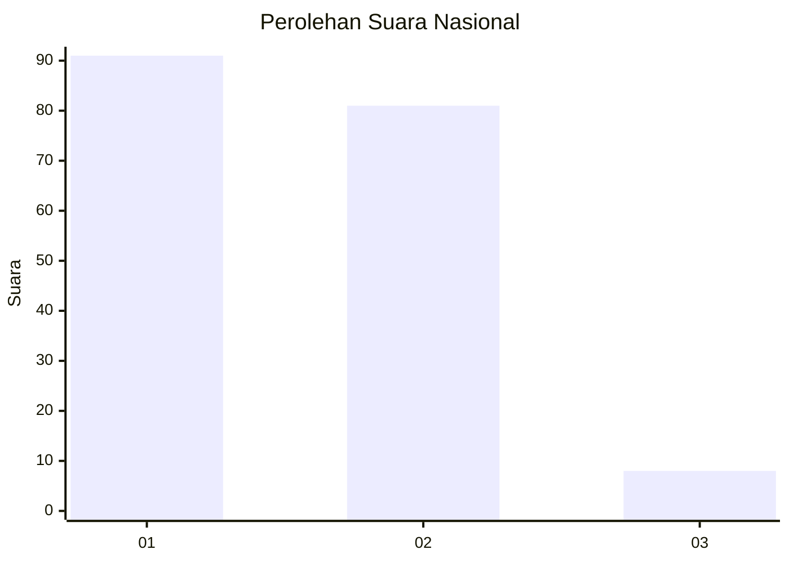
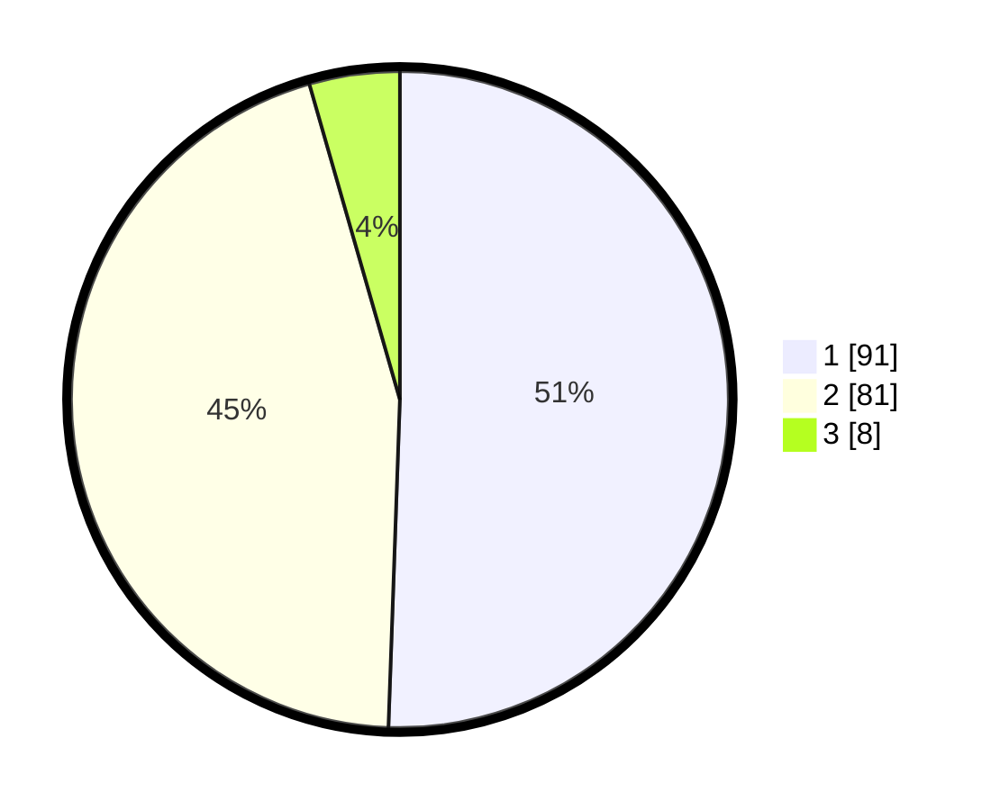

# Hasil

## Grafik

## Tabel

| No. | Nama Paslon    | Suara | Suara (raw) | Persentase |
|:--- |:-------------- | -----:| -----------:| ----------:|
| 1   | ANIES MUHAIMIN | 91    | [91][p-1]   | 50,56      |
| 2   | PRABOWO GIBRAN | 81    | [81][p-2]   | 45,00      |
| 3   | GANJAR MAHFUD  | 8     | [8][p-3]    | 4,44       |

[p-1]: https://github.com/gigit-pemilu/pemilu-2024/blob/main/pilpres/hitung-suara/sub/11-aceh/sub/16-aceh-tamiang/sub/07-tamiang-hulu/sub/2001-alur-tani-satu/sub/004-tps/sub/paslon-1.txt
[p-2]: https://github.com/gigit-pemilu/pemilu-2024/blob/main/pilpres/hitung-suara/sub/11-aceh/sub/16-aceh-tamiang/sub/07-tamiang-hulu/sub/2001-alur-tani-satu/sub/004-tps/sub/paslon-2.txt
[p-3]: https://github.com/gigit-pemilu/pemilu-2024/blob/main/pilpres/hitung-suara/sub/11-aceh/sub/16-aceh-tamiang/sub/07-tamiang-hulu/sub/2001-alur-tani-satu/sub/004-tps/sub/paslon-3.txt

## Foto C Plano

https://sirekap-obj-formc.kpu.go.id/477b/pemilu/ppwp/11/16/07/20/01/1116072001004-20240218-204459--c2975723-d6fe-42b5-96fa-d1e947828e07.jpg

https://sirekap-obj-formc.kpu.go.id/477b/pemilu/ppwp/11/16/07/20/01/1116072001004-20240218-205312--b7a3be74-39e3-42b2-b871-7fc8740544b8.jpg

https://sirekap-obj-formc.kpu.go.id/477b/pemilu/ppwp/11/16/07/20/01/1116072001004-20240218-204851--8defb445-12ee-4f60-958b-ce41e15fb032.jpg

## Metadata

| Key        | Value               |
| ---------- | ------------------- |
| Time Stamp | 2024-02-19 06:16:00 |

## DATA PEMILIH TETAP

Jumlah pemilih dalam DPT: **214**.
 * L: **104**.
 * P: **110**.

## DATA PENGGUNA HAK PILIH

Jumlah pengguna hak pilih dalam DPT: **182**.
 * L: **87**.
 * P: **95**.

Jumlah pengguna hak pilih dalam DPTb: **0**.
 * L: **0**.
 * P: **0**.

Jumlah pengguna hak pilih dalam DPK: **1**.
 * L: **0**.
 * P: **1**.

Jumlah pengguna hak pilih: **183**.
 * L: **87**.
 * P: **96**.

## JUMLAH SUARA SAH DAN TIDAK SAH

JUMLAH SELURUH SUARA SAH: **180**.

JUMLAH SUARA TIDAK SAH: **3**.

JUMLAH SELURUH SUARA SAH DAN SUARA TIDAK SAH: **183**.

