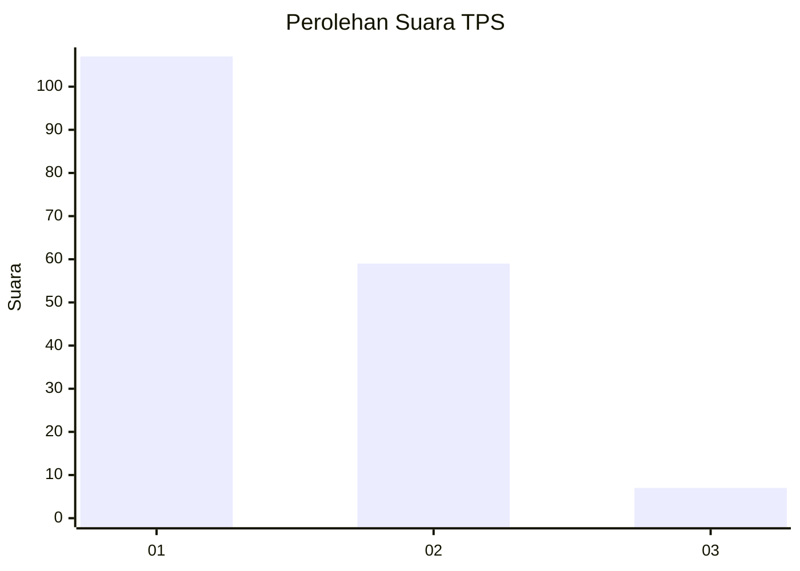
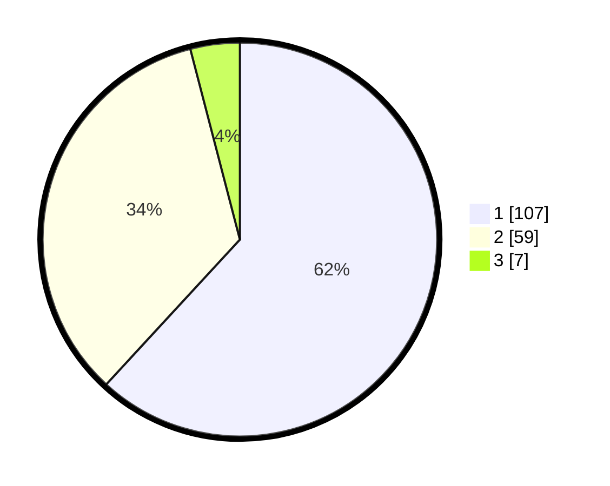

# Hasil

## Grafik

## Tabel

| No. | Nama Paslon    | Suara | Suara (raw) | Persentase |
|:--- |:-------------- | -----:| -----------:| ----------:|
| 1   | ANIES MUHAIMIN | 107   | [107][p-1]  | 61,85      |
| 2   | PRABOWO GIBRAN | 59    | [59][p-2]   | 34,10      |
| 3   | GANJAR MAHFUD  | 7     | [7][p-3]    | 4,05       |

[p-1]: https://github.com/gigit-pemilu/pemilu-2024-11-aceh/blob/main/pilpres/hitung-suara/sub/11-aceh/sub/16-aceh-tamiang/sub/07-tamiang-hulu/sub/2002-alur-tani-dua/sub/002-tps/sub/paslon-1.txt
[p-2]: https://github.com/gigit-pemilu/pemilu-2024-11-aceh/blob/main/pilpres/hitung-suara/sub/11-aceh/sub/16-aceh-tamiang/sub/07-tamiang-hulu/sub/2002-alur-tani-dua/sub/002-tps/sub/paslon-2.txt
[p-3]: https://github.com/gigit-pemilu/pemilu-2024-11-aceh/blob/main/pilpres/hitung-suara/sub/11-aceh/sub/16-aceh-tamiang/sub/07-tamiang-hulu/sub/2002-alur-tani-dua/sub/002-tps/sub/paslon-3.txt

## Foto C Plano

https://sirekap-obj-formc.kpu.go.id/f082/pemilu/ppwp/11/16/07/20/02/1116072002002-20240214-155510--9d850a32-25bf-46c0-ae9c-8ce75f97e8e7.jpg

https://sirekap-obj-formc.kpu.go.id/f082/pemilu/ppwp/11/16/07/20/02/1116072002002-20240218-213736--7cc62c41-8906-4890-9f4b-eff31171a79f.jpg

https://sirekap-obj-formc.kpu.go.id/f082/pemilu/ppwp/11/16/07/20/02/1116072002002-20240214-160110--cf6b7bbc-6da2-40b0-a8df-57e9612ec4d9.jpg

## Metadata

| Key        | Value               |
| ---------- | ------------------- |
| Time Stamp | 2024-02-19 06:16:00 |

## DATA PEMILIH TETAP

Jumlah pemilih dalam DPT: **213**.
 * L: **113**.
 * P: **100**.

## DATA PENGGUNA HAK PILIH

Jumlah pengguna hak pilih dalam DPT: **181**.
 * L: **90**.
 * P: **91**.

Jumlah pengguna hak pilih dalam DPTb: **0**.
 * L: **0**.
 * P: **0**.

Jumlah pengguna hak pilih dalam DPK: **0**.
 * L: **0**.
 * P: **0**.

Jumlah pengguna hak pilih: **181**.
 * L: **90**.
 * P: **91**.

## JUMLAH SUARA SAH DAN TIDAK SAH

JUMLAH SELURUH SUARA SAH: **173**.

JUMLAH SUARA TIDAK SAH: **8**.

JUMLAH SELURUH SUARA SAH DAN SUARA TIDAK SAH: **181**.

