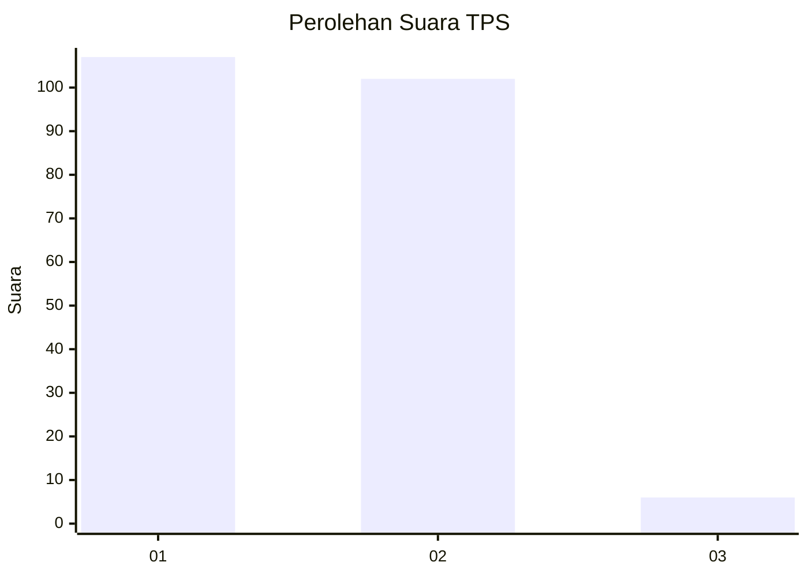
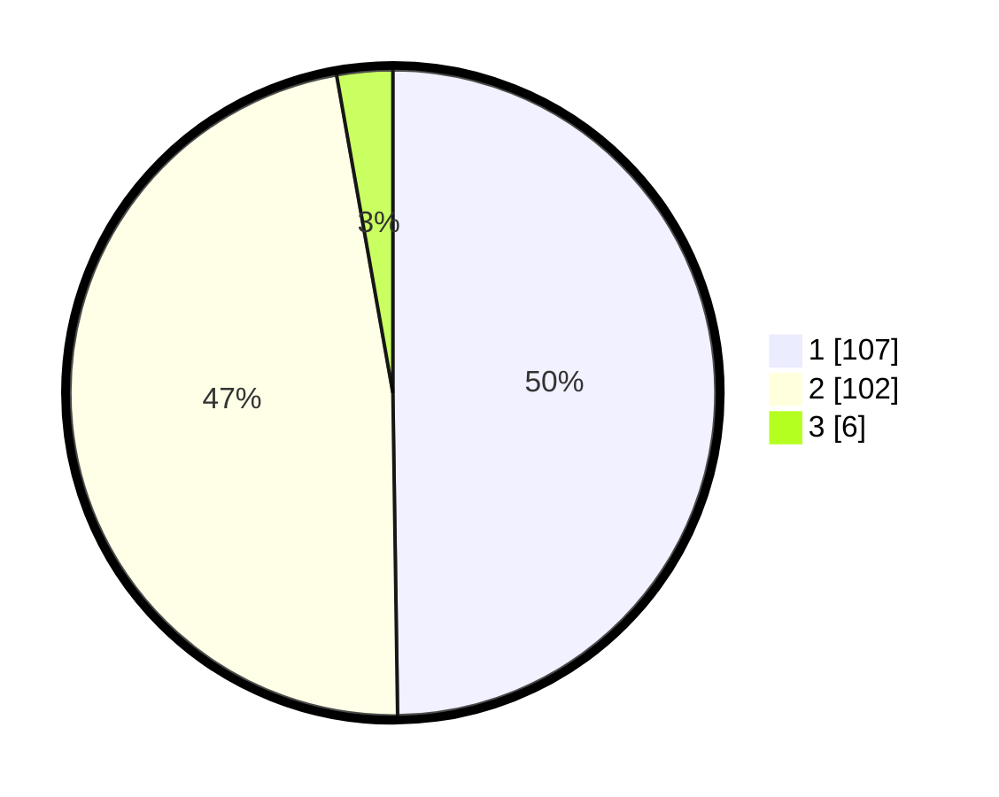

# Hasil

## Grafik

## Tabel

| No. | Nama Paslon    | Suara | Suara (raw) | Persentase |
|:--- |:-------------- | -----:| -----------:| ----------:|
| 1   | ANIES MUHAIMIN | 107   | [107][p-1]  | 49,77      |
| 2   | PRABOWO GIBRAN | 102   | [102][p-2]  | 47,44      |
| 3   | GANJAR MAHFUD  | 6     | [6][p-3]    | 2,79       |

[p-1]: https://github.com/gigit-pemilu/pemilu-2024-11-aceh/blob/main/pilpres/hitung-suara/sub/11-aceh/sub/16-aceh-tamiang/sub/07-tamiang-hulu/sub/2004-kaloy/sub/001-tps/sub/paslon-1.txt
[p-2]: https://github.com/gigit-pemilu/pemilu-2024-11-aceh/blob/main/pilpres/hitung-suara/sub/11-aceh/sub/16-aceh-tamiang/sub/07-tamiang-hulu/sub/2004-kaloy/sub/001-tps/sub/paslon-2.txt
[p-3]: https://github.com/gigit-pemilu/pemilu-2024-11-aceh/blob/main/pilpres/hitung-suara/sub/11-aceh/sub/16-aceh-tamiang/sub/07-tamiang-hulu/sub/2004-kaloy/sub/001-tps/sub/paslon-3.txt

## Foto C Plano

https://sirekap-obj-formc.kpu.go.id/ab24/pemilu/ppwp/11/16/07/20/04/1116072004001-20240214-225854--dc47938a-c5f9-4e6a-b5a2-d0f057acc06d.jpg

https://sirekap-obj-formc.kpu.go.id/ab24/pemilu/ppwp/11/16/07/20/04/1116072004001-20240214-225917--a99e6afd-c8eb-4dcb-9d1f-b1a24af7a251.jpg

https://sirekap-obj-formc.kpu.go.id/ab24/pemilu/ppwp/11/16/07/20/04/1116072004001-20240215-002059--433e2511-e265-48dc-be51-846e4ed67c13.jpg

## Metadata

| Key        | Value               |
| ---------- | ------------------- |
| Time Stamp | 2024-02-15 20:00:44 |

