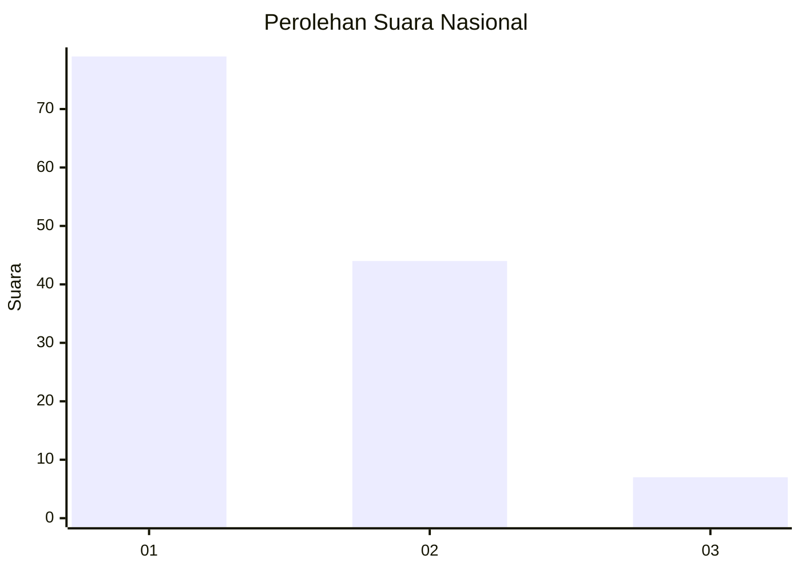
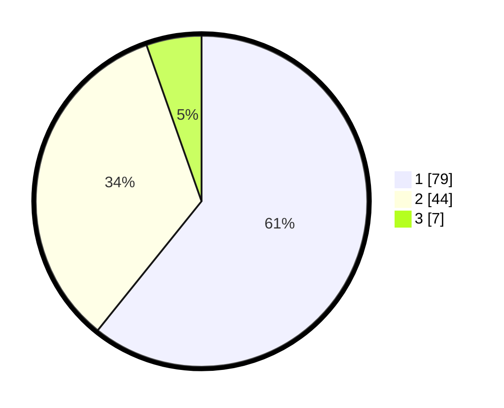

# Hasil

## Grafik

## Tabel

| No. | Nama Paslon    | Suara | Suara (raw) | Persentase |
|:--- |:-------------- | -----:| -----------:| ----------:|
| 1   | ANIES MUHAIMIN | 79    | [79][p-1]   | 60,77      |
| 2   | PRABOWO GIBRAN | 44    | [44][p-2]   | 33,85      |
| 3   | GANJAR MAHFUD  | 7     | [7][p-3]    | 5,38       |

[p-1]: https://github.com/gigit-pemilu/pemilu-2024/blob/main/pilpres/hitung-suara/sub/11-aceh/sub/16-aceh-tamiang/sub/07-tamiang-hulu/sub/2004-kaloy/sub/015-tps/sub/paslon-1.txt
[p-2]: https://github.com/gigit-pemilu/pemilu-2024/blob/main/pilpres/hitung-suara/sub/11-aceh/sub/16-aceh-tamiang/sub/07-tamiang-hulu/sub/2004-kaloy/sub/015-tps/sub/paslon-2.txt
[p-3]: https://github.com/gigit-pemilu/pemilu-2024/blob/main/pilpres/hitung-suara/sub/11-aceh/sub/16-aceh-tamiang/sub/07-tamiang-hulu/sub/2004-kaloy/sub/015-tps/sub/paslon-3.txt

## Foto C Plano

https://sirekap-obj-formc.kpu.go.id/f912/pemilu/ppwp/11/16/07/20/04/1116072004015-20240221-013202--a4083d81-d717-4fed-99e3-8db3d036ae35.jpg

https://sirekap-obj-formc.kpu.go.id/f912/pemilu/ppwp/11/16/07/20/04/1116072004015-20240221-022138--844b6fe5-e7ab-47e9-b9c9-79c016886e4d.jpg

https://sirekap-obj-formc.kpu.go.id/f912/pemilu/ppwp/11/16/07/20/04/1116072004015-20240221-013457--8e82c02c-dc39-4760-8d47-2a65c776ebf6.jpg

## Metadata

| Key        | Value               |
| ---------- | ------------------- |
| Time Stamp | 2024-02-21 05:00:00 |

## DATA PEMILIH TETAP

Jumlah pemilih dalam DPT: **324**.
 * L: **312**.
 * P: **12**.

## DATA PENGGUNA HAK PILIH

Jumlah pengguna hak pilih dalam DPT: **191**.
 * L: **84**.
 * P: **107**.

Jumlah pengguna hak pilih dalam DPTb: **0**.
 * L: **0**.
 * P: **0**.

Jumlah pengguna hak pilih dalam DPK: **0**.
 * L: **0**.
 * P: **0**.

Jumlah pengguna hak pilih: **191**.
 * L: **84**.
 * P: **107**.

## JUMLAH SUARA SAH DAN TIDAK SAH

JUMLAH SELURUH SUARA SAH: **184**.

JUMLAH SUARA TIDAK SAH: **7**.

JUMLAH SELURUH SUARA SAH DAN SUARA TIDAK SAH: **191**.

