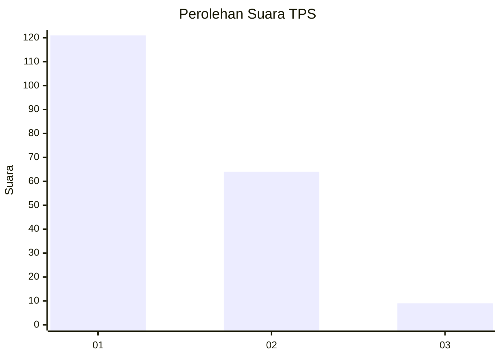
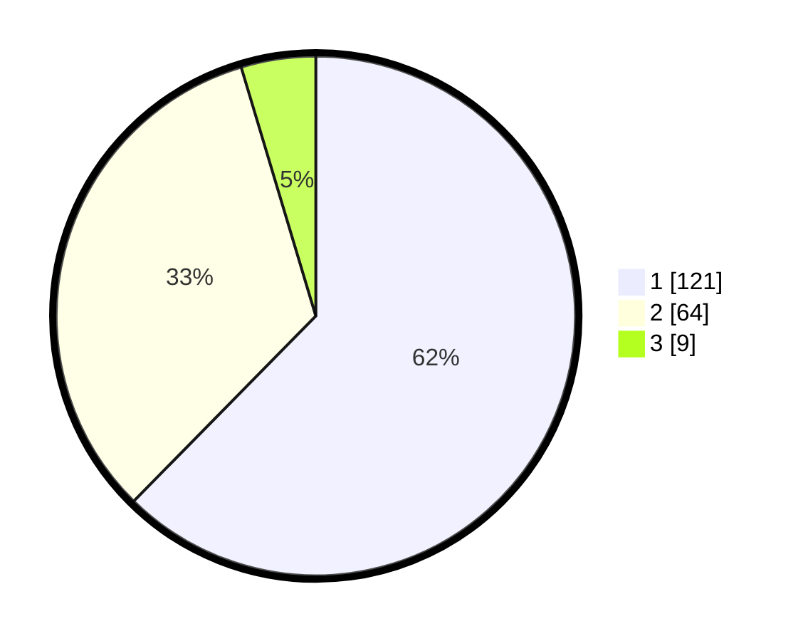

# Hasil

## Grafik

## Tabel

| No. | Nama Paslon    | Suara | Suara (raw) | Persentase |
|:--- |:-------------- | -----:| -----------:| ----------:|
| 1   | ANIES MUHAIMIN | 121   | [121][p-1]  | 62,37      |
| 2   | PRABOWO GIBRAN | 64    | [64][p-2]   | 32,99      |
| 3   | GANJAR MAHFUD  | 9     | [9][p-3]    | 4,64       |

[p-1]: https://github.com/gigit-pemilu/pemilu-2024-11-aceh/blob/main/pilpres/hitung-suara/sub/11-aceh/sub/16-aceh-tamiang/sub/08-rantau/sub/2001-benua-raja/sub/004-tps/sub/paslon-1.txt
[p-2]: https://github.com/gigit-pemilu/pemilu-2024-11-aceh/blob/main/pilpres/hitung-suara/sub/11-aceh/sub/16-aceh-tamiang/sub/08-rantau/sub/2001-benua-raja/sub/004-tps/sub/paslon-2.txt
[p-3]: https://github.com/gigit-pemilu/pemilu-2024-11-aceh/blob/main/pilpres/hitung-suara/sub/11-aceh/sub/16-aceh-tamiang/sub/08-rantau/sub/2001-benua-raja/sub/004-tps/sub/paslon-3.txt

## Foto C Plano

https://sirekap-obj-formc.kpu.go.id/3e90/pemilu/ppwp/11/16/08/20/01/1116082001004-20240223-150632--46530b08-29fd-4d9a-9a8a-a1a1d20c3a67.jpg

https://sirekap-obj-formc.kpu.go.id/3e90/pemilu/ppwp/11/16/08/20/01/1116082001004-20240223-151305--a2bf1e25-49b7-4388-a38a-7a8b8feb4d14.jpg

https://sirekap-obj-formc.kpu.go.id/3e90/pemilu/ppwp/11/16/08/20/01/1116082001004-20240223-151505--b751e0b9-3b2c-4a52-8b98-3e8059cae9f3.jpg

## Metadata

| Key        | Value               |
| ---------- | ------------------- |
| Time Stamp | 2024-02-24 22:31:28 |

## DATA PEMILIH TETAP

Jumlah pemilih dalam DPT: **254**.
 * L: **132**.
 * P: **122**.

## DATA PENGGUNA HAK PILIH

Jumlah pengguna hak pilih dalam DPT: **196**.
 * L: **97**.
 * P: **99**.

Jumlah pengguna hak pilih dalam DPTb: **0**.
 * L: **0**.
 * P: **0**.

Jumlah pengguna hak pilih dalam DPK: **3**.
 * L: **1**.
 * P: **2**.

Jumlah pengguna hak pilih: **199**.
 * L: **98**.
 * P: **101**.

## JUMLAH SUARA SAH DAN TIDAK SAH

JUMLAH SELURUH SUARA SAH: **194**.

JUMLAH SUARA TIDAK SAH: **5**.

JUMLAH SELURUH SUARA SAH DAN SUARA TIDAK SAH: **199**.

