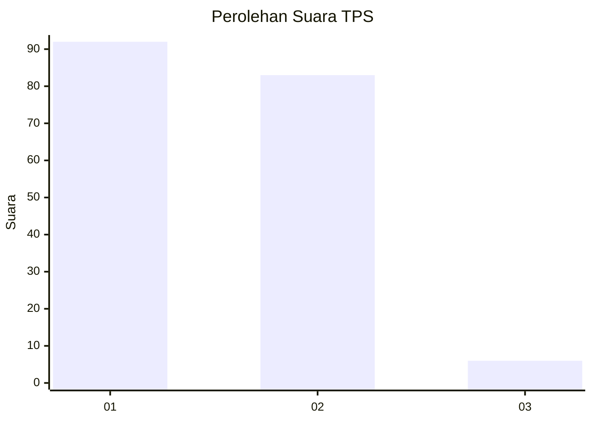
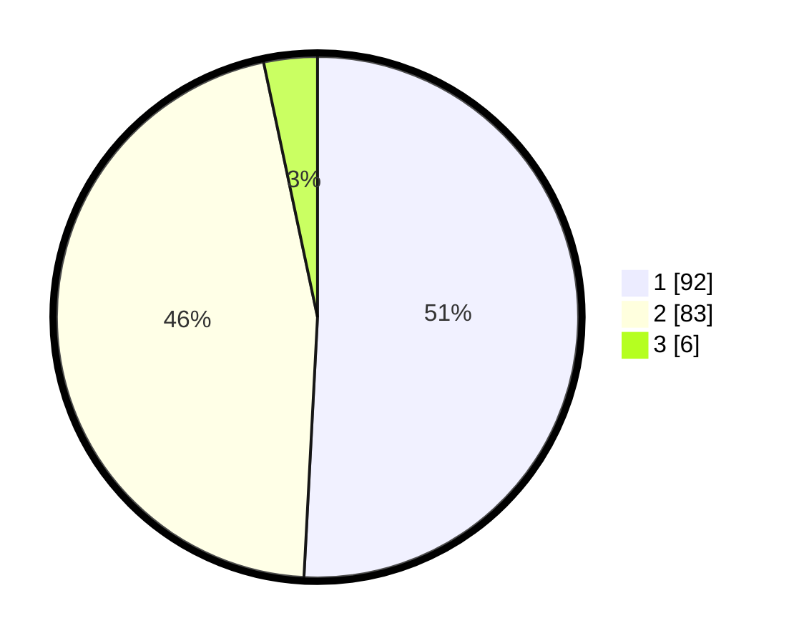

# Hasil

## Grafik

## Tabel

| No. | Nama Paslon    | Suara | Suara (raw) | Persentase |
|:--- |:-------------- | -----:| -----------:| ----------:|
| 1   | ANIES MUHAIMIN | 92    | [92][p-1]   | 50,83      |
| 2   | PRABOWO GIBRAN | 83    | [83][p-2]   | 45,86      |
| 3   | GANJAR MAHFUD  | 6     | [6][p-3]    | 3,31       |

[p-1]: https://github.com/gigit-pemilu/pemilu-2024-11-aceh/blob/main/pilpres/hitung-suara/sub/11-aceh/sub/16-aceh-tamiang/sub/08-rantau/sub/2001-benua-raja/sub/005-tps/sub/paslon-1.txt
[p-2]: https://github.com/gigit-pemilu/pemilu-2024-11-aceh/blob/main/pilpres/hitung-suara/sub/11-aceh/sub/16-aceh-tamiang/sub/08-rantau/sub/2001-benua-raja/sub/005-tps/sub/paslon-2.txt
[p-3]: https://github.com/gigit-pemilu/pemilu-2024-11-aceh/blob/main/pilpres/hitung-suara/sub/11-aceh/sub/16-aceh-tamiang/sub/08-rantau/sub/2001-benua-raja/sub/005-tps/sub/paslon-3.txt

## Foto C Plano

https://sirekap-obj-formc.kpu.go.id/ba61/pemilu/ppwp/11/16/08/20/01/1116082001005-20240223-182527--2e721da7-5d96-4df5-a97c-131d1bd8c441.jpg

https://sirekap-obj-formc.kpu.go.id/ba61/pemilu/ppwp/11/16/08/20/01/1116082001005-20240223-182633--f5ff2dce-5375-4e72-bb01-0f417f855801.jpg

https://sirekap-obj-formc.kpu.go.id/ba61/pemilu/ppwp/11/16/08/20/01/1116082001005-20240223-182752--568bf77b-e002-4cd1-a625-122864cf1d58.jpg

## Metadata

| Key        | Value               |
| ---------- | ------------------- |
| Time Stamp | 2024-02-24 22:31:28 |

## DATA PEMILIH TETAP

Jumlah pemilih dalam DPT: **234**.
 * L: **105**.
 * P: **129**.

## DATA PENGGUNA HAK PILIH

Jumlah pengguna hak pilih dalam DPT: **180**.
 * L: **75**.
 * P: **105**.

Jumlah pengguna hak pilih dalam DPTb: **3**.
 * L: **2**.
 * P: **1**.

Jumlah pengguna hak pilih dalam DPK: **2**.
 * L: **2**.
 * P: **0**.

Jumlah pengguna hak pilih: **185**.
 * L: **79**.
 * P: **106**.

## JUMLAH SUARA SAH DAN TIDAK SAH

JUMLAH SELURUH SUARA SAH: **181**.

JUMLAH SUARA TIDAK SAH: **4**.

JUMLAH SELURUH SUARA SAH DAN SUARA TIDAK SAH: **185**.

