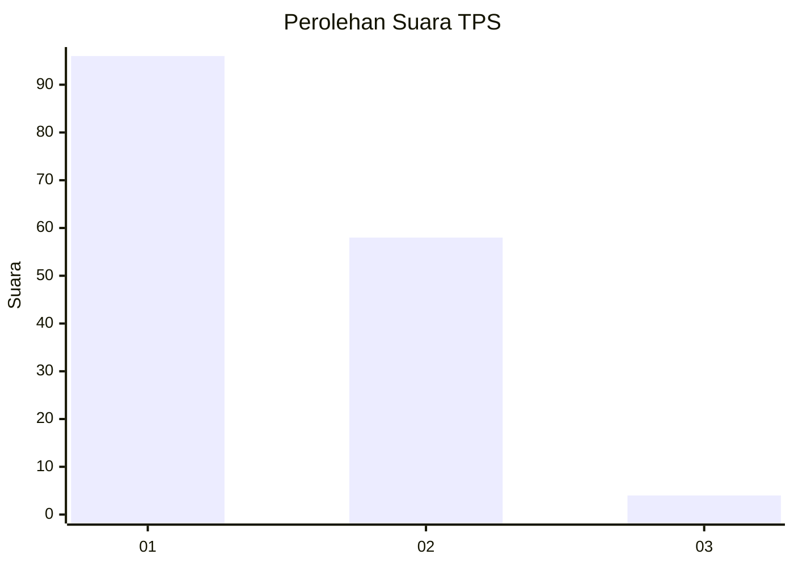
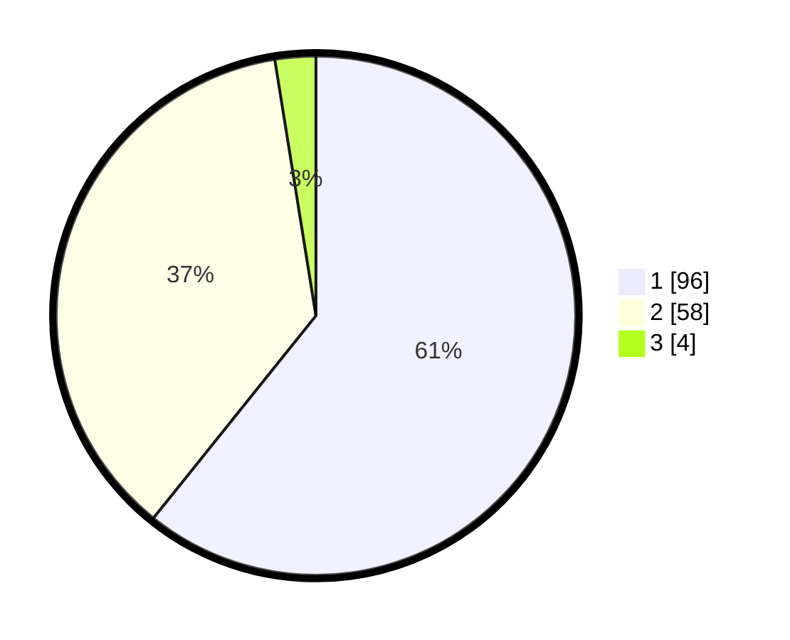

# Hasil

## Grafik

## Tabel

| No. | Nama Paslon    | Suara | Suara (raw) | Persentase |
|:--- |:-------------- | -----:| -----------:| ----------:|
| 1   | ANIES MUHAIMIN | 96    | [96][p-1]   | 60,76      |
| 2   | PRABOWO GIBRAN | 58    | [58][p-2]   | 36,71      |
| 3   | GANJAR MAHFUD  | 4     | [4][p-3]    | 2,53       |

[p-1]: https://github.com/gigit-pemilu/pemilu-2024-11-aceh/blob/main/pilpres/hitung-suara/sub/11-aceh/sub/16-aceh-tamiang/sub/08-rantau/sub/2002-landuh/sub/010-tps/sub/paslon-1.txt
[p-2]: https://github.com/gigit-pemilu/pemilu-2024-11-aceh/blob/main/pilpres/hitung-suara/sub/11-aceh/sub/16-aceh-tamiang/sub/08-rantau/sub/2002-landuh/sub/010-tps/sub/paslon-2.txt
[p-3]: https://github.com/gigit-pemilu/pemilu-2024-11-aceh/blob/main/pilpres/hitung-suara/sub/11-aceh/sub/16-aceh-tamiang/sub/08-rantau/sub/2002-landuh/sub/010-tps/sub/paslon-3.txt

## Foto C Plano

https://sirekap-obj-formc.kpu.go.id/fab4/pemilu/ppwp/11/16/08/20/02/1116082002010-20240222-213908--c2790011-c469-4216-9ded-55758666298a.jpg

https://sirekap-obj-formc.kpu.go.id/fab4/pemilu/ppwp/11/16/08/20/02/1116082002010-20240222-214535--7d2066cb-845a-4372-837f-eca474f34c78.jpg

https://sirekap-obj-formc.kpu.go.id/fab4/pemilu/ppwp/11/16/08/20/02/1116082002010-20240222-214918--62d93900-4397-43c4-a4cb-8279e18de738.jpg

## Metadata

| Key        | Value               |
| ---------- | ------------------- |
| Time Stamp | 2024-02-22 22:00:00 |

