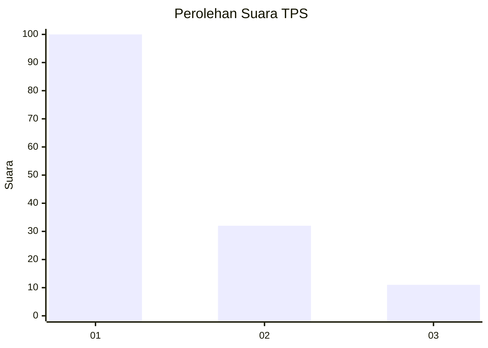
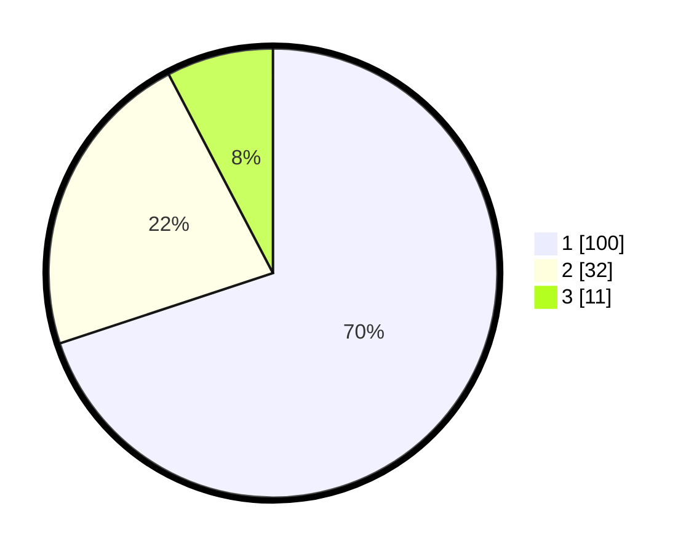

# Hasil

## Grafik

## Tabel

| No. | Nama Paslon    | Suara | Suara (raw) | Persentase |
|:--- |:-------------- | -----:| -----------:| ----------:|
| 1   | ANIES MUHAIMIN | 100   | [100][p-1]  | 69,93      |
| 2   | PRABOWO GIBRAN | 32    | [32][p-2]   | 22,38      |
| 3   | GANJAR MAHFUD  | 11    | [11][p-3]   | 7,69       |

[p-1]: https://github.com/gigit-pemilu/pemilu-2024-11-aceh/blob/main/pilpres/hitung-suara/sub/11-aceh/sub/16-aceh-tamiang/sub/08-rantau/sub/2003-paya-bedi/sub/009-tps/sub/paslon-1.txt
[p-2]: https://github.com/gigit-pemilu/pemilu-2024-11-aceh/blob/main/pilpres/hitung-suara/sub/11-aceh/sub/16-aceh-tamiang/sub/08-rantau/sub/2003-paya-bedi/sub/009-tps/sub/paslon-2.txt
[p-3]: https://github.com/gigit-pemilu/pemilu-2024-11-aceh/blob/main/pilpres/hitung-suara/sub/11-aceh/sub/16-aceh-tamiang/sub/08-rantau/sub/2003-paya-bedi/sub/009-tps/sub/paslon-3.txt

## Foto C Plano

https://sirekap-obj-formc.kpu.go.id/21f8/pemilu/ppwp/11/16/08/20/03/1116082003009-20240223-145047--54130500-7b13-4e0e-827e-0cb7b452fa38.jpg

https://sirekap-obj-formc.kpu.go.id/21f8/pemilu/ppwp/11/16/08/20/03/1116082003009-20240223-150041--3df466ac-cae1-4f0a-8111-713d157b93f4.jpg

https://sirekap-obj-formc.kpu.go.id/21f8/pemilu/ppwp/11/16/08/20/03/1116082003009-20240223-151103--ca871dcb-d489-4e21-8def-13c0ab7fc8e9.jpg

## Metadata

| Key        | Value               |
| ---------- | ------------------- |
| Time Stamp | 2024-02-24 22:31:28 |

## DATA PEMILIH TETAP

Jumlah pemilih dalam DPT: **189**.
 * L: **91**.
 * P: **98**.

## DATA PENGGUNA HAK PILIH

Jumlah pengguna hak pilih dalam DPT: **143**.
 * L: **65**.
 * P: **78**.

Jumlah pengguna hak pilih dalam DPTb: **143**.
 * L: **65**.
 * P: **78**.

Jumlah pengguna hak pilih dalam DPK: **0**.
 * L: **0**.
 * P: **0**.

Jumlah pengguna hak pilih: **143**.
 * L: **65**.
 * P: **78**.

## JUMLAH SUARA SAH DAN TIDAK SAH

JUMLAH SELURUH SUARA SAH: **143**.

JUMLAH SUARA TIDAK SAH: **0**.

JUMLAH SELURUH SUARA SAH DAN SUARA TIDAK SAH: **143**.

