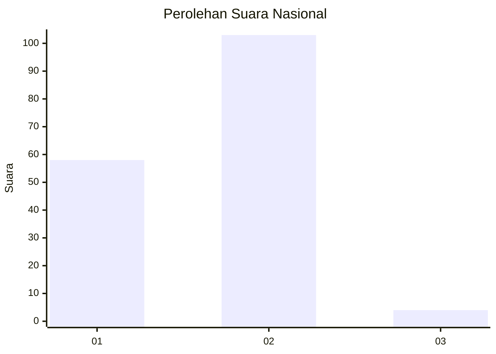
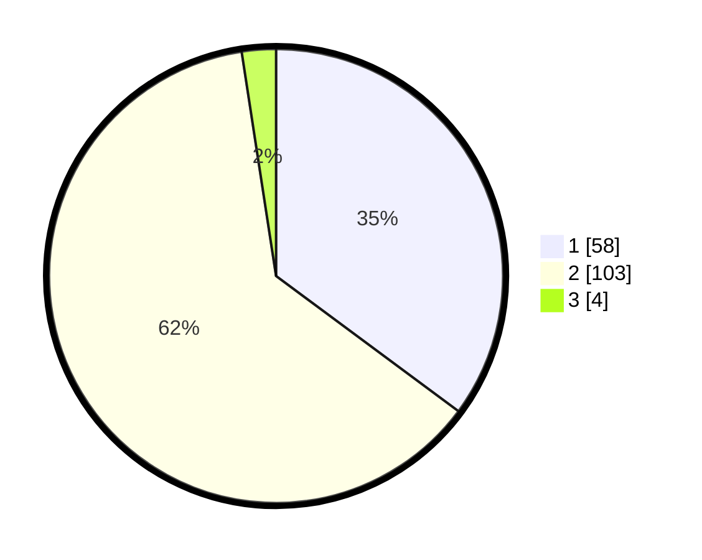

# Hasil

## Grafik

## Tabel

| No. | Nama Paslon    | Suara | Suara (raw) | Persentase |
|:--- |:-------------- | -----:| -----------:| ----------:|
| 1   | ANIES MUHAIMIN | 58    | [58][p-1]   | 35,15      |
| 2   | PRABOWO GIBRAN | 103   | [103][p-2]  | 62,42      |
| 3   | GANJAR MAHFUD  | 4     | [4][p-3]    | 2,42       |

[p-1]: https://github.com/gigit-pemilu/pemilu-2024/blob/main/pilpres/hitung-suara/sub/11-aceh/sub/16-aceh-tamiang/sub/08-rantau/sub/2006-suka-jadi/sub/003-tps/sub/paslon-1.txt
[p-2]: https://github.com/gigit-pemilu/pemilu-2024/blob/main/pilpres/hitung-suara/sub/11-aceh/sub/16-aceh-tamiang/sub/08-rantau/sub/2006-suka-jadi/sub/003-tps/sub/paslon-2.txt
[p-3]: https://github.com/gigit-pemilu/pemilu-2024/blob/main/pilpres/hitung-suara/sub/11-aceh/sub/16-aceh-tamiang/sub/08-rantau/sub/2006-suka-jadi/sub/003-tps/sub/paslon-3.txt

## Foto C Plano

https://sirekap-obj-formc.kpu.go.id/acaa/pemilu/ppwp/11/16/08/20/06/1116082006003-20240221-230826--b140e29c-2e21-46f0-ac6d-b0d908f3c37c.jpg

https://sirekap-obj-formc.kpu.go.id/acaa/pemilu/ppwp/11/16/08/20/06/1116082006003-20240222-030253--8989b20e-71b6-4c9b-9f87-9b631b834400.jpg

https://sirekap-obj-formc.kpu.go.id/acaa/pemilu/ppwp/11/16/08/20/06/1116082006003-20240221-231615--96914fca-c360-4e65-8713-f18209d6044d.jpg

## Metadata

| Key        | Value               |
| ---------- | ------------------- |
| Time Stamp | 2024-02-22 11:00:00 |

## DATA PEMILIH TETAP

Jumlah pemilih dalam DPT: **148**.
 * L: **66**.
 * P: **82**.

## DATA PENGGUNA HAK PILIH

Jumlah pengguna hak pilih dalam DPT: **125**.
 * L: **54**.
 * P: **71**.

Jumlah pengguna hak pilih dalam DPTb: **0**.
 * L: **0**.
 * P: **0**.

Jumlah pengguna hak pilih dalam DPK: **41**.
 * L: **18**.
 * P: **23**.

Jumlah pengguna hak pilih: **166**.
 * L: **72**.
 * P: **94**.

## JUMLAH SUARA SAH DAN TIDAK SAH

JUMLAH SELURUH SUARA SAH: **165**.

JUMLAH SUARA TIDAK SAH: **1**.

JUMLAH SELURUH SUARA SAH DAN SUARA TIDAK SAH: **166**.

