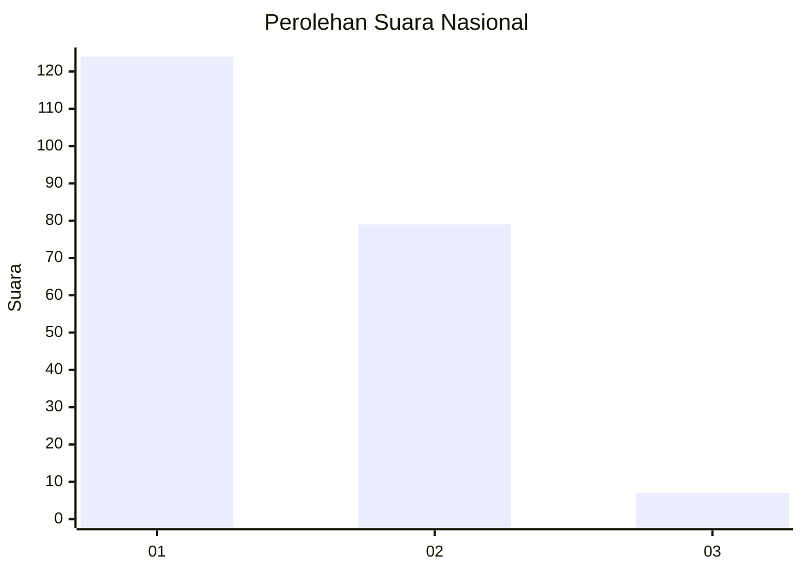
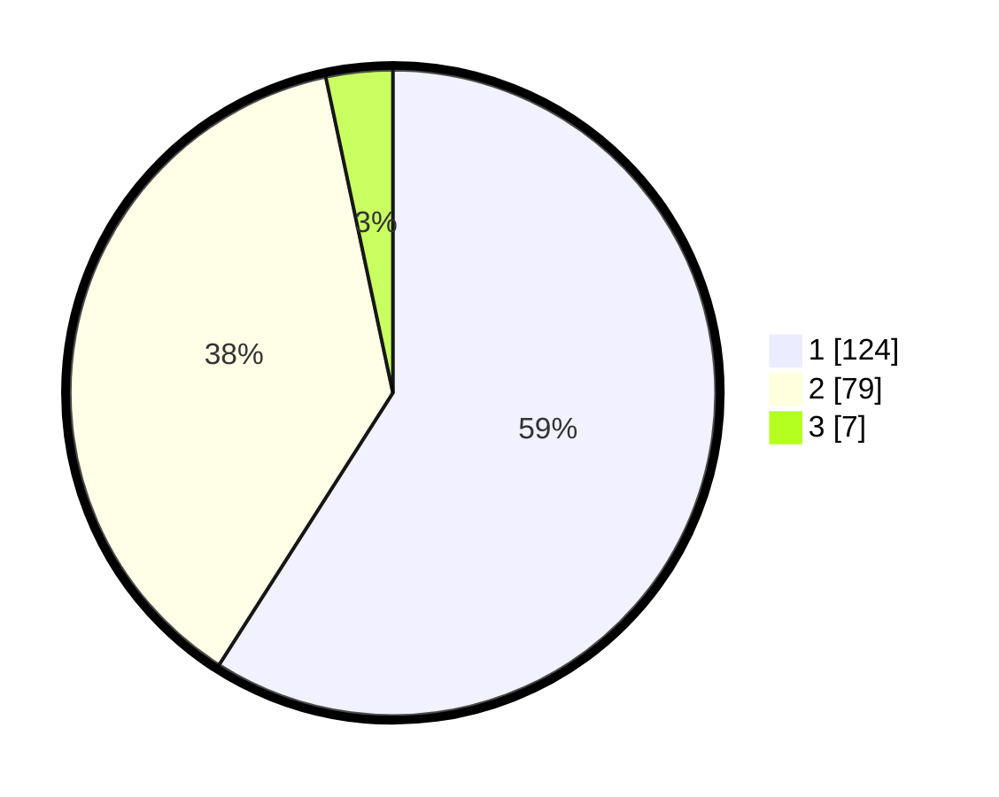

# Hasil

## Grafik

## Tabel

| No. | Nama Paslon    | Suara | Suara (raw) | Persentase |
|:--- |:-------------- | -----:| -----------:| ----------:|
| 1   | ANIES MUHAIMIN | 124   | [124][p-1]  | 59,05      |
| 2   | PRABOWO GIBRAN | 79    | [79][p-2]   | 37,62      |
| 3   | GANJAR MAHFUD  | 7     | [7][p-3]    | 3,33       |

[p-1]: https://github.com/gigit-pemilu/pemilu-2024/blob/main/pilpres/hitung-suara/sub/11-aceh/sub/16-aceh-tamiang/sub/08-rantau/sub/2010-pertamina/sub/002-tps/sub/paslon-1.txt
[p-2]: https://github.com/gigit-pemilu/pemilu-2024/blob/main/pilpres/hitung-suara/sub/11-aceh/sub/16-aceh-tamiang/sub/08-rantau/sub/2010-pertamina/sub/002-tps/sub/paslon-2.txt
[p-3]: https://github.com/gigit-pemilu/pemilu-2024/blob/main/pilpres/hitung-suara/sub/11-aceh/sub/16-aceh-tamiang/sub/08-rantau/sub/2010-pertamina/sub/002-tps/sub/paslon-3.txt

## Foto C Plano

https://sirekap-obj-formc.kpu.go.id/4103/pemilu/ppwp/11/16/08/20/10/1116082010002-20240214-211438--70a4cd24-7e1a-48c9-9751-3635114f4620.jpg

https://sirekap-obj-formc.kpu.go.id/4103/pemilu/ppwp/11/16/08/20/10/1116082010002-20240214-200519--e952a1fb-8831-4153-8c1f-b3b65ee9ae2b.jpg

https://sirekap-obj-formc.kpu.go.id/4103/pemilu/ppwp/11/16/08/20/10/1116082010002-20240214-211712--b3fb3deb-34f9-4828-a83c-0223217514fd.jpg

## Metadata

| Key        | Value               |
| ---------- | ------------------- |
| Time Stamp | 2024-02-15 01:04:11 |

## DATA PEMILIH TETAP

Jumlah pemilih dalam DPT: **238**.
 * L: **125**.
 * P: **113**.

## DATA PENGGUNA HAK PILIH

Jumlah pengguna hak pilih dalam DPT: **199**.
 * L: **101**.
 * P: **98**.

Jumlah pengguna hak pilih dalam DPTb: **13**.
 * L: **8**.
 * P: **5**.

Jumlah pengguna hak pilih dalam DPK: **0**.
 * L: **0**.
 * P: **0**.

Jumlah pengguna hak pilih: **212**.
 * L: **109**.
 * P: **103**.

## JUMLAH SUARA SAH DAN TIDAK SAH

JUMLAH SELURUH SUARA SAH: **210**.

JUMLAH SUARA TIDAK SAH: **2**.

JUMLAH SELURUH SUARA SAH DAN SUARA TIDAK SAH: **212**.

