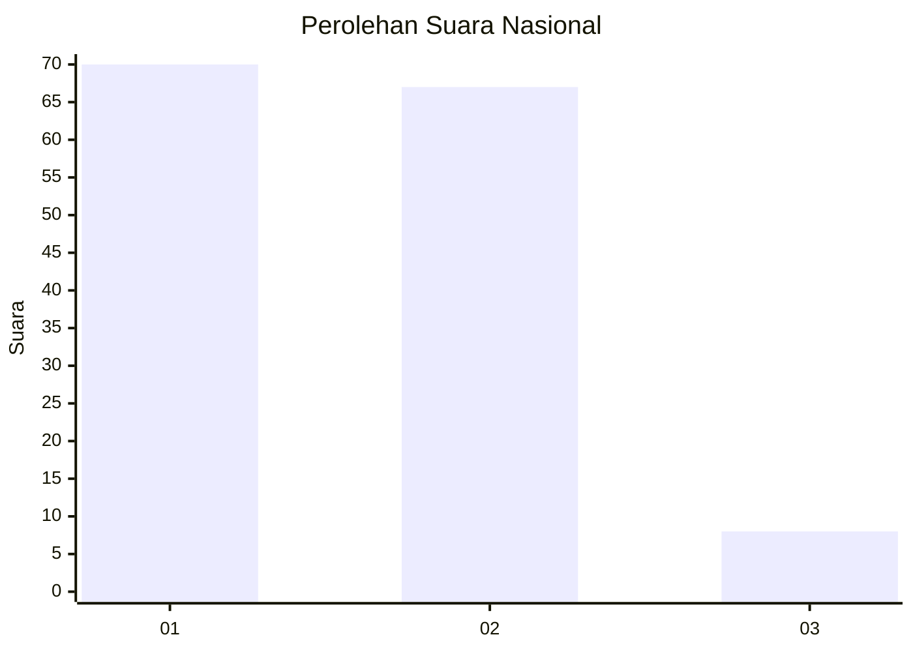
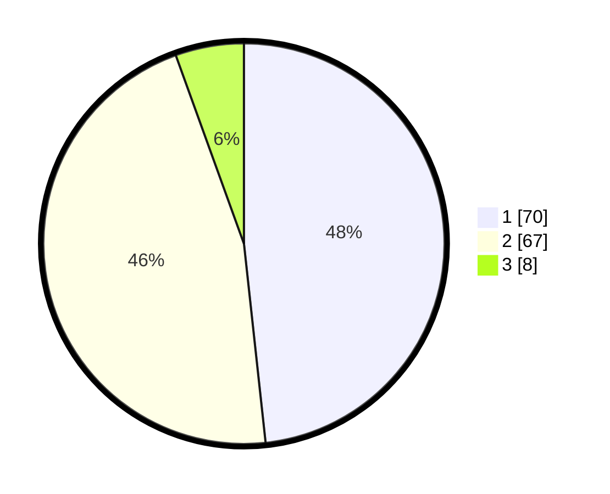

# Hasil

## Grafik

## Tabel

| No. | Nama Paslon    | Suara | Suara (raw) | Persentase |
|:--- |:-------------- | -----:| -----------:| ----------:|
| 1   | ANIES MUHAIMIN | 70    | [70][p-1]   | 48,28      |
| 2   | PRABOWO GIBRAN | 67    | [67][p-2]   | 46,21      |
| 3   | GANJAR MAHFUD  | 8     | [8][p-3]    | 5,52       |

[p-1]: https://github.com/gigit-pemilu/pemilu-2024/blob/main/pilpres/hitung-suara/sub/11-aceh/sub/16-aceh-tamiang/sub/08-rantau/sub/2017-mekar-jaya/sub/005-tps/sub/paslon-1.txt
[p-2]: https://github.com/gigit-pemilu/pemilu-2024/blob/main/pilpres/hitung-suara/sub/11-aceh/sub/16-aceh-tamiang/sub/08-rantau/sub/2017-mekar-jaya/sub/005-tps/sub/paslon-2.txt
[p-3]: https://github.com/gigit-pemilu/pemilu-2024/blob/main/pilpres/hitung-suara/sub/11-aceh/sub/16-aceh-tamiang/sub/08-rantau/sub/2017-mekar-jaya/sub/005-tps/sub/paslon-3.txt

## Foto C Plano

https://sirekap-obj-formc.kpu.go.id/f65c/pemilu/ppwp/11/16/08/20/17/1116082017005-20240214-155212--edda4bb5-8a67-4b4e-bf73-72b87e5077aa.jpg

https://sirekap-obj-formc.kpu.go.id/f65c/pemilu/ppwp/11/16/08/20/17/1116082017005-20240214-185231--25e6db93-4cd9-4cb2-815e-90003e4bebc3.jpg

https://sirekap-obj-formc.kpu.go.id/f65c/pemilu/ppwp/11/16/08/20/17/1116082017005-20240214-155649--351e53e8-c403-414a-b3ef-65b22d907626.jpg

## Metadata

| Key        | Value               |
| ---------- | ------------------- |
| Time Stamp | 2024-02-15 00:41:44 |

## DATA PEMILIH TETAP

Jumlah pemilih dalam DPT: **150**.
 * L: **80**.
 * P: **70**.

## DATA PENGGUNA HAK PILIH

Jumlah pengguna hak pilih dalam DPT: **116**.
 * L: **61**.
 * P: **55**.

Jumlah pengguna hak pilih dalam DPTb: **8**.
 * L: **3**.
 * P: **5**.

Jumlah pengguna hak pilih dalam DPK: **23**.
 * L: **10**.
 * P: **13**.

Jumlah pengguna hak pilih: **147**.
 * L: **74**.
 * P: **73**.

## JUMLAH SUARA SAH DAN TIDAK SAH

JUMLAH SELURUH SUARA SAH: **145**.

JUMLAH SUARA TIDAK SAH: **2**.

JUMLAH SELURUH SUARA SAH DAN SUARA TIDAK SAH: **147**.

