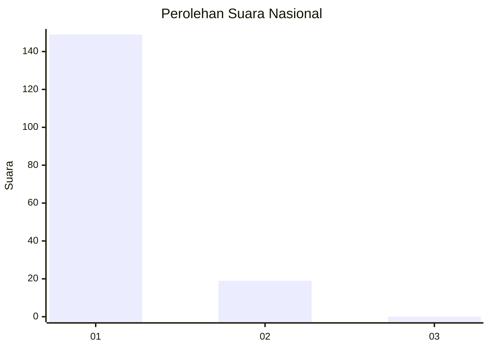
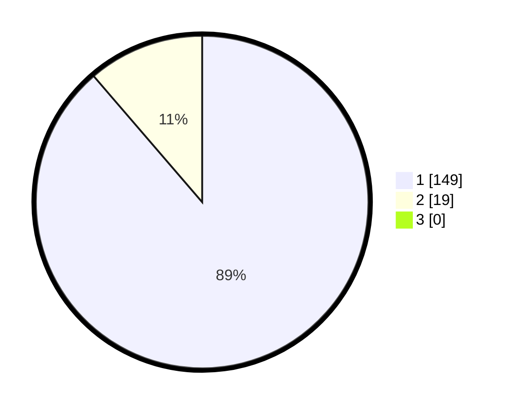

# Hasil

## Grafik

## Tabel

| No. | Nama Paslon    | Suara | Suara (raw) | Persentase |
|:--- |:-------------- | -----:| -----------:| ----------:|
| 1   | ANIES MUHAIMIN | 149   | [149][p-1]  | 88,69      |
| 2   | PRABOWO GIBRAN | 19    | [19][p-2]   | 11,31      |
| 3   | GANJAR MAHFUD  | 0     | [0][p-3]    | 0,00       |

[p-1]: https://github.com/gigit-pemilu/pemilu-2024/blob/main/pilpres/hitung-suara/sub/11-aceh/sub/16-aceh-tamiang/sub/09-banda-mulia/sub/2001-telaga-meuku-sa/sub/003-tps/sub/paslon-1.txt
[p-2]: https://github.com/gigit-pemilu/pemilu-2024/blob/main/pilpres/hitung-suara/sub/11-aceh/sub/16-aceh-tamiang/sub/09-banda-mulia/sub/2001-telaga-meuku-sa/sub/003-tps/sub/paslon-2.txt
[p-3]: https://github.com/gigit-pemilu/pemilu-2024/blob/main/pilpres/hitung-suara/sub/11-aceh/sub/16-aceh-tamiang/sub/09-banda-mulia/sub/2001-telaga-meuku-sa/sub/003-tps/sub/paslon-3.txt

## Foto C Plano

https://sirekap-obj-formc.kpu.go.id/7c06/pemilu/ppwp/11/16/09/20/01/1116092001003-20240217-230844--d62b5ebc-770b-4db0-a463-22c22565501a.jpg

https://sirekap-obj-formc.kpu.go.id/7c06/pemilu/ppwp/11/16/09/20/01/1116092001003-20240217-230207--5a558ecb-c1a4-46a8-849c-9033ad39f920.jpg

## Metadata

| Key        | Value               |
| ---------- | ------------------- |
| Time Stamp | 2024-02-19 06:16:00 |

