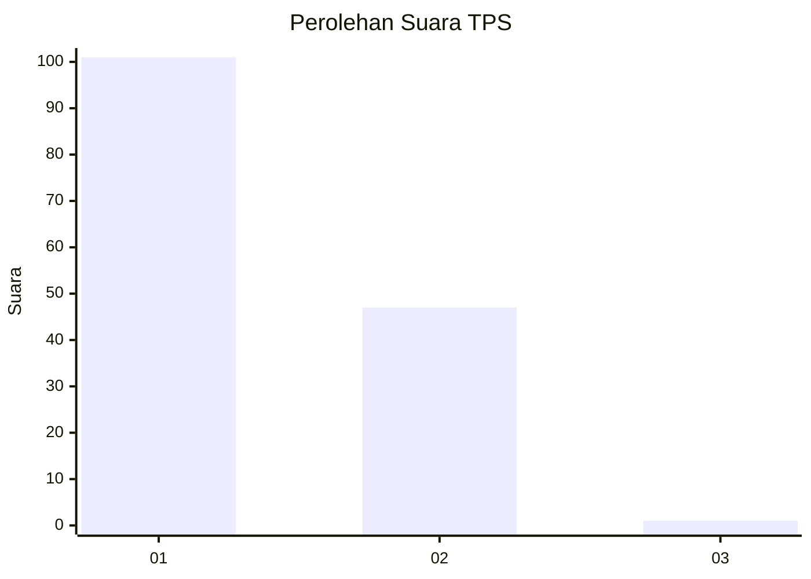
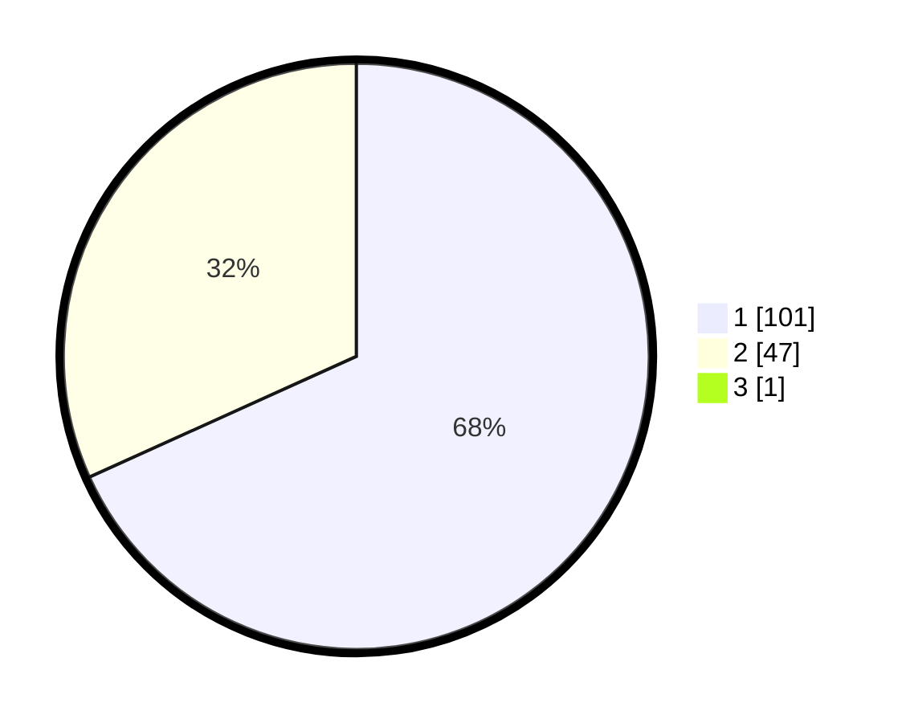

# Hasil

## Grafik

## Tabel

| No. | Nama Paslon    | Suara | Suara (raw) | Persentase |
|:--- |:-------------- | -----:| -----------:| ----------:|
| 1   | ANIES MUHAIMIN | 101   | [101][p-1]  | 67,79      |
| 2   | PRABOWO GIBRAN | 47    | [47][p-2]   | 31,54      |
| 3   | GANJAR MAHFUD  | 1     | [1][p-3]    | 0,67       |

[p-1]: https://github.com/gigit-pemilu/pemilu-2024-11-aceh/blob/main/pilpres/hitung-suara/sub/11-aceh/sub/16-aceh-tamiang/sub/09-banda-mulia/sub/2006-besar/sub/003-tps/sub/paslon-1.txt
[p-2]: https://github.com/gigit-pemilu/pemilu-2024-11-aceh/blob/main/pilpres/hitung-suara/sub/11-aceh/sub/16-aceh-tamiang/sub/09-banda-mulia/sub/2006-besar/sub/003-tps/sub/paslon-2.txt
[p-3]: https://github.com/gigit-pemilu/pemilu-2024-11-aceh/blob/main/pilpres/hitung-suara/sub/11-aceh/sub/16-aceh-tamiang/sub/09-banda-mulia/sub/2006-besar/sub/003-tps/sub/paslon-3.txt

## Foto C Plano

https://sirekap-obj-formc.kpu.go.id/9252/pemilu/ppwp/11/16/09/20/06/1116092006003-20240220-154607--b37cb38c-d5b4-4942-a089-cc8e7146ab01.jpg

https://sirekap-obj-formc.kpu.go.id/9252/pemilu/ppwp/11/16/09/20/06/1116092006003-20240220-213717--312a8512-8649-4af6-bd5e-d7c137125cea.jpg

https://sirekap-obj-formc.kpu.go.id/9252/pemilu/ppwp/11/16/09/20/06/1116092006003-20240220-164343--ad0c030a-625c-4702-8fb5-2677d0aa7dd0.jpg

## Metadata

| Key        | Value               |
| ---------- | ------------------- |
| Time Stamp | 2024-02-20 22:00:00 |

