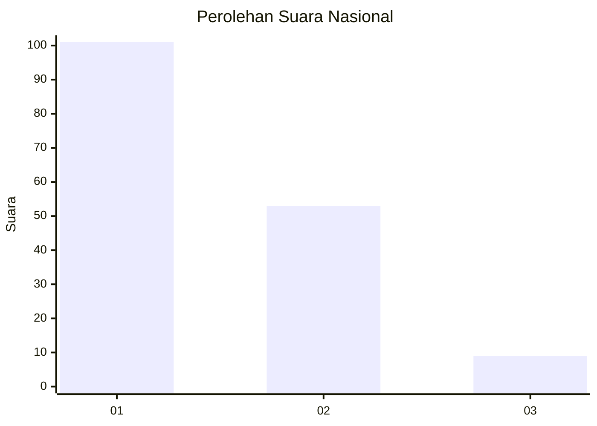
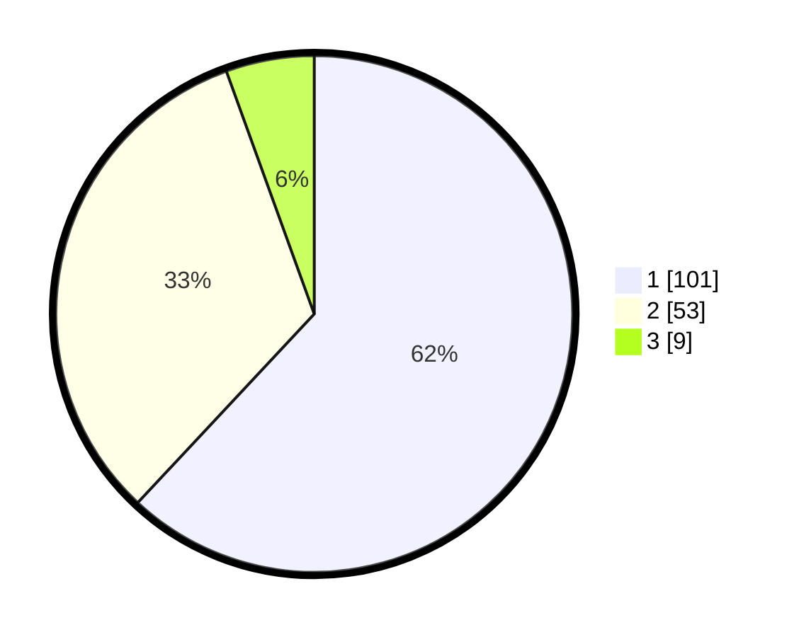

# Hasil

## Grafik

## Tabel

| No. | Nama Paslon    | Suara | Suara (raw) | Persentase |
|:--- |:-------------- | -----:| -----------:| ----------:|
| 1   | ANIES MUHAIMIN | 101   | [101][p-1]  | 61,96      |
| 2   | PRABOWO GIBRAN | 53    | [53][p-2]   | 32,52      |
| 3   | GANJAR MAHFUD  | 9     | [9][p-3]    | 5,52       |

[p-1]: https://github.com/gigit-pemilu/pemilu-2024/blob/main/pilpres/hitung-suara/sub/11-aceh/sub/16-aceh-tamiang/sub/10-bandar-pusaka/sub/2006-batang-ara/sub/001-tps/sub/paslon-1.txt
[p-2]: https://github.com/gigit-pemilu/pemilu-2024/blob/main/pilpres/hitung-suara/sub/11-aceh/sub/16-aceh-tamiang/sub/10-bandar-pusaka/sub/2006-batang-ara/sub/001-tps/sub/paslon-2.txt
[p-3]: https://github.com/gigit-pemilu/pemilu-2024/blob/main/pilpres/hitung-suara/sub/11-aceh/sub/16-aceh-tamiang/sub/10-bandar-pusaka/sub/2006-batang-ara/sub/001-tps/sub/paslon-3.txt

## Foto C Plano

https://sirekap-obj-formc.kpu.go.id/93f5/pemilu/ppwp/11/16/10/20/06/1116102006001-20240219-170457--b8f7a9c9-f629-4efd-9aca-c0147af36991.jpg

https://sirekap-obj-formc.kpu.go.id/93f5/pemilu/ppwp/11/16/10/20/06/1116102006001-20240219-170208--8f8f4980-0239-4d3c-ba57-b279afc7c0ba.jpg

https://sirekap-obj-formc.kpu.go.id/93f5/pemilu/ppwp/11/16/10/20/06/1116102006001-20240219-170306--5947848e-704b-4205-9835-99260e4ff7e2.jpg

## Metadata

| Key        | Value               |
| ---------- | ------------------- |
| Time Stamp | 2024-02-24 22:31:28 |

## DATA PEMILIH TETAP

Jumlah pemilih dalam DPT: **195**.
 * L: **92**.
 * P: **103**.

## DATA PENGGUNA HAK PILIH

Jumlah pengguna hak pilih dalam DPT: **163**.
 * L: **78**.
 * P: **85**.

Jumlah pengguna hak pilih dalam DPTb: **3**.
 * L: **2**.
 * P: **1**.

Jumlah pengguna hak pilih dalam DPK: **1**.
 * L: **1**.
 * P: **0**.

Jumlah pengguna hak pilih: **167**.
 * L: **81**.
 * P: **86**.

## JUMLAH SUARA SAH DAN TIDAK SAH

JUMLAH SELURUH SUARA SAH: **163**.

JUMLAH SUARA TIDAK SAH: **4**.

JUMLAH SELURUH SUARA SAH DAN SUARA TIDAK SAH: **167**.

