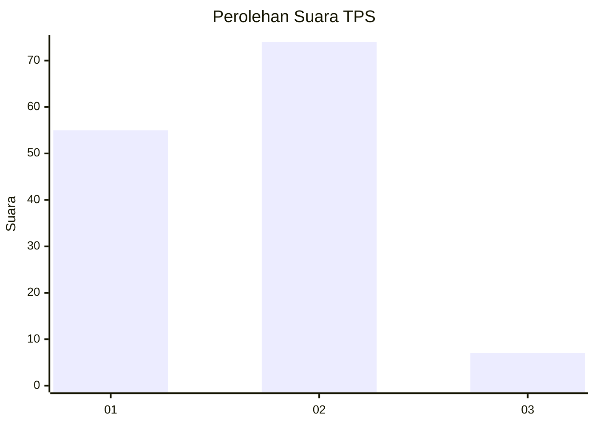
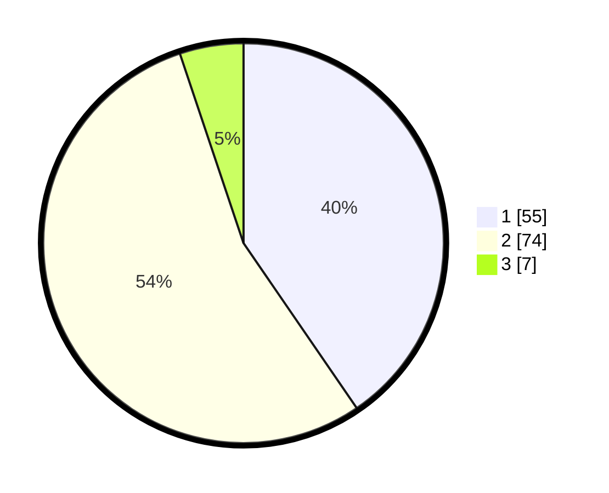

# Hasil

## Grafik

## Tabel

| No. | Nama Paslon    | Suara | Suara (raw) | Persentase |
|:--- |:-------------- | -----:| -----------:| ----------:|
| 1   | ANIES MUHAIMIN | 55    | [55][p-1]   | 40,44      |
| 2   | PRABOWO GIBRAN | 74    | [74][p-2]   | 54,41      |
| 3   | GANJAR MAHFUD  | 7     | [7][p-3]    | 5,15       |

[p-1]: https://github.com/gigit-pemilu/pemilu-2024-11-aceh/blob/main/pilpres/hitung-suara/sub/11-aceh/sub/16-aceh-tamiang/sub/10-bandar-pusaka/sub/2012-pantai-cempa/sub/004-tps/sub/paslon-1.txt
[p-2]: https://github.com/gigit-pemilu/pemilu-2024-11-aceh/blob/main/pilpres/hitung-suara/sub/11-aceh/sub/16-aceh-tamiang/sub/10-bandar-pusaka/sub/2012-pantai-cempa/sub/004-tps/sub/paslon-2.txt
[p-3]: https://github.com/gigit-pemilu/pemilu-2024-11-aceh/blob/main/pilpres/hitung-suara/sub/11-aceh/sub/16-aceh-tamiang/sub/10-bandar-pusaka/sub/2012-pantai-cempa/sub/004-tps/sub/paslon-3.txt

## Foto C Plano

https://sirekap-obj-formc.kpu.go.id/26d5/pemilu/ppwp/11/16/10/20/12/1116102012004-20240223-195800--c522c135-c11a-483f-be86-30be1d402be9.jpg

https://sirekap-obj-formc.kpu.go.id/26d5/pemilu/ppwp/11/16/10/20/12/1116102012004-20240223-195956--69e862c7-630b-4915-bf4c-b5baf65aee27.jpg

## Metadata

| Key        | Value               |
| ---------- | ------------------- |
| Time Stamp | 2024-02-26 12:00:00 |

