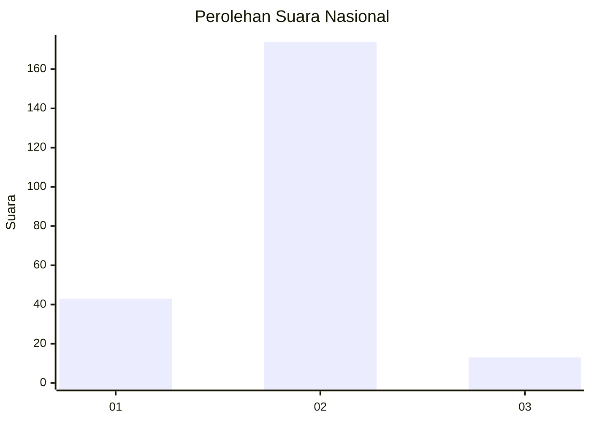
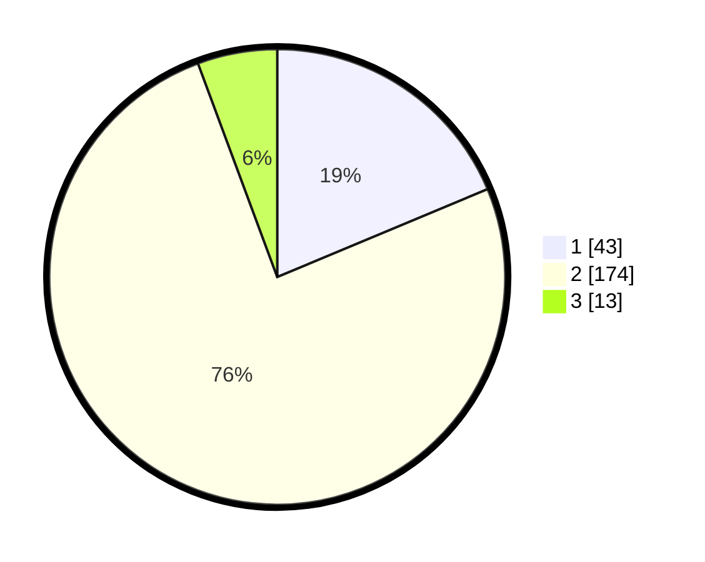

# Hasil

## Grafik

## Tabel

| No. | Nama Paslon    | Suara | Suara (raw) | Persentase |
|:--- |:-------------- | -----:| -----------:| ----------:|
| 1   | ANIES MUHAIMIN | 43    | [43][p-1]   | 18,70      |
| 2   | PRABOWO GIBRAN | 174   | [174][p-2]  | 75,65      |
| 3   | GANJAR MAHFUD  | 13    | [13][p-3]   | 5,65       |

[p-1]: https://github.com/gigit-pemilu/pemilu-2024/blob/main/pilpres/hitung-suara/sub/11-aceh/sub/16-aceh-tamiang/sub/11-tenggulun/sub/2001-tebing-tinggi/sub/003-tps/sub/paslon-1.txt
[p-2]: https://github.com/gigit-pemilu/pemilu-2024/blob/main/pilpres/hitung-suara/sub/11-aceh/sub/16-aceh-tamiang/sub/11-tenggulun/sub/2001-tebing-tinggi/sub/003-tps/sub/paslon-2.txt
[p-3]: https://github.com/gigit-pemilu/pemilu-2024/blob/main/pilpres/hitung-suara/sub/11-aceh/sub/16-aceh-tamiang/sub/11-tenggulun/sub/2001-tebing-tinggi/sub/003-tps/sub/paslon-3.txt

## Foto C Plano

https://sirekap-obj-formc.kpu.go.id/6f05/pemilu/ppwp/11/16/11/20/01/1116112001003-20240218-115543--45708453-5cb3-4c5b-a6d1-2298eb780626.jpg

https://sirekap-obj-formc.kpu.go.id/6f05/pemilu/ppwp/11/16/11/20/01/1116112001003-20240218-115618--4edd6550-19e5-4a24-8668-35bb040c32fb.jpg

https://sirekap-obj-formc.kpu.go.id/6f05/pemilu/ppwp/11/16/11/20/01/1116112001003-20240218-115722--0c823645-0672-4e58-926e-1171e2b4ff76.jpg

## Metadata

| Key        | Value               |
| ---------- | ------------------- |
| Time Stamp | 2024-02-19 06:16:00 |

## DATA PEMILIH TETAP

Jumlah pemilih dalam DPT: **263**.
 * L: **139**.
 * P: **124**.

## DATA PENGGUNA HAK PILIH

Jumlah pengguna hak pilih dalam DPT: **236**.
 * L: **128**.
 * P: **108**.

Jumlah pengguna hak pilih dalam DPTb: **3**.
 * L: **0**.
 * P: **3**.

Jumlah pengguna hak pilih dalam DPK: **1**.
 * L: **0**.
 * P: **1**.

Jumlah pengguna hak pilih: **240**.
 * L: **128**.
 * P: **112**.

## JUMLAH SUARA SAH DAN TIDAK SAH

JUMLAH SELURUH SUARA SAH: **230**.

JUMLAH SUARA TIDAK SAH: **10**.

JUMLAH SELURUH SUARA SAH DAN SUARA TIDAK SAH: **240**.

