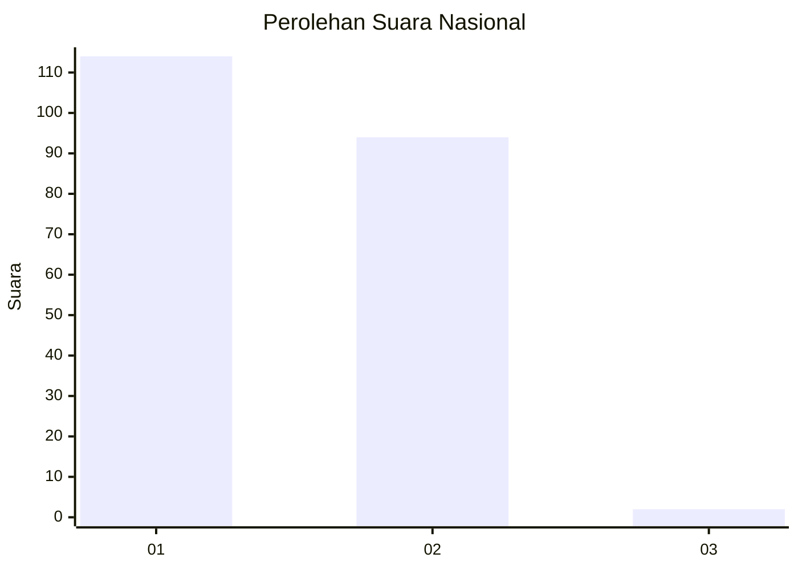
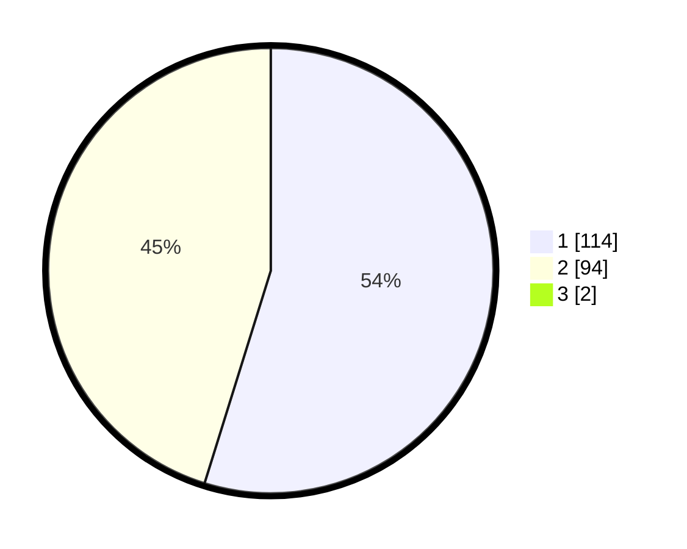

# Hasil

## Grafik

## Tabel

| No. | Nama Paslon    | Suara | Suara (raw) | Persentase |
|:--- |:-------------- | -----:| -----------:| ----------:|
| 1   | ANIES MUHAIMIN | 114   | [114][p-1]  | 54,29      |
| 2   | PRABOWO GIBRAN | 94    | [94][p-2]   | 44,76      |
| 3   | GANJAR MAHFUD  | 2     | [2][p-3]    | 0,95       |

[p-1]: https://github.com/gigit-pemilu/pemilu-2024/blob/main/pilpres/hitung-suara/sub/11-aceh/sub/16-aceh-tamiang/sub/11-tenggulun/sub/2002-rimba-sawang/sub/002-tps/sub/paslon-1.txt
[p-2]: https://github.com/gigit-pemilu/pemilu-2024/blob/main/pilpres/hitung-suara/sub/11-aceh/sub/16-aceh-tamiang/sub/11-tenggulun/sub/2002-rimba-sawang/sub/002-tps/sub/paslon-2.txt
[p-3]: https://github.com/gigit-pemilu/pemilu-2024/blob/main/pilpres/hitung-suara/sub/11-aceh/sub/16-aceh-tamiang/sub/11-tenggulun/sub/2002-rimba-sawang/sub/002-tps/sub/paslon-3.txt

## Foto C Plano

https://sirekap-obj-formc.kpu.go.id/de84/pemilu/ppwp/11/16/11/20/02/1116112002002-20240215-144619--543375da-314e-4cf9-993d-74c79a8ca6d3.jpg

https://sirekap-obj-formc.kpu.go.id/de84/pemilu/ppwp/11/16/11/20/02/1116112002002-20240215-005505--f9da223d-8c69-4c52-ab9f-e7f03405130c.jpg

https://sirekap-obj-formc.kpu.go.id/de84/pemilu/ppwp/11/16/11/20/02/1116112002002-20240215-005644--539a19b7-fb8e-48b1-8f5b-acc5c10b1cd7.jpg

## Metadata

| Key        | Value               |
| ---------- | ------------------- |
| Time Stamp | 2024-02-15 20:00:44 |

