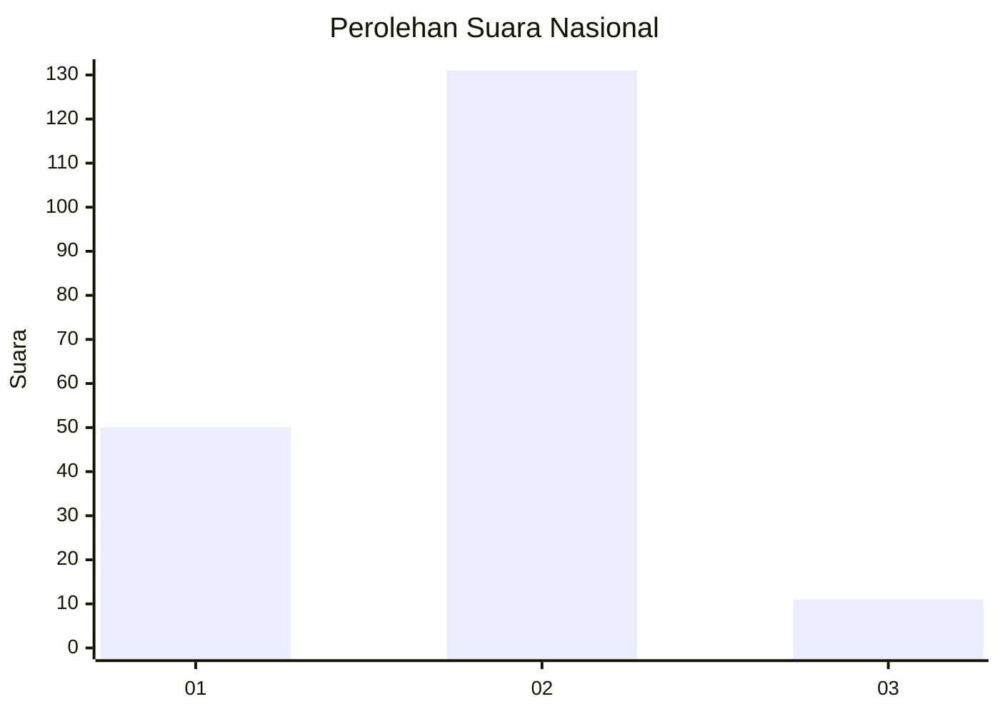
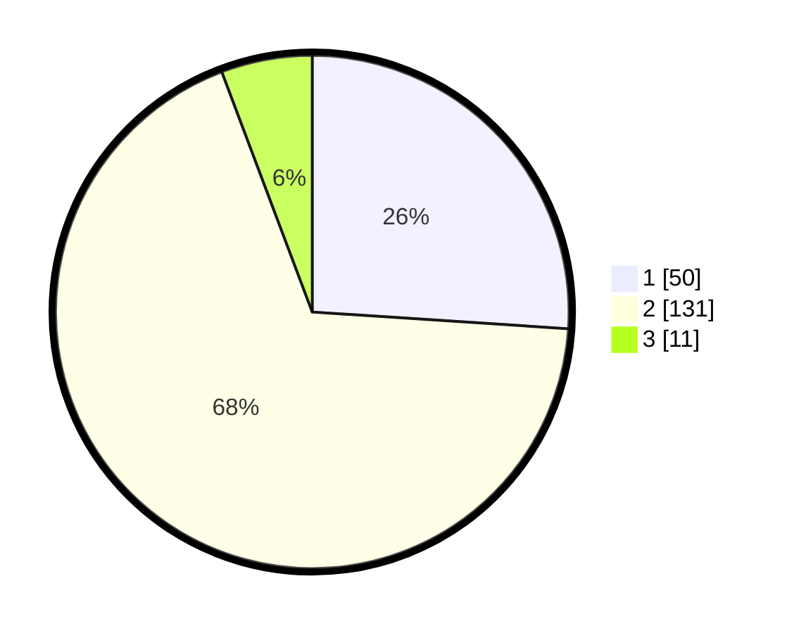

# Hasil

## Grafik

## Tabel

| No. | Nama Paslon    | Suara | Suara (raw) | Persentase |
|:--- |:-------------- | -----:| -----------:| ----------:|
| 1   | ANIES MUHAIMIN | 50    | [50][p-1]   | 26,04      |
| 2   | PRABOWO GIBRAN | 131   | [131][p-2]  | 68,23      |
| 3   | GANJAR MAHFUD  | 11    | [11][p-3]   | 5,73       |

[p-1]: https://github.com/gigit-pemilu/pemilu-2024/blob/main/pilpres/hitung-suara/sub/11-aceh/sub/16-aceh-tamiang/sub/11-tenggulun/sub/2003-tenggulun/sub/003-tps/sub/paslon-1.txt
[p-2]: https://github.com/gigit-pemilu/pemilu-2024/blob/main/pilpres/hitung-suara/sub/11-aceh/sub/16-aceh-tamiang/sub/11-tenggulun/sub/2003-tenggulun/sub/003-tps/sub/paslon-2.txt
[p-3]: https://github.com/gigit-pemilu/pemilu-2024/blob/main/pilpres/hitung-suara/sub/11-aceh/sub/16-aceh-tamiang/sub/11-tenggulun/sub/2003-tenggulun/sub/003-tps/sub/paslon-3.txt

## Foto C Plano

https://sirekap-obj-formc.kpu.go.id/8189/pemilu/ppwp/11/16/11/20/03/1116112003003-20240220-134837--f755bee5-bb16-4aff-87b1-045307304e94.jpg

https://sirekap-obj-formc.kpu.go.id/8189/pemilu/ppwp/11/16/11/20/03/1116112003003-20240220-152629--b32fc463-d947-4a60-ae04-c9a8284ff855.jpg

https://sirekap-obj-formc.kpu.go.id/8189/pemilu/ppwp/11/16/11/20/03/1116112003003-20240220-160139--5de9d6e5-c769-4eb4-a210-7e87236f711e.jpg

## Metadata

| Key        | Value               |
| ---------- | ------------------- |
| Time Stamp | 2024-02-21 13:00:00 |

