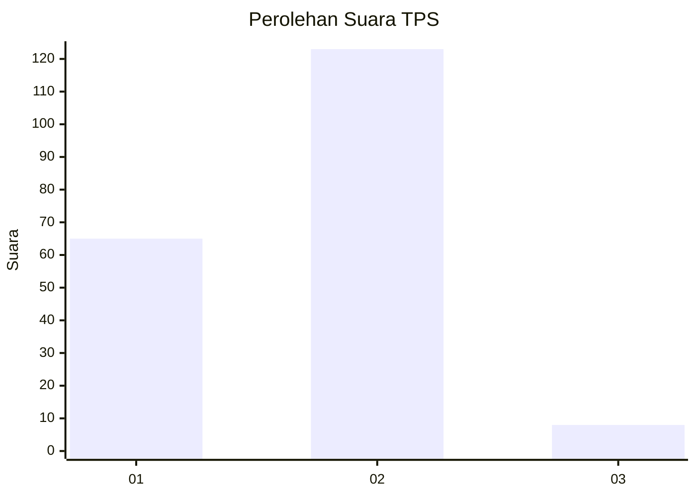
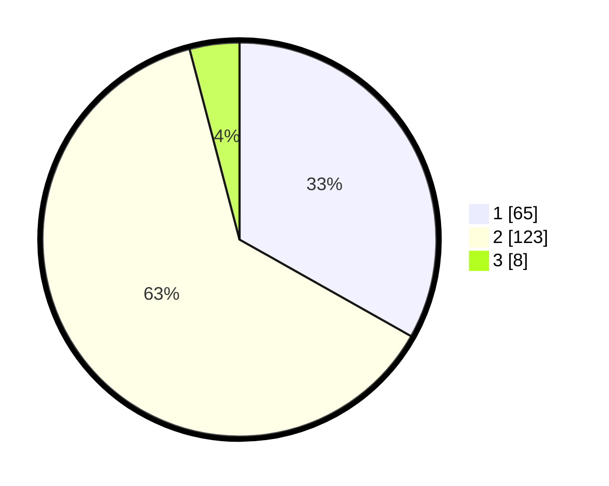

# Hasil

## Grafik

## Tabel

| No. | Nama Paslon    | Suara | Suara (raw) | Persentase |
|:--- |:-------------- | -----:| -----------:| ----------:|
| 1   | ANIES MUHAIMIN | 65    | [65][p-1]   | 33,16      |
| 2   | PRABOWO GIBRAN | 123   | [123][p-2]  | 62,76      |
| 3   | GANJAR MAHFUD  | 8     | [8][p-3]    | 4,08       |

[p-1]: https://github.com/gigit-pemilu/pemilu-2024-11-aceh/blob/main/pilpres/hitung-suara/sub/11-aceh/sub/16-aceh-tamiang/sub/11-tenggulun/sub/2003-tenggulun/sub/004-tps/sub/paslon-1.txt
[p-2]: https://github.com/gigit-pemilu/pemilu-2024-11-aceh/blob/main/pilpres/hitung-suara/sub/11-aceh/sub/16-aceh-tamiang/sub/11-tenggulun/sub/2003-tenggulun/sub/004-tps/sub/paslon-2.txt
[p-3]: https://github.com/gigit-pemilu/pemilu-2024-11-aceh/blob/main/pilpres/hitung-suara/sub/11-aceh/sub/16-aceh-tamiang/sub/11-tenggulun/sub/2003-tenggulun/sub/004-tps/sub/paslon-3.txt

## Foto C Plano

https://sirekap-obj-formc.kpu.go.id/8590/pemilu/ppwp/11/16/11/20/03/1116112003004-20240219-183327--e73232d9-f3a2-4311-8015-b11c87dd8f95.jpg

https://sirekap-obj-formc.kpu.go.id/8590/pemilu/ppwp/11/16/11/20/03/1116112003004-20240215-071428--36098f6f-8480-46c7-a9b4-ab95590267cf.jpg

https://sirekap-obj-formc.kpu.go.id/8590/pemilu/ppwp/11/16/11/20/03/1116112003004-20240215-071521--8cbdb7c3-a8b3-48e9-b33e-320ca287b733.jpg

## Metadata

| Key        | Value               |
| ---------- | ------------------- |
| Time Stamp | 2024-02-19 19:00:00 |

