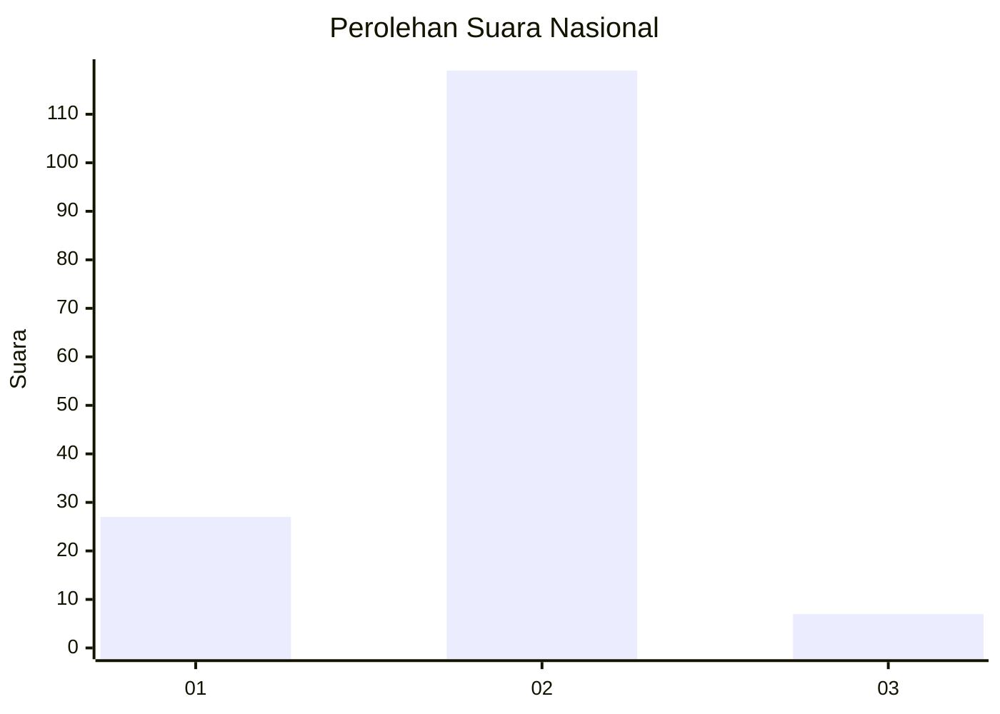
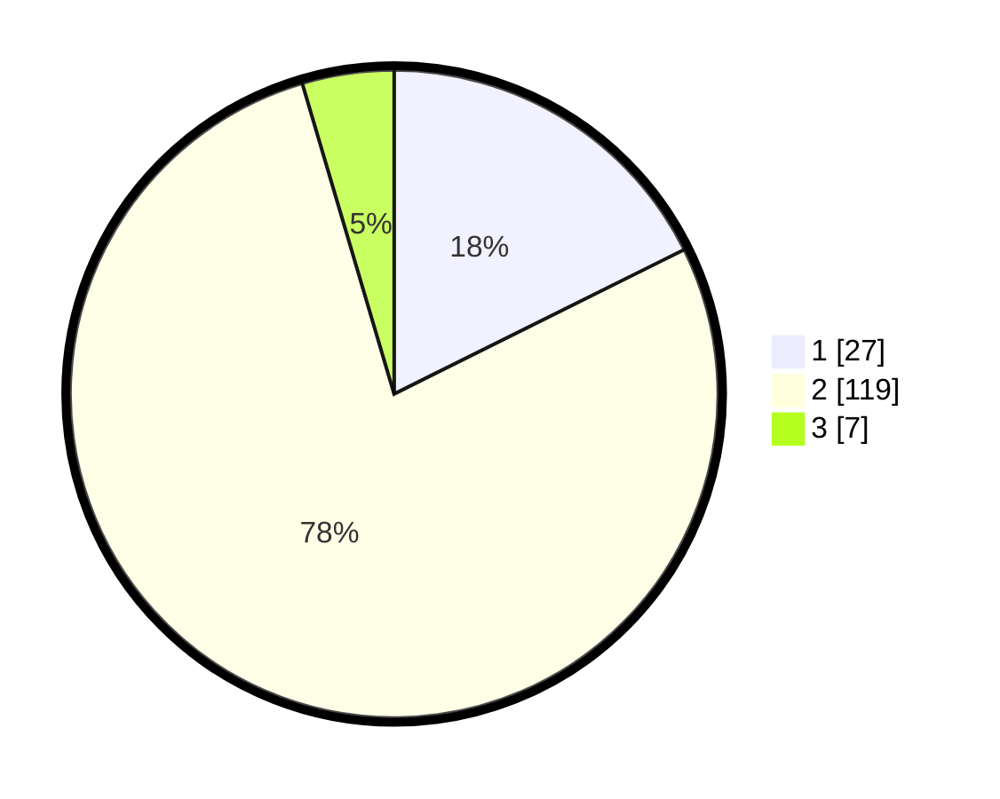

# Hasil

## Grafik

## Tabel

| No. | Nama Paslon    | Suara | Suara (raw) | Persentase |
|:--- |:-------------- | -----:| -----------:| ----------:|
| 1   | ANIES MUHAIMIN | 27    | [27][p-1]   | 17,65      |
| 2   | PRABOWO GIBRAN | 119   | [119][p-2]  | 77,78      |
| 3   | GANJAR MAHFUD  | 7     | [7][p-3]    | 4,58       |

[p-1]: https://github.com/gigit-pemilu/pemilu-2024/blob/main/pilpres/hitung-suara/sub/11-aceh/sub/16-aceh-tamiang/sub/11-tenggulun/sub/2003-tenggulun/sub/013-tps/sub/paslon-1.txt
[p-2]: https://github.com/gigit-pemilu/pemilu-2024/blob/main/pilpres/hitung-suara/sub/11-aceh/sub/16-aceh-tamiang/sub/11-tenggulun/sub/2003-tenggulun/sub/013-tps/sub/paslon-2.txt
[p-3]: https://github.com/gigit-pemilu/pemilu-2024/blob/main/pilpres/hitung-suara/sub/11-aceh/sub/16-aceh-tamiang/sub/11-tenggulun/sub/2003-tenggulun/sub/013-tps/sub/paslon-3.txt

## Foto C Plano

https://sirekap-obj-formc.kpu.go.id/f510/pemilu/ppwp/11/16/11/20/03/1116112003013-20240225-223015--6d287041-df18-46b5-bf96-751b65186a6a.jpg

https://sirekap-obj-formc.kpu.go.id/f510/pemilu/ppwp/11/16/11/20/03/1116112003013-20240225-223110--6be473f3-80b2-451d-8a39-7aa9c141e807.jpg

https://sirekap-obj-formc.kpu.go.id/f510/pemilu/ppwp/11/16/11/20/03/1116112003013-20240225-223204--1c04414d-d99d-46f1-b8c8-b7282eb1f132.jpg

## Metadata

| Key        | Value               |
| ---------- | ------------------- |
| Time Stamp | 2024-02-26 17:00:04 |

