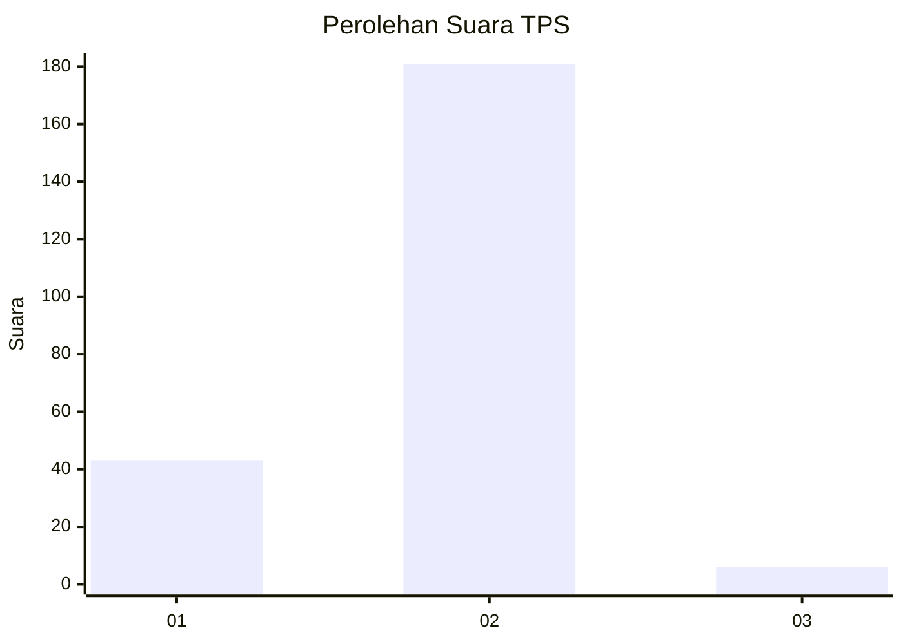
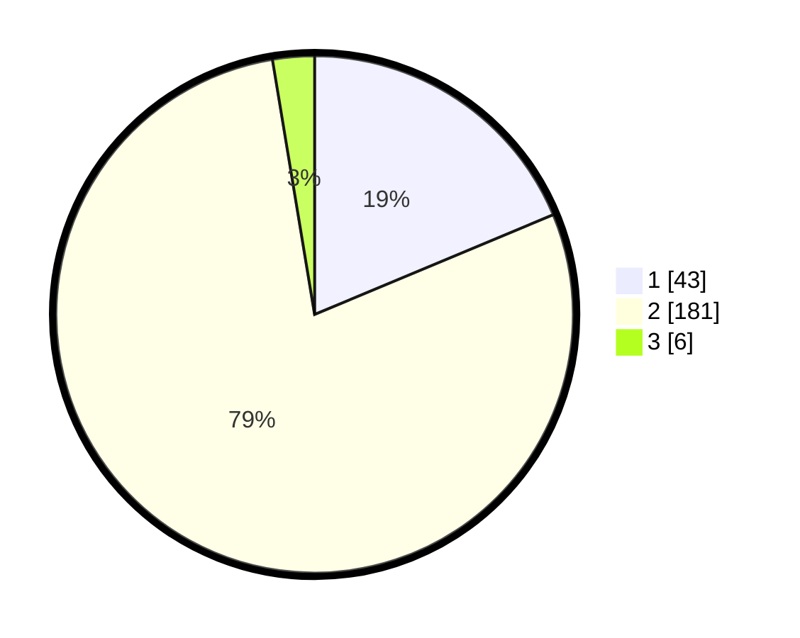

# Hasil

## Grafik

## Tabel

| No. | Nama Paslon    | Suara | Suara (raw) | Persentase |
|:--- |:-------------- | -----:| -----------:| ----------:|
| 1   | ANIES MUHAIMIN | 43    | [43][p-1]   | 18,70      |
| 2   | PRABOWO GIBRAN | 181   | [181][p-2]  | 78,70      |
| 3   | GANJAR MAHFUD  | 6     | [6][p-3]    | 2,61       |

[p-1]: https://github.com/gigit-pemilu/pemilu-2024-11-aceh/blob/main/pilpres/hitung-suara/sub/11-aceh/sub/16-aceh-tamiang/sub/11-tenggulun/sub/2004-selamat/sub/005-tps/sub/paslon-1.txt
[p-2]: https://github.com/gigit-pemilu/pemilu-2024-11-aceh/blob/main/pilpres/hitung-suara/sub/11-aceh/sub/16-aceh-tamiang/sub/11-tenggulun/sub/2004-selamat/sub/005-tps/sub/paslon-2.txt
[p-3]: https://github.com/gigit-pemilu/pemilu-2024-11-aceh/blob/main/pilpres/hitung-suara/sub/11-aceh/sub/16-aceh-tamiang/sub/11-tenggulun/sub/2004-selamat/sub/005-tps/sub/paslon-3.txt

## Foto C Plano

https://sirekap-obj-formc.kpu.go.id/e0c1/pemilu/ppwp/11/16/11/20/04/1116112004005-20240215-100636--b42462b1-01c8-4a2b-a5f1-57581098e2b1.jpg

https://sirekap-obj-formc.kpu.go.id/e0c1/pemilu/ppwp/11/16/11/20/04/1116112004005-20240215-003807--0d009f39-3e47-4d19-9e7a-ed3f60071419.jpg

https://sirekap-obj-formc.kpu.go.id/e0c1/pemilu/ppwp/11/16/11/20/04/1116112004005-20240215-004103--60225af8-0857-42a5-835b-e54f5b0a6df7.jpg

## Metadata

| Key        | Value               |
| ---------- | ------------------- |
| Time Stamp | 2024-02-15 20:30:46 |

