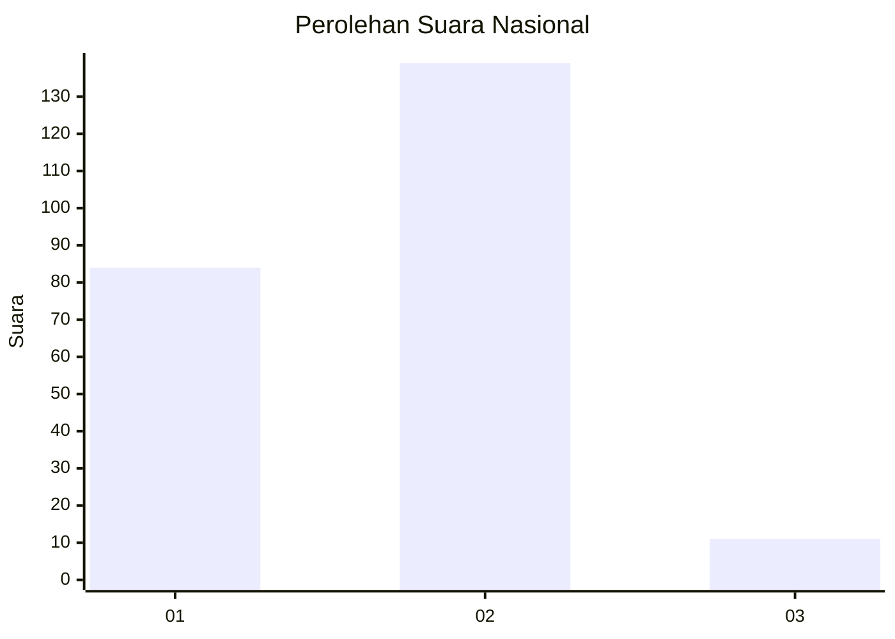
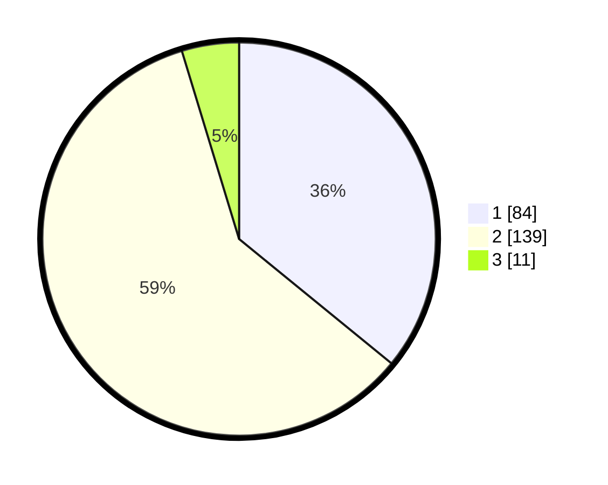

# Hasil

## Grafik

## Tabel

| No. | Nama Paslon    | Suara | Suara (raw) | Persentase |
|:--- |:-------------- | -----:| -----------:| ----------:|
| 1   | ANIES MUHAIMIN | 84    | [84][p-1]   | 35,90      |
| 2   | PRABOWO GIBRAN | 139   | [139][p-2]  | 59,40      |
| 3   | GANJAR MAHFUD  | 11    | [11][p-3]   | 4,70       |

[p-1]: https://github.com/gigit-pemilu/pemilu-2024/blob/main/pilpres/hitung-suara/sub/11-aceh/sub/16-aceh-tamiang/sub/11-tenggulun/sub/2004-selamat/sub/013-tps/sub/paslon-1.txt
[p-2]: https://github.com/gigit-pemilu/pemilu-2024/blob/main/pilpres/hitung-suara/sub/11-aceh/sub/16-aceh-tamiang/sub/11-tenggulun/sub/2004-selamat/sub/013-tps/sub/paslon-2.txt
[p-3]: https://github.com/gigit-pemilu/pemilu-2024/blob/main/pilpres/hitung-suara/sub/11-aceh/sub/16-aceh-tamiang/sub/11-tenggulun/sub/2004-selamat/sub/013-tps/sub/paslon-3.txt

## Foto C Plano

https://sirekap-obj-formc.kpu.go.id/5c6d/pemilu/ppwp/11/16/11/20/04/1116112004013-20240219-170154--88dec03b-ea48-4f40-967b-98e73ce0df96.jpg

https://sirekap-obj-formc.kpu.go.id/5c6d/pemilu/ppwp/11/16/11/20/04/1116112004013-20240215-043601--58df8021-af93-4275-a8f3-80630ec03d19.jpg

https://sirekap-obj-formc.kpu.go.id/5c6d/pemilu/ppwp/11/16/11/20/04/1116112004013-20240215-043659--6f9a8b9e-2555-44d0-8cf9-e02da778fa10.jpg

## Metadata

| Key        | Value               |
| ---------- | ------------------- |
| Time Stamp | 2024-02-19 18:00:00 |

