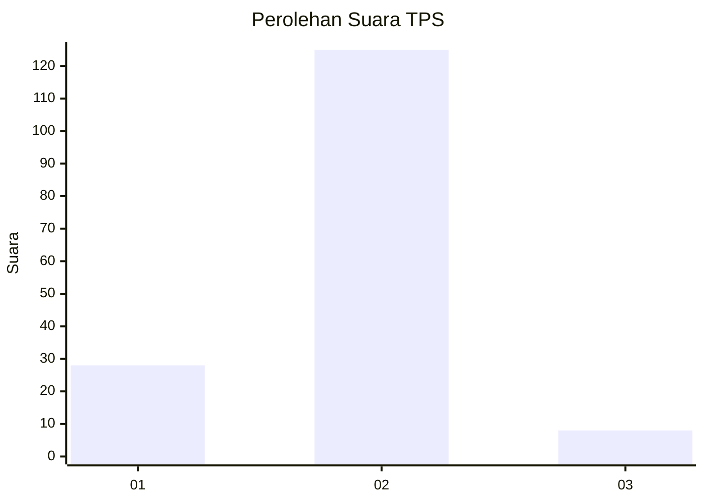
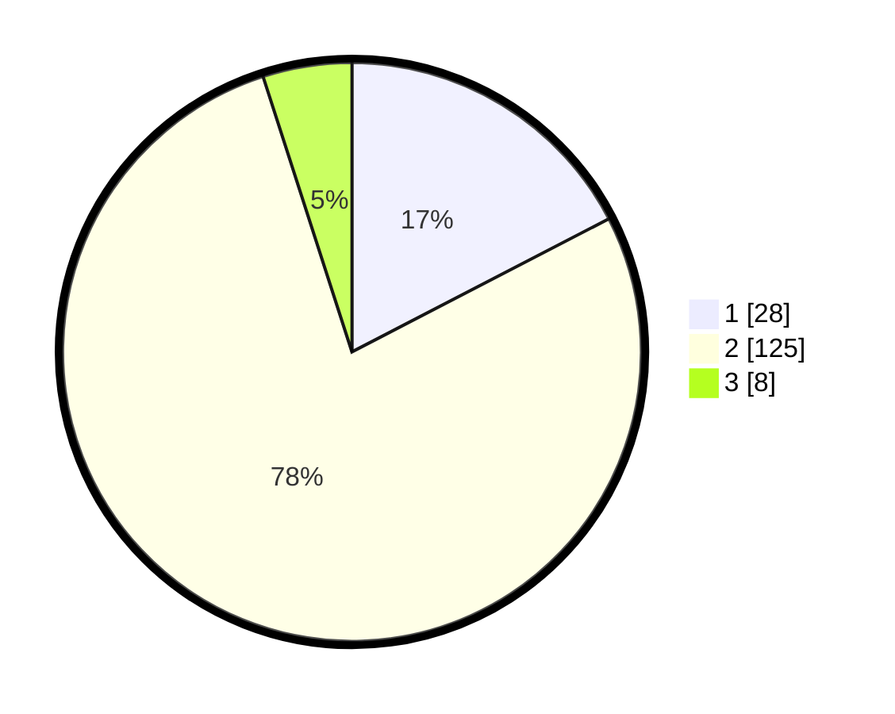

# Hasil

## Grafik

## Tabel

| No. | Nama Paslon    | Suara | Suara (raw) | Persentase |
|:--- |:-------------- | -----:| -----------:| ----------:|
| 1   | ANIES MUHAIMIN | 28    | [28][p-1]   | 17,39      |
| 2   | PRABOWO GIBRAN | 125   | [125][p-2]  | 77,64      |
| 3   | GANJAR MAHFUD  | 8     | [8][p-3]    | 4,97       |

[p-1]: https://github.com/gigit-pemilu/pemilu-2024-11-aceh/blob/main/pilpres/hitung-suara/sub/11-aceh/sub/16-aceh-tamiang/sub/11-tenggulun/sub/2004-selamat/sub/014-tps/sub/paslon-1.txt
[p-2]: https://github.com/gigit-pemilu/pemilu-2024-11-aceh/blob/main/pilpres/hitung-suara/sub/11-aceh/sub/16-aceh-tamiang/sub/11-tenggulun/sub/2004-selamat/sub/014-tps/sub/paslon-2.txt
[p-3]: https://github.com/gigit-pemilu/pemilu-2024-11-aceh/blob/main/pilpres/hitung-suara/sub/11-aceh/sub/16-aceh-tamiang/sub/11-tenggulun/sub/2004-selamat/sub/014-tps/sub/paslon-3.txt

## Foto C Plano

https://sirekap-obj-formc.kpu.go.id/dbc0/pemilu/ppwp/11/16/11/20/04/1116112004014-20240220-105031--6155d838-7497-44ce-b9b2-373d2ae08e36.jpg

https://sirekap-obj-formc.kpu.go.id/dbc0/pemilu/ppwp/11/16/11/20/04/1116112004014-20240214-234616--0dd3884d-eb7d-43ed-a152-0d3a9867b8fc.jpg

https://sirekap-obj-formc.kpu.go.id/dbc0/pemilu/ppwp/11/16/11/20/04/1116112004014-20240214-234838--40946488-e19e-4b37-9d5d-f84de61cbbb3.jpg

## Metadata

| Key        | Value               |
| ---------- | ------------------- |
| Time Stamp | 2024-02-20 11:00:00 |

