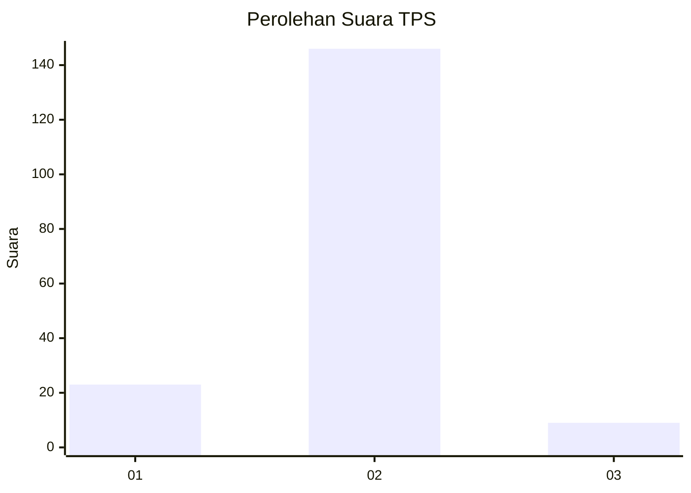
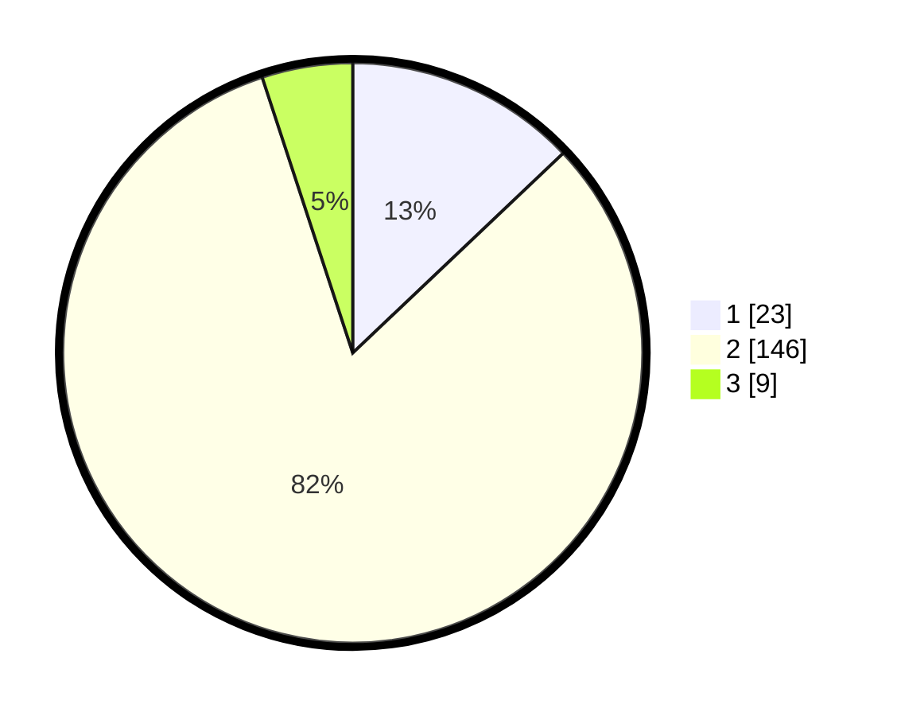

# Hasil

## Grafik

## Tabel

| No. | Nama Paslon    | Suara | Suara (raw) | Persentase |
|:--- |:-------------- | -----:| -----------:| ----------:|
| 1   | ANIES MUHAIMIN | 23    | [23][p-1]   | 12,92      |
| 2   | PRABOWO GIBRAN | 146   | [146][p-2]  | 82,02      |
| 3   | GANJAR MAHFUD  | 9     | [9][p-3]    | 5,06       |

[p-1]: https://github.com/gigit-pemilu/pemilu-2024-11-aceh/blob/main/pilpres/hitung-suara/sub/11-aceh/sub/16-aceh-tamiang/sub/11-tenggulun/sub/2004-selamat/sub/015-tps/sub/paslon-1.txt
[p-2]: https://github.com/gigit-pemilu/pemilu-2024-11-aceh/blob/main/pilpres/hitung-suara/sub/11-aceh/sub/16-aceh-tamiang/sub/11-tenggulun/sub/2004-selamat/sub/015-tps/sub/paslon-2.txt
[p-3]: https://github.com/gigit-pemilu/pemilu-2024-11-aceh/blob/main/pilpres/hitung-suara/sub/11-aceh/sub/16-aceh-tamiang/sub/11-tenggulun/sub/2004-selamat/sub/015-tps/sub/paslon-3.txt

## Foto C Plano

https://sirekap-obj-formc.kpu.go.id/7355/pemilu/ppwp/11/16/11/20/04/1116112004015-20240220-174048--2ad8f0b9-8944-4528-92cb-6e82ab54f976.jpg

https://sirekap-obj-formc.kpu.go.id/7355/pemilu/ppwp/11/16/11/20/04/1116112004015-20240215-044557--1fc729d6-288e-4a9d-994b-1f5655696123.jpg

https://sirekap-obj-formc.kpu.go.id/7355/pemilu/ppwp/11/16/11/20/04/1116112004015-20240215-044705--18e7d21d-513a-4bde-a1fa-1d81ca0ebfe1.jpg

## Metadata

| Key        | Value               |
| ---------- | ------------------- |
| Time Stamp | 2024-02-20 18:00:00 |

