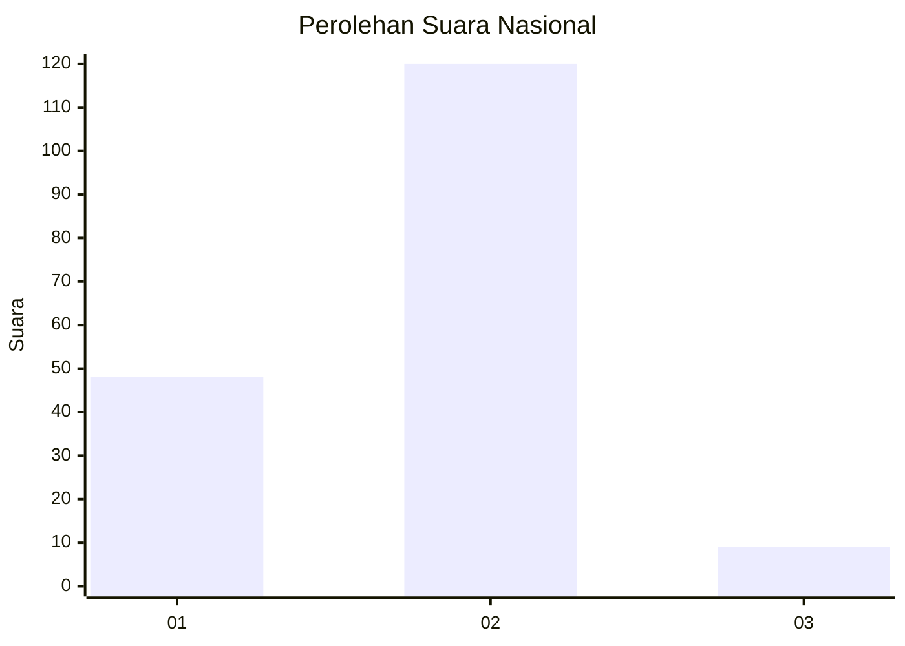
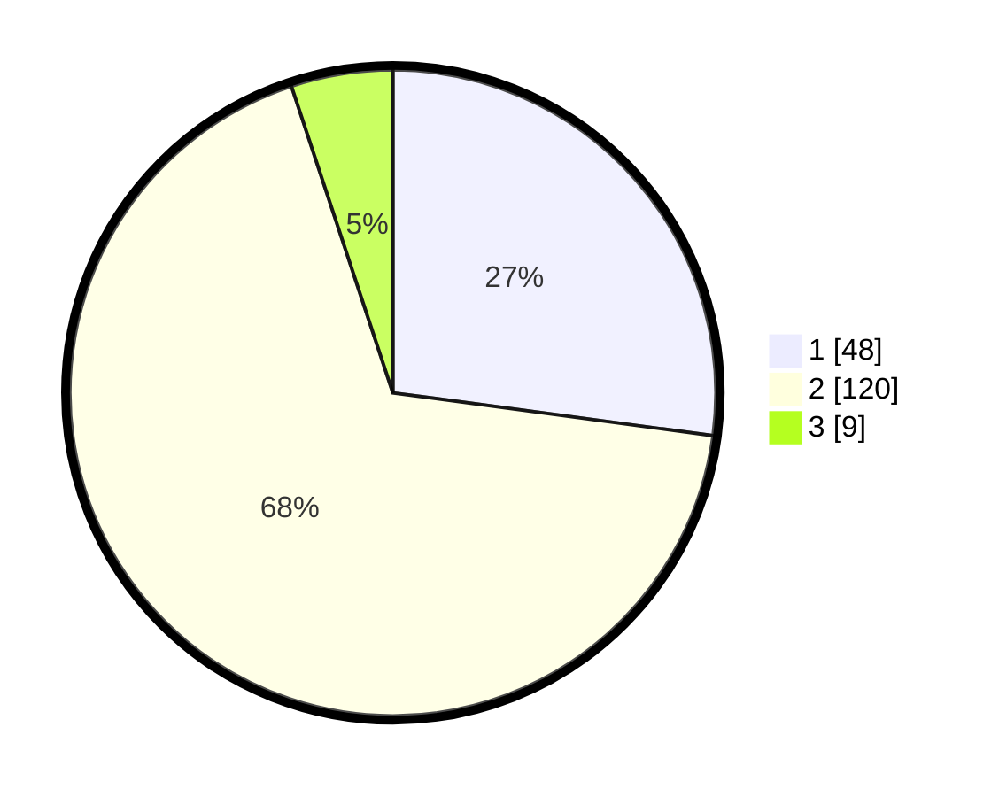

# Hasil

## Grafik

## Tabel

| No. | Nama Paslon    | Suara | Suara (raw) | Persentase |
|:--- |:-------------- | -----:| -----------:| ----------:|
| 1   | ANIES MUHAIMIN | 48    | [48][p-1]   | 27,12      |
| 2   | PRABOWO GIBRAN | 120   | [120][p-2]  | 67,80      |
| 3   | GANJAR MAHFUD  | 9     | [9][p-3]    | 5,08       |

[p-1]: https://github.com/gigit-pemilu/pemilu-2024/blob/main/pilpres/hitung-suara/sub/11-aceh/sub/16-aceh-tamiang/sub/11-tenggulun/sub/2005-simpang-kiri/sub/002-tps/sub/paslon-1.txt
[p-2]: https://github.com/gigit-pemilu/pemilu-2024/blob/main/pilpres/hitung-suara/sub/11-aceh/sub/16-aceh-tamiang/sub/11-tenggulun/sub/2005-simpang-kiri/sub/002-tps/sub/paslon-2.txt
[p-3]: https://github.com/gigit-pemilu/pemilu-2024/blob/main/pilpres/hitung-suara/sub/11-aceh/sub/16-aceh-tamiang/sub/11-tenggulun/sub/2005-simpang-kiri/sub/002-tps/sub/paslon-3.txt

## Foto C Plano

https://sirekap-obj-formc.kpu.go.id/24ec/pemilu/ppwp/11/16/11/20/05/1116112005002-20240215-001238--629b6a64-18cb-4a53-8c78-8d0fa7c3e322.jpg

https://sirekap-obj-formc.kpu.go.id/24ec/pemilu/ppwp/11/16/11/20/05/1116112005002-20240215-001626--602a1bd5-0ea2-4b18-ad18-96f08cd1f91b.jpg

https://sirekap-obj-formc.kpu.go.id/24ec/pemilu/ppwp/11/16/11/20/05/1116112005002-20240215-002911--baf9aa95-ac5d-46f5-93ab-bf19f9808777.jpg

## Metadata

| Key        | Value               |
| ---------- | ------------------- |
| Time Stamp | 2024-02-15 19:30:26 |

