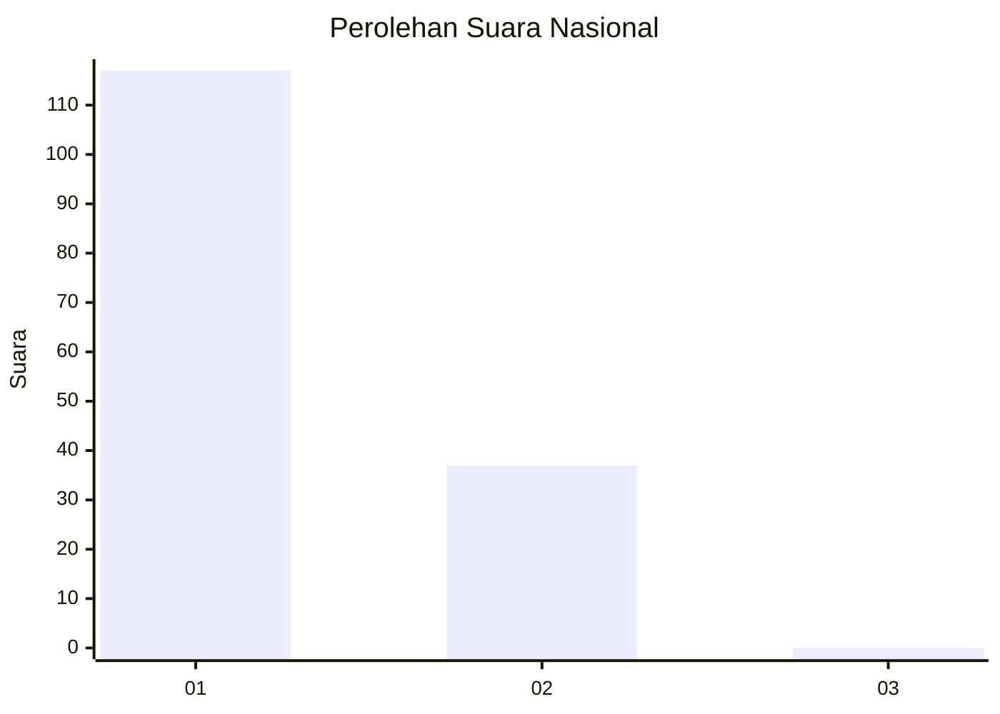
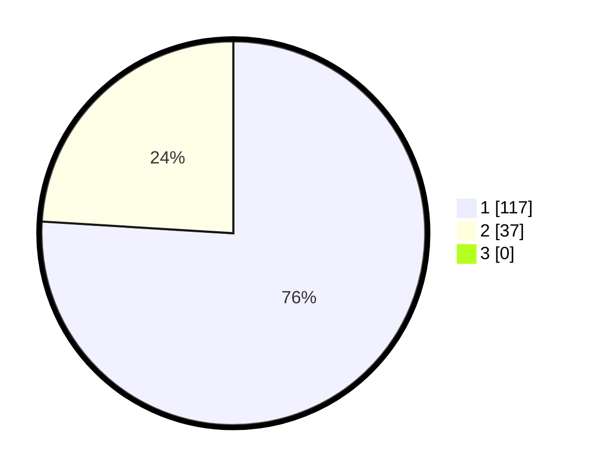

# Hasil

## Grafik

## Tabel

| No. | Nama Paslon    | Suara | Suara (raw) | Persentase |
|:--- |:-------------- | -----:| -----------:| ----------:|
| 1   | ANIES MUHAIMIN | 117   | [117][p-1]  | 75,97      |
| 2   | PRABOWO GIBRAN | 37    | [37][p-2]   | 24,03      |
| 3   | GANJAR MAHFUD  | 0     | [0][p-3]    | 0,00       |

[p-1]: https://github.com/gigit-pemilu/pemilu-2024/blob/main/pilpres/hitung-suara/sub/11-aceh/sub/18-pidie-jaya/sub/01-meureudu/sub/2002-kota-meureudu/sub/001-tps/sub/paslon-1.txt
[p-2]: https://github.com/gigit-pemilu/pemilu-2024/blob/main/pilpres/hitung-suara/sub/11-aceh/sub/18-pidie-jaya/sub/01-meureudu/sub/2002-kota-meureudu/sub/001-tps/sub/paslon-2.txt
[p-3]: https://github.com/gigit-pemilu/pemilu-2024/blob/main/pilpres/hitung-suara/sub/11-aceh/sub/18-pidie-jaya/sub/01-meureudu/sub/2002-kota-meureudu/sub/001-tps/sub/paslon-3.txt

## Foto C Plano

https://sirekap-obj-formc.kpu.go.id/2e2c/pemilu/ppwp/11/18/01/20/02/1118012002001-20240214-155638--47fd8638-0f10-4888-900c-035c54fcd116.jpg

https://sirekap-obj-formc.kpu.go.id/2e2c/pemilu/ppwp/11/18/01/20/02/1118012002001-20240214-160130--8baf732a-5d85-433b-86a1-441692472319.jpg

https://sirekap-obj-formc.kpu.go.id/2e2c/pemilu/ppwp/11/18/01/20/02/1118012002001-20240214-160142--05fc0b12-8d6b-47cd-8fd8-29c01a3d4d89.jpg

## Metadata

| Key        | Value               |
| ---------- | ------------------- |
| Time Stamp | 2024-02-14 21:46:01 |

## DATA PEMILIH TETAP

Jumlah pemilih dalam DPT: **182**.
 * L: **95**.
 * P: **87**.

## DATA PENGGUNA HAK PILIH

Jumlah pengguna hak pilih dalam DPT: **147**.
 * L: **78**.
 * P: **69**.

Jumlah pengguna hak pilih dalam DPTb: **3**.
 * L: **2**.
 * P: **1**.

Jumlah pengguna hak pilih dalam DPK: **6**.
 * L: **0**.
 * P: **6**.

Jumlah pengguna hak pilih: **155**.
 * L: **76**.
 * P: **156**.

## JUMLAH SUARA SAH DAN TIDAK SAH

JUMLAH SELURUH SUARA SAH: **154**.

JUMLAH SUARA TIDAK SAH: **2**.

JUMLAH SELURUH SUARA SAH DAN SUARA TIDAK SAH: **156**.

