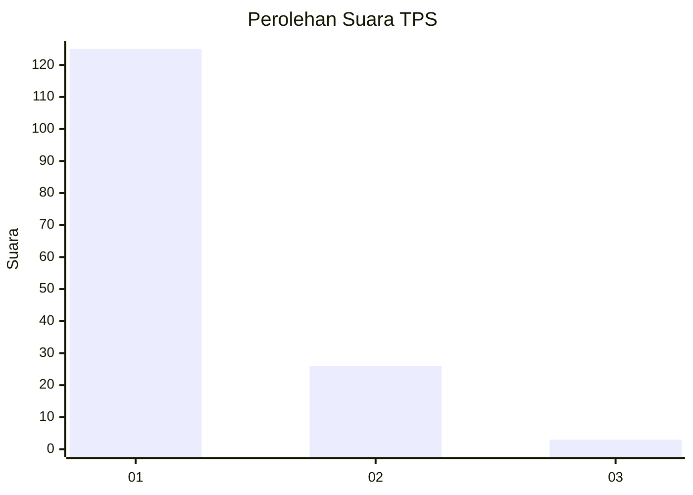
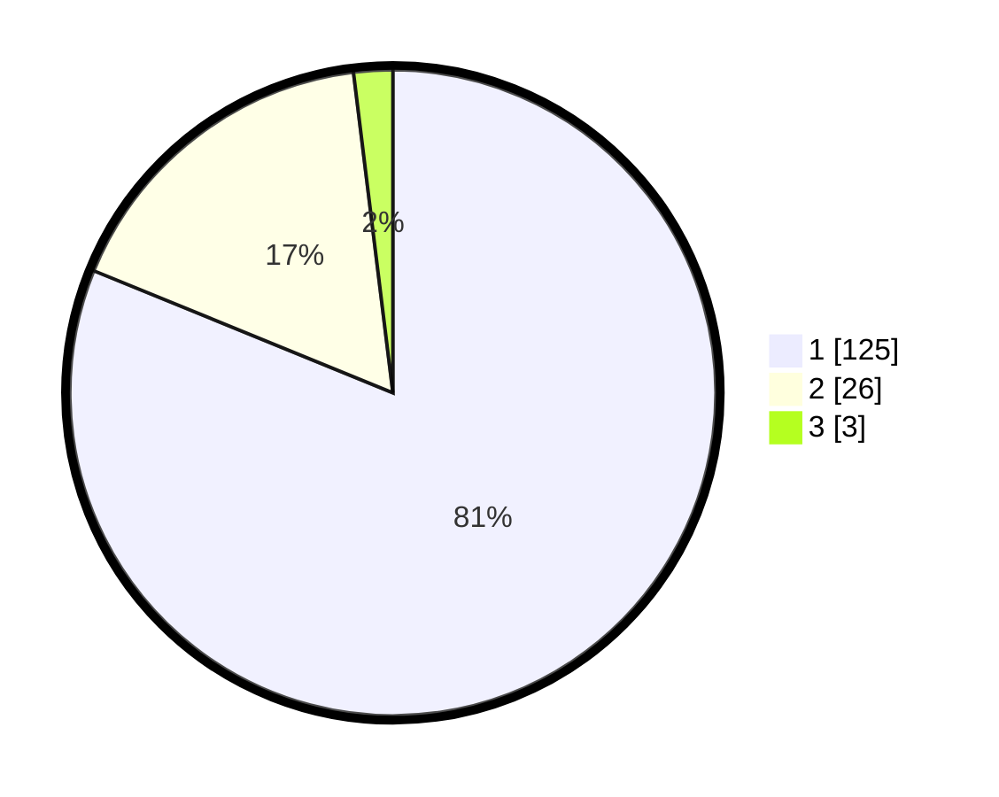

# Hasil

## Grafik

## Tabel

| No. | Nama Paslon    | Suara | Suara (raw) | Persentase |
|:--- |:-------------- | -----:| -----------:| ----------:|
| 1   | ANIES MUHAIMIN | 125   | [125][p-1]  | 81,17      |
| 2   | PRABOWO GIBRAN | 26    | [26][p-2]   | 16,88      |
| 3   | GANJAR MAHFUD  | 3     | [3][p-3]    | 1,95       |

[p-1]: https://github.com/gigit-pemilu/pemilu-2024-11-aceh/blob/main/pilpres/hitung-suara/sub/11-aceh/sub/18-pidie-jaya/sub/01-meureudu/sub/2002-kota-meureudu/sub/002-tps/sub/paslon-1.txt
[p-2]: https://github.com/gigit-pemilu/pemilu-2024-11-aceh/blob/main/pilpres/hitung-suara/sub/11-aceh/sub/18-pidie-jaya/sub/01-meureudu/sub/2002-kota-meureudu/sub/002-tps/sub/paslon-2.txt
[p-3]: https://github.com/gigit-pemilu/pemilu-2024-11-aceh/blob/main/pilpres/hitung-suara/sub/11-aceh/sub/18-pidie-jaya/sub/01-meureudu/sub/2002-kota-meureudu/sub/002-tps/sub/paslon-3.txt

## Foto C Plano

https://sirekap-obj-formc.kpu.go.id/f4b8/pemilu/ppwp/11/18/01/20/02/1118012002002-20240215-042106--b046ad98-d7c8-4bf1-9104-22240d3e5834.jpg

https://sirekap-obj-formc.kpu.go.id/f4b8/pemilu/ppwp/11/18/01/20/02/1118012002002-20240214-203802--7870fa65-44a3-437c-b5f5-07751de863d7.jpg

## Metadata

| Key        | Value               |
| ---------- | ------------------- |
| Time Stamp | 2024-02-15 21:01:18 |

