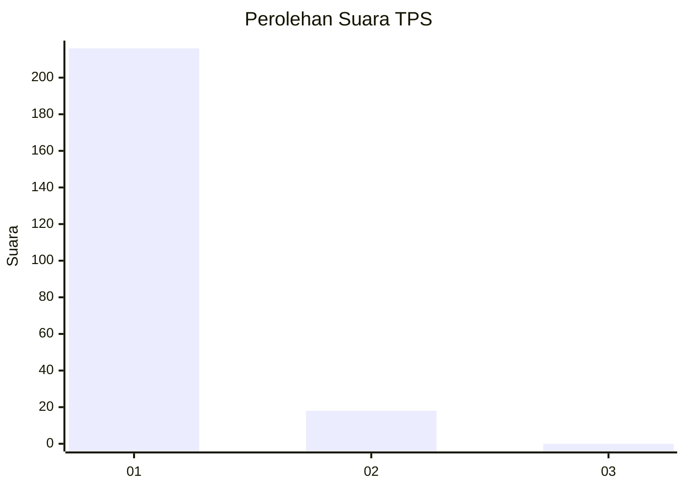
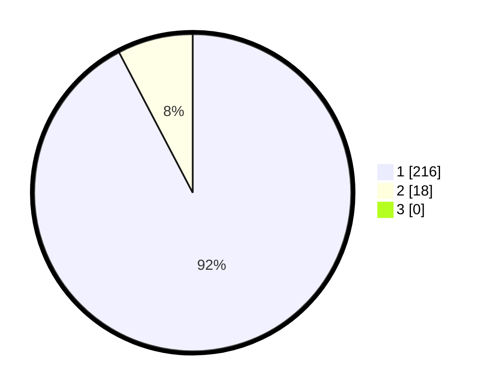

# Hasil

## Grafik

## Tabel

| No. | Nama Paslon    | Suara | Suara (raw) | Persentase |
|:--- |:-------------- | -----:| -----------:| ----------:|
| 1   | ANIES MUHAIMIN | 216   | [216][p-1]  | 92,31      |
| 2   | PRABOWO GIBRAN | 18    | [18][p-2]   | 7,69       |
| 3   | GANJAR MAHFUD  | 0     | [0][p-3]    | 0,00       |

[p-1]: https://github.com/gigit-pemilu/pemilu-2024-11-aceh/blob/main/pilpres/hitung-suara/sub/11-aceh/sub/18-pidie-jaya/sub/01-meureudu/sub/2003-mesjid-tuha/sub/001-tps/sub/paslon-1.txt
[p-2]: https://github.com/gigit-pemilu/pemilu-2024-11-aceh/blob/main/pilpres/hitung-suara/sub/11-aceh/sub/18-pidie-jaya/sub/01-meureudu/sub/2003-mesjid-tuha/sub/001-tps/sub/paslon-2.txt
[p-3]: https://github.com/gigit-pemilu/pemilu-2024-11-aceh/blob/main/pilpres/hitung-suara/sub/11-aceh/sub/18-pidie-jaya/sub/01-meureudu/sub/2003-mesjid-tuha/sub/001-tps/sub/paslon-3.txt

## Foto C Plano

https://sirekap-obj-formc.kpu.go.id/280e/pemilu/ppwp/11/18/01/20/03/1118012003001-20240215-062949--9129bd63-8da1-4afb-a45a-ccf6176ffc1a.jpg

https://sirekap-obj-formc.kpu.go.id/280e/pemilu/ppwp/11/18/01/20/03/1118012003001-20240217-161026--1aee96e0-0dd8-465a-a182-0ee35be92716.jpg

## Metadata

| Key        | Value               |
| ---------- | ------------------- |
| Time Stamp | 2024-02-21 15:00:00 |

