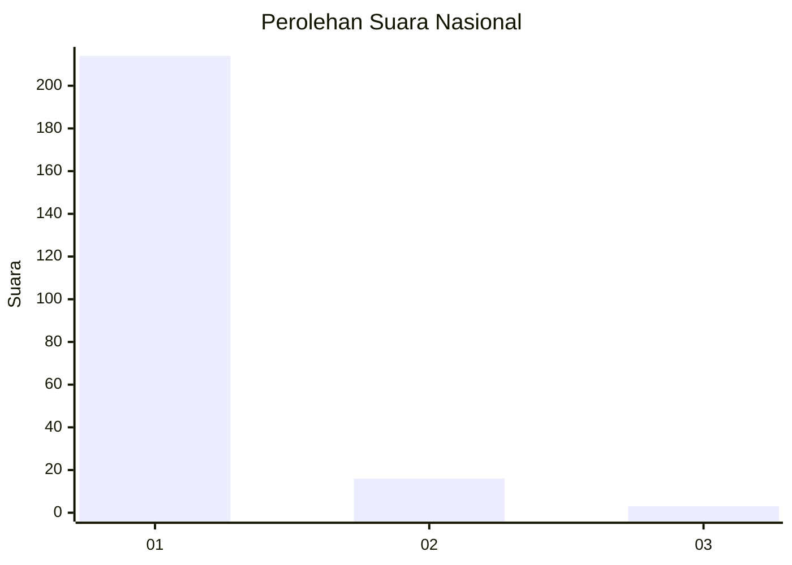
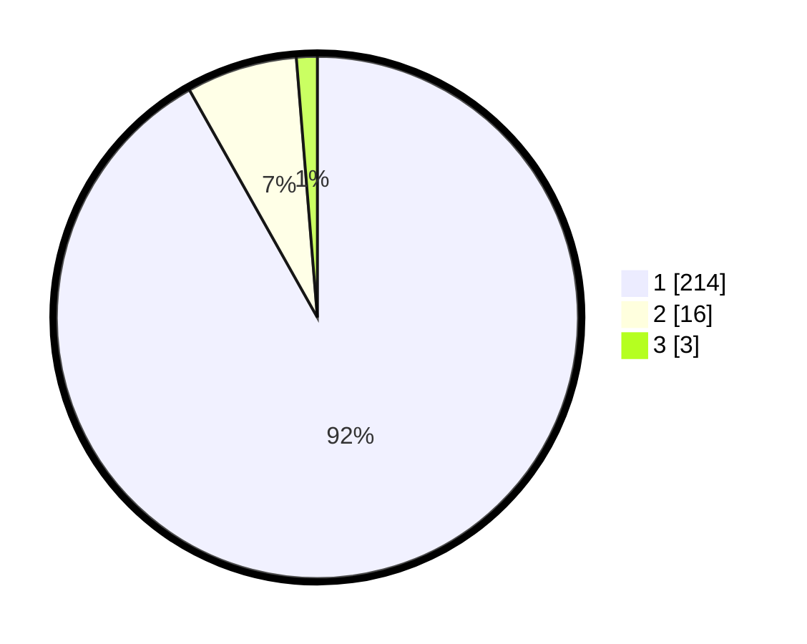

# Hasil

## Grafik

## Tabel

| No. | Nama Paslon    | Suara | Suara (raw) | Persentase |
|:--- |:-------------- | -----:| -----------:| ----------:|
| 1   | ANIES MUHAIMIN | 214   | [214][p-1]  | 91,85      |
| 2   | PRABOWO GIBRAN | 16    | [16][p-2]   | 6,87       |
| 3   | GANJAR MAHFUD  | 3     | [3][p-3]    | 1,29       |

[p-1]: https://github.com/gigit-pemilu/pemilu-2024/blob/main/pilpres/hitung-suara/sub/11-aceh/sub/18-pidie-jaya/sub/01-meureudu/sub/2003-mesjid-tuha/sub/002-tps/sub/paslon-1.txt
[p-2]: https://github.com/gigit-pemilu/pemilu-2024/blob/main/pilpres/hitung-suara/sub/11-aceh/sub/18-pidie-jaya/sub/01-meureudu/sub/2003-mesjid-tuha/sub/002-tps/sub/paslon-2.txt
[p-3]: https://github.com/gigit-pemilu/pemilu-2024/blob/main/pilpres/hitung-suara/sub/11-aceh/sub/18-pidie-jaya/sub/01-meureudu/sub/2003-mesjid-tuha/sub/002-tps/sub/paslon-3.txt

## Foto C Plano

https://sirekap-obj-formc.kpu.go.id/87e1/pemilu/ppwp/11/18/01/20/03/1118012003002-20240215-093450--93e0d548-885b-4b07-8c69-8db377bae50f.jpg

https://sirekap-obj-formc.kpu.go.id/87e1/pemilu/ppwp/11/18/01/20/03/1118012003002-20240215-093706--68067da6-fca1-491b-9e60-07ab95bdf5ee.jpg

https://sirekap-obj-formc.kpu.go.id/87e1/pemilu/ppwp/11/18/01/20/03/1118012003002-20240215-093819--77416b37-e852-47dd-9a82-363e40aea64c.jpg

## Metadata

| Key        | Value               |
| ---------- | ------------------- |
| Time Stamp | 2024-02-15 22:30:27 |

