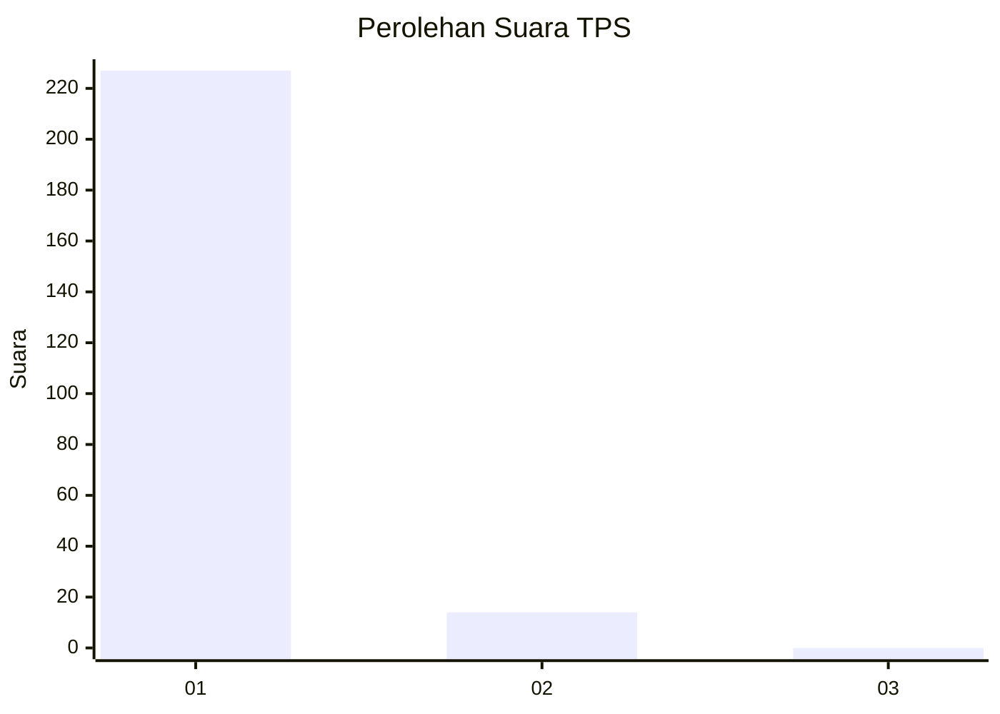
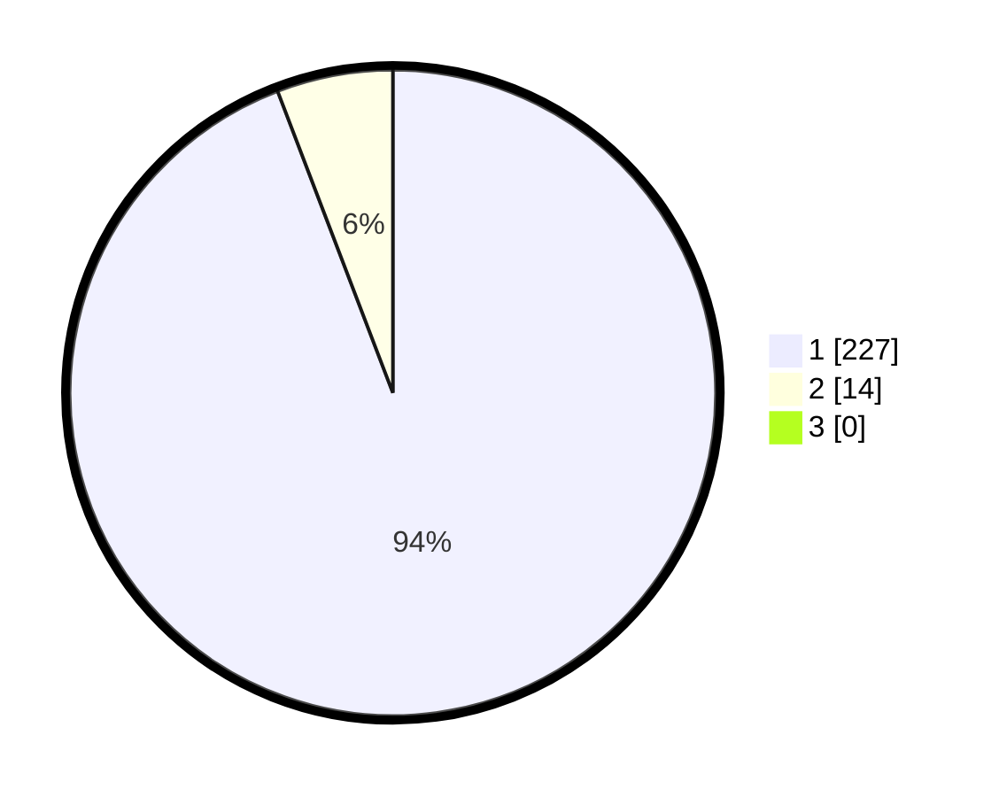

# Hasil

## Grafik

## Tabel

| No. | Nama Paslon    | Suara | Suara (raw) | Persentase |
|:--- |:-------------- | -----:| -----------:| ----------:|
| 1   | ANIES MUHAIMIN | 227   | [227][p-1]  | 94,19      |
| 2   | PRABOWO GIBRAN | 14    | [14][p-2]   | 5,81       |
| 3   | GANJAR MAHFUD  | 0     | [0][p-3]    | 0,00       |

[p-1]: https://github.com/gigit-pemilu/pemilu-2024-11-aceh/blob/main/pilpres/hitung-suara/sub/11-aceh/sub/18-pidie-jaya/sub/01-meureudu/sub/2003-mesjid-tuha/sub/004-tps/sub/paslon-1.txt
[p-2]: https://github.com/gigit-pemilu/pemilu-2024-11-aceh/blob/main/pilpres/hitung-suara/sub/11-aceh/sub/18-pidie-jaya/sub/01-meureudu/sub/2003-mesjid-tuha/sub/004-tps/sub/paslon-2.txt
[p-3]: https://github.com/gigit-pemilu/pemilu-2024-11-aceh/blob/main/pilpres/hitung-suara/sub/11-aceh/sub/18-pidie-jaya/sub/01-meureudu/sub/2003-mesjid-tuha/sub/004-tps/sub/paslon-3.txt

## Foto C Plano

https://sirekap-obj-formc.kpu.go.id/1a70/pemilu/ppwp/11/18/01/20/03/1118012003004-20240215-080853--77156193-a76e-4bb2-b9f7-dc8b75dd76dd.jpg

https://sirekap-obj-formc.kpu.go.id/1a70/pemilu/ppwp/11/18/01/20/03/1118012003004-20240215-082425--e0318a5e-d652-4863-baf2-6f37afe5bbab.jpg

https://sirekap-obj-formc.kpu.go.id/1a70/pemilu/ppwp/11/18/01/20/03/1118012003004-20240215-081824--92703dc6-d814-4561-8234-f11d8ab7a3c6.jpg

## Metadata

| Key        | Value               |
| ---------- | ------------------- |
| Time Stamp | 2024-02-15 22:30:27 |

