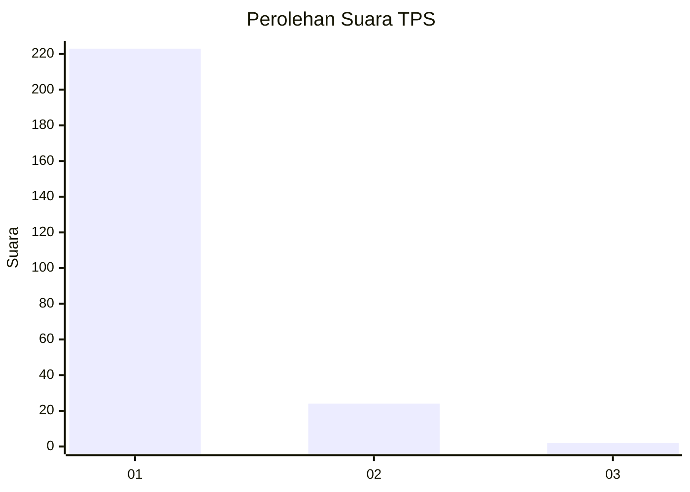
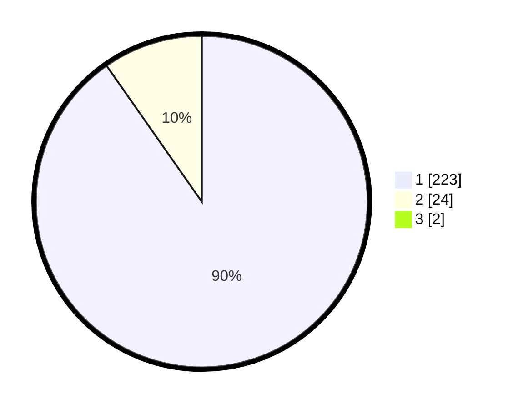

# Hasil

## Grafik

## Tabel

| No. | Nama Paslon    | Suara | Suara (raw) | Persentase |
|:--- |:-------------- | -----:| -----------:| ----------:|
| 1   | ANIES MUHAIMIN | 223   | [223][p-1]  | 89,56      |
| 2   | PRABOWO GIBRAN | 24    | [24][p-2]   | 9,64       |
| 3   | GANJAR MAHFUD  | 2     | [2][p-3]    | 0,80       |

[p-1]: https://github.com/gigit-pemilu/pemilu-2024-11-aceh/blob/main/pilpres/hitung-suara/sub/11-aceh/sub/18-pidie-jaya/sub/01-meureudu/sub/2004-rungkom/sub/001-tps/sub/paslon-1.txt
[p-2]: https://github.com/gigit-pemilu/pemilu-2024-11-aceh/blob/main/pilpres/hitung-suara/sub/11-aceh/sub/18-pidie-jaya/sub/01-meureudu/sub/2004-rungkom/sub/001-tps/sub/paslon-2.txt
[p-3]: https://github.com/gigit-pemilu/pemilu-2024-11-aceh/blob/main/pilpres/hitung-suara/sub/11-aceh/sub/18-pidie-jaya/sub/01-meureudu/sub/2004-rungkom/sub/001-tps/sub/paslon-3.txt

## Foto C Plano

https://sirekap-obj-formc.kpu.go.id/8695/pemilu/ppwp/11/18/01/20/04/1118012004001-20240215-093332--34c41e94-c0ee-4e34-b338-f1afae80e989.jpg

https://sirekap-obj-formc.kpu.go.id/8695/pemilu/ppwp/11/18/01/20/04/1118012004001-20240215-115201--e6ad7d0f-3f91-4ac3-9366-543328b73442.jpg

https://sirekap-obj-formc.kpu.go.id/8695/pemilu/ppwp/11/18/01/20/04/1118012004001-20240215-111832--f37eb019-a858-4e04-895d-da998d52d631.jpg

## Metadata

| Key        | Value               |
| ---------- | ------------------- |
| Time Stamp | 2024-02-19 06:16:00 |

