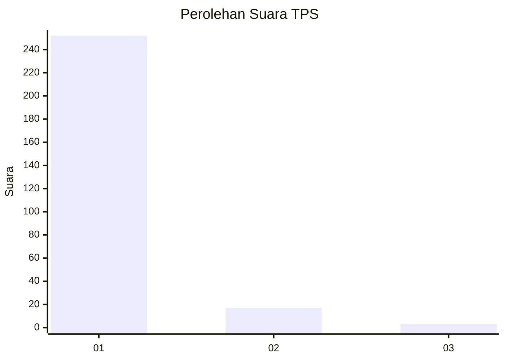
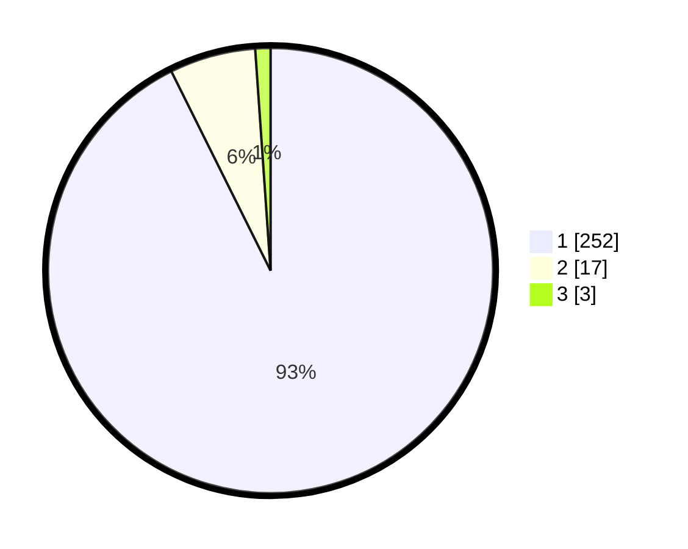

# Hasil

## Grafik

## Tabel

| No. | Nama Paslon    | Suara | Suara (raw) | Persentase |
|:--- |:-------------- | -----:| -----------:| ----------:|
| 1   | ANIES MUHAIMIN | 252   | [252][p-1]  | 92,65      |
| 2   | PRABOWO GIBRAN | 17    | [17][p-2]   | 6,25       |
| 3   | GANJAR MAHFUD  | 3     | [3][p-3]    | 1,10       |

[p-1]: https://github.com/gigit-pemilu/pemilu-2024-11-aceh/blob/main/pilpres/hitung-suara/sub/11-aceh/sub/18-pidie-jaya/sub/01-meureudu/sub/2005-blang-awe/sub/003-tps/sub/paslon-1.txt
[p-2]: https://github.com/gigit-pemilu/pemilu-2024-11-aceh/blob/main/pilpres/hitung-suara/sub/11-aceh/sub/18-pidie-jaya/sub/01-meureudu/sub/2005-blang-awe/sub/003-tps/sub/paslon-2.txt
[p-3]: https://github.com/gigit-pemilu/pemilu-2024-11-aceh/blob/main/pilpres/hitung-suara/sub/11-aceh/sub/18-pidie-jaya/sub/01-meureudu/sub/2005-blang-awe/sub/003-tps/sub/paslon-3.txt

## Foto C Plano

https://sirekap-obj-formc.kpu.go.id/40e7/pemilu/ppwp/11/18/01/20/05/1118012005003-20240215-123819--3179502c-1522-45f9-a0e2-ca81b83aa817.jpg

https://sirekap-obj-formc.kpu.go.id/40e7/pemilu/ppwp/11/18/01/20/05/1118012005003-20240215-124245--9176607a-0dc2-4d9a-9694-4953d58c819a.jpg

https://sirekap-obj-formc.kpu.go.id/40e7/pemilu/ppwp/11/18/01/20/05/1118012005003-20240215-124403--ecdfbd3f-7ce3-4639-bf19-0e92e0a24fac.jpg

## Metadata

| Key        | Value               |
| ---------- | ------------------- |
| Time Stamp | 2024-02-15 22:30:27 |

