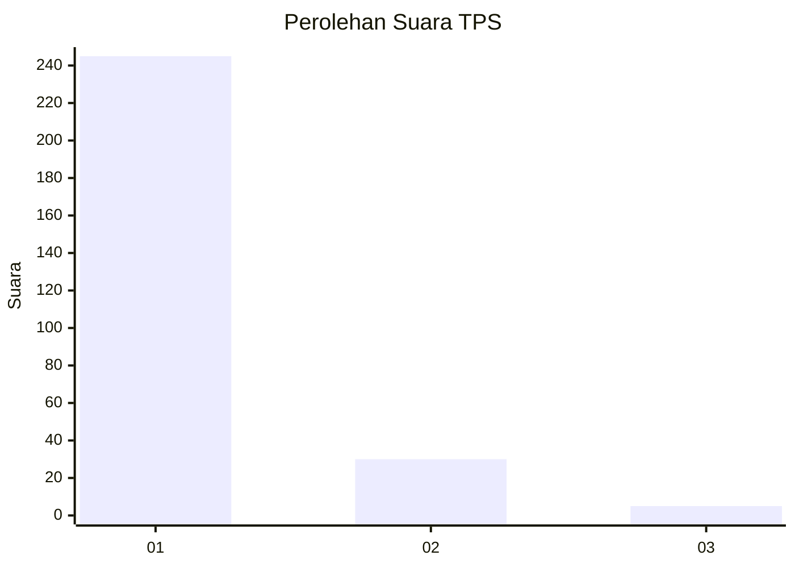
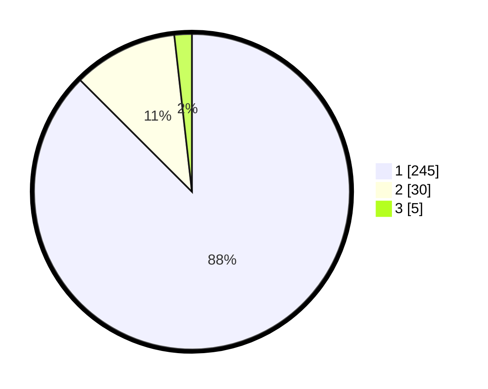

# Hasil

## Grafik

## Tabel

| No. | Nama Paslon    | Suara | Suara (raw) | Persentase |
|:--- |:-------------- | -----:| -----------:| ----------:|
| 1   | ANIES MUHAIMIN | 245   | [245][p-1]  | 87,50      |
| 2   | PRABOWO GIBRAN | 30    | [30][p-2]   | 10,71      |
| 3   | GANJAR MAHFUD  | 5     | [5][p-3]    | 1,79       |

[p-1]: https://github.com/gigit-pemilu/pemilu-2024-11-aceh/blob/main/pilpres/hitung-suara/sub/11-aceh/sub/18-pidie-jaya/sub/01-meureudu/sub/2007-manyang-cut/sub/001-tps/sub/paslon-1.txt
[p-2]: https://github.com/gigit-pemilu/pemilu-2024-11-aceh/blob/main/pilpres/hitung-suara/sub/11-aceh/sub/18-pidie-jaya/sub/01-meureudu/sub/2007-manyang-cut/sub/001-tps/sub/paslon-2.txt
[p-3]: https://github.com/gigit-pemilu/pemilu-2024-11-aceh/blob/main/pilpres/hitung-suara/sub/11-aceh/sub/18-pidie-jaya/sub/01-meureudu/sub/2007-manyang-cut/sub/001-tps/sub/paslon-3.txt

## Foto C Plano

https://sirekap-obj-formc.kpu.go.id/c6a1/pemilu/ppwp/11/18/01/20/07/1118012007001-20240214-210203--2939cf31-13fa-4fdf-9022-97d8d6480584.jpg

https://sirekap-obj-formc.kpu.go.id/c6a1/pemilu/ppwp/11/18/01/20/07/1118012007001-20240214-210325--26b3a9df-de43-4172-82bb-a0005f9f341b.jpg

https://sirekap-obj-formc.kpu.go.id/c6a1/pemilu/ppwp/11/18/01/20/07/1118012007001-20240214-210417--f7fbe26d-3c92-41c7-a30b-6095a0ee4c76.jpg

## Metadata

| Key        | Value               |
| ---------- | ------------------- |
| Time Stamp | 2024-02-15 22:30:27 |

