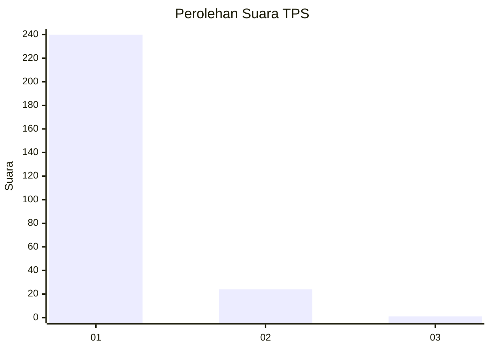
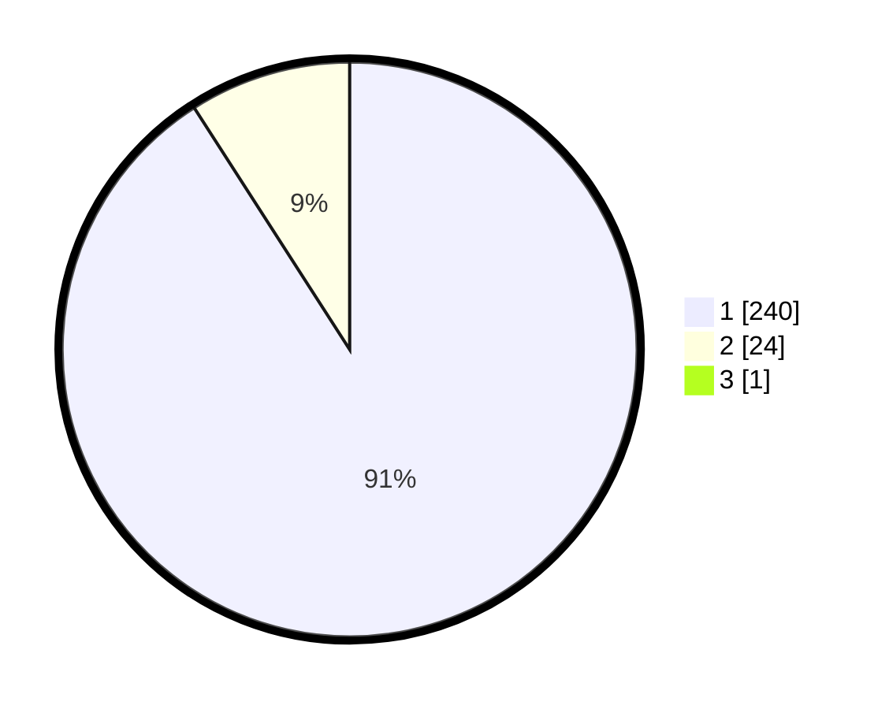

# Hasil

## Grafik

## Tabel

| No. | Nama Paslon    | Suara | Suara (raw) | Persentase |
|:--- |:-------------- | -----:| -----------:| ----------:|
| 1   | ANIES MUHAIMIN | 240   | [240][p-1]  | 90,57      |
| 2   | PRABOWO GIBRAN | 24    | [24][p-2]   | 9,06       |
| 3   | GANJAR MAHFUD  | 1     | [1][p-3]    | 0,38       |

[p-1]: https://github.com/gigit-pemilu/pemilu-2024-11-aceh/blob/main/pilpres/hitung-suara/sub/11-aceh/sub/18-pidie-jaya/sub/01-meureudu/sub/2007-manyang-cut/sub/002-tps/sub/paslon-1.txt
[p-2]: https://github.com/gigit-pemilu/pemilu-2024-11-aceh/blob/main/pilpres/hitung-suara/sub/11-aceh/sub/18-pidie-jaya/sub/01-meureudu/sub/2007-manyang-cut/sub/002-tps/sub/paslon-2.txt
[p-3]: https://github.com/gigit-pemilu/pemilu-2024-11-aceh/blob/main/pilpres/hitung-suara/sub/11-aceh/sub/18-pidie-jaya/sub/01-meureudu/sub/2007-manyang-cut/sub/002-tps/sub/paslon-3.txt

## Foto C Plano

https://sirekap-obj-formc.kpu.go.id/dd0c/pemilu/ppwp/11/18/01/20/07/1118012007002-20240214-211547--4a1aafe1-35e4-4e54-99f2-1907dd4d7a41.jpg

https://sirekap-obj-formc.kpu.go.id/dd0c/pemilu/ppwp/11/18/01/20/07/1118012007002-20240215-080758--13350817-6d2f-46cc-90d4-bf2e517238b4.jpg

https://sirekap-obj-formc.kpu.go.id/dd0c/pemilu/ppwp/11/18/01/20/07/1118012007002-20240215-080942--fae4b489-38be-486f-b497-46f058bba194.jpg

## Metadata

| Key        | Value               |
| ---------- | ------------------- |
| Time Stamp | 2024-02-15 22:30:27 |

