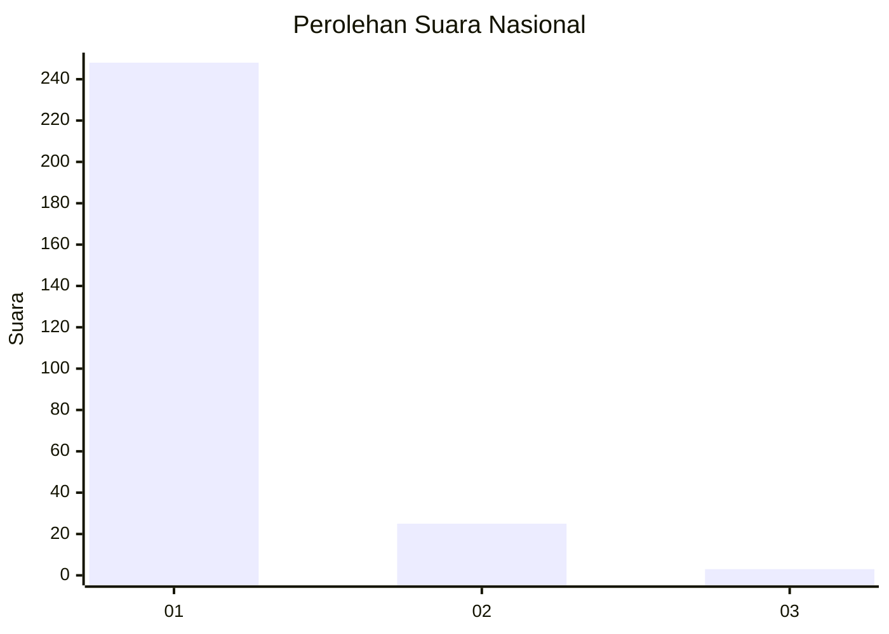
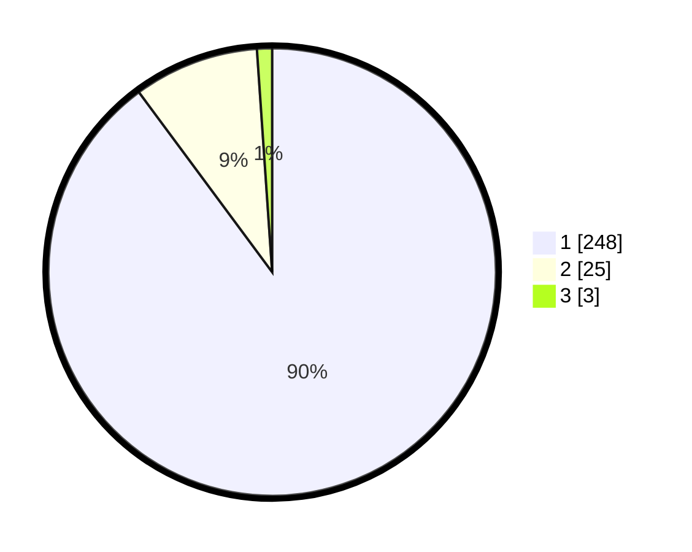

# Hasil

## Grafik

## Tabel

| No. | Nama Paslon    | Suara | Suara (raw) | Persentase |
|:--- |:-------------- | -----:| -----------:| ----------:|
| 1   | ANIES MUHAIMIN | 248   | [248][p-1]  | 89,86      |
| 2   | PRABOWO GIBRAN | 25    | [25][p-2]   | 9,06       |
| 3   | GANJAR MAHFUD  | 3     | [3][p-3]    | 1,09       |

[p-1]: https://github.com/gigit-pemilu/pemilu-2024/blob/main/pilpres/hitung-suara/sub/11-aceh/sub/18-pidie-jaya/sub/01-meureudu/sub/2007-manyang-cut/sub/004-tps/sub/paslon-1.txt
[p-2]: https://github.com/gigit-pemilu/pemilu-2024/blob/main/pilpres/hitung-suara/sub/11-aceh/sub/18-pidie-jaya/sub/01-meureudu/sub/2007-manyang-cut/sub/004-tps/sub/paslon-2.txt
[p-3]: https://github.com/gigit-pemilu/pemilu-2024/blob/main/pilpres/hitung-suara/sub/11-aceh/sub/18-pidie-jaya/sub/01-meureudu/sub/2007-manyang-cut/sub/004-tps/sub/paslon-3.txt

## Foto C Plano

https://sirekap-obj-formc.kpu.go.id/57e0/pemilu/ppwp/11/18/01/20/07/1118012007004-20240214-200505--44449742-859d-49aa-9ef2-314cf550b019.jpg

https://sirekap-obj-formc.kpu.go.id/57e0/pemilu/ppwp/11/18/01/20/07/1118012007004-20240214-201711--ec1c37e4-5aea-44fc-ad3f-66ea01b2cebe.jpg

https://sirekap-obj-formc.kpu.go.id/57e0/pemilu/ppwp/11/18/01/20/07/1118012007004-20240214-202349--28eb8f71-d785-45a1-a6fd-97e89e272f54.jpg

## Metadata

| Key        | Value               |
| ---------- | ------------------- |
| Time Stamp | 2024-02-15 22:30:27 |

