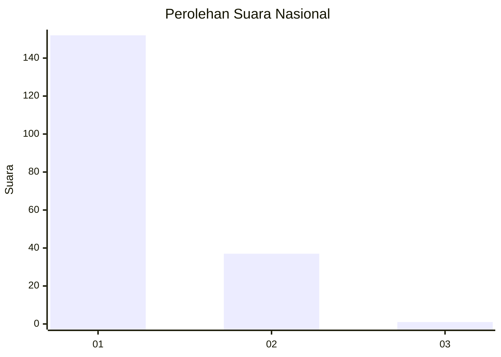
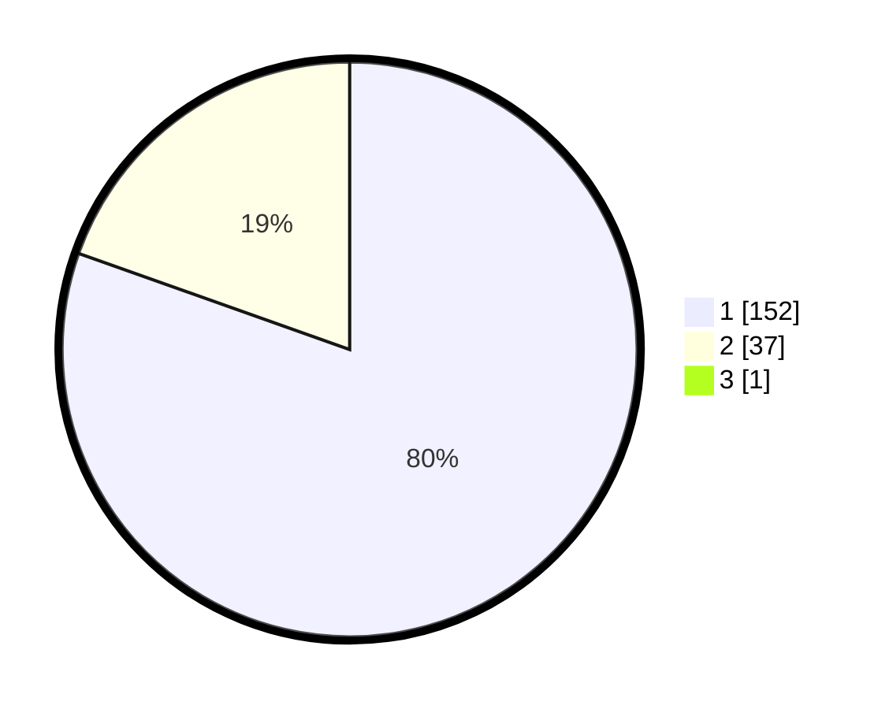

# Hasil

## Grafik

## Tabel

| No. | Nama Paslon    | Suara | Suara (raw) | Persentase |
|:--- |:-------------- | -----:| -----------:| ----------:|
| 1   | ANIES MUHAIMIN | 152   | [152][p-1]  | 80,00      |
| 2   | PRABOWO GIBRAN | 37    | [37][p-2]   | 19,47      |
| 3   | GANJAR MAHFUD  | 1     | [1][p-3]    | 0,53       |

[p-1]: https://github.com/gigit-pemilu/pemilu-2024/blob/main/pilpres/hitung-suara/sub/11-aceh/sub/18-pidie-jaya/sub/01-meureudu/sub/2009-rhieng-blang/sub/001-tps/sub/paslon-1.txt
[p-2]: https://github.com/gigit-pemilu/pemilu-2024/blob/main/pilpres/hitung-suara/sub/11-aceh/sub/18-pidie-jaya/sub/01-meureudu/sub/2009-rhieng-blang/sub/001-tps/sub/paslon-2.txt
[p-3]: https://github.com/gigit-pemilu/pemilu-2024/blob/main/pilpres/hitung-suara/sub/11-aceh/sub/18-pidie-jaya/sub/01-meureudu/sub/2009-rhieng-blang/sub/001-tps/sub/paslon-3.txt

## Foto C Plano

https://sirekap-obj-formc.kpu.go.id/8ca1/pemilu/ppwp/11/18/01/20/09/1118012009001-20240215-074810--b354f67d-9db2-4761-b645-d9bde6961060.jpg

https://sirekap-obj-formc.kpu.go.id/8ca1/pemilu/ppwp/11/18/01/20/09/1118012009001-20240215-074846--d69f732f-8cc4-4844-9d3c-88930d7a6005.jpg

https://sirekap-obj-formc.kpu.go.id/8ca1/pemilu/ppwp/11/18/01/20/09/1118012009001-20240215-074926--686f970e-3909-4d45-b299-8f17071be071.jpg

## Metadata

| Key        | Value               |
| ---------- | ------------------- |
| Time Stamp | 2024-02-15 22:40:13 |

