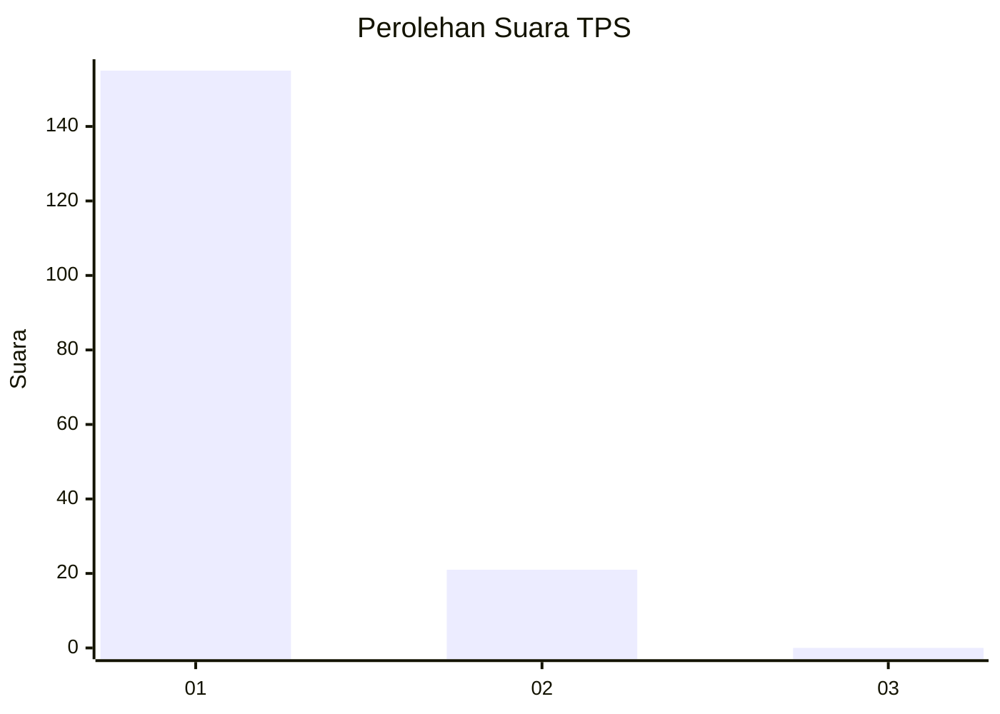
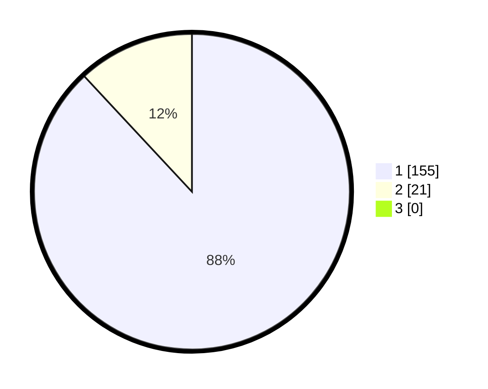

# Hasil

## Grafik

## Tabel

| No. | Nama Paslon    | Suara | Suara (raw) | Persentase |
|:--- |:-------------- | -----:| -----------:| ----------:|
| 1   | ANIES MUHAIMIN | 155   | [155][p-1]  | 88,07      |
| 2   | PRABOWO GIBRAN | 21    | [21][p-2]   | 11,93      |
| 3   | GANJAR MAHFUD  | 0     | [0][p-3]    | 0,00       |

[p-1]: https://github.com/gigit-pemilu/pemilu-2024-11-aceh/blob/main/pilpres/hitung-suara/sub/11-aceh/sub/18-pidie-jaya/sub/01-meureudu/sub/2009-rhieng-blang/sub/003-tps/sub/paslon-1.txt
[p-2]: https://github.com/gigit-pemilu/pemilu-2024-11-aceh/blob/main/pilpres/hitung-suara/sub/11-aceh/sub/18-pidie-jaya/sub/01-meureudu/sub/2009-rhieng-blang/sub/003-tps/sub/paslon-2.txt
[p-3]: https://github.com/gigit-pemilu/pemilu-2024-11-aceh/blob/main/pilpres/hitung-suara/sub/11-aceh/sub/18-pidie-jaya/sub/01-meureudu/sub/2009-rhieng-blang/sub/003-tps/sub/paslon-3.txt

## Foto C Plano

https://sirekap-obj-formc.kpu.go.id/57de/pemilu/ppwp/11/18/01/20/09/1118012009003-20240215-062954--93aba15b-5d69-4771-b8a2-dbe5a2648324.jpg

https://sirekap-obj-formc.kpu.go.id/57de/pemilu/ppwp/11/18/01/20/09/1118012009003-20240215-030247--9d78bd1a-8301-4135-ac45-dfc686217810.jpg

https://sirekap-obj-formc.kpu.go.id/57de/pemilu/ppwp/11/18/01/20/09/1118012009003-20240215-030416--7c8539b8-19a0-4d38-a750-8ece5a813a5b.jpg

## Metadata

| Key        | Value               |
| ---------- | ------------------- |
| Time Stamp | 2024-02-15 23:29:50 |

