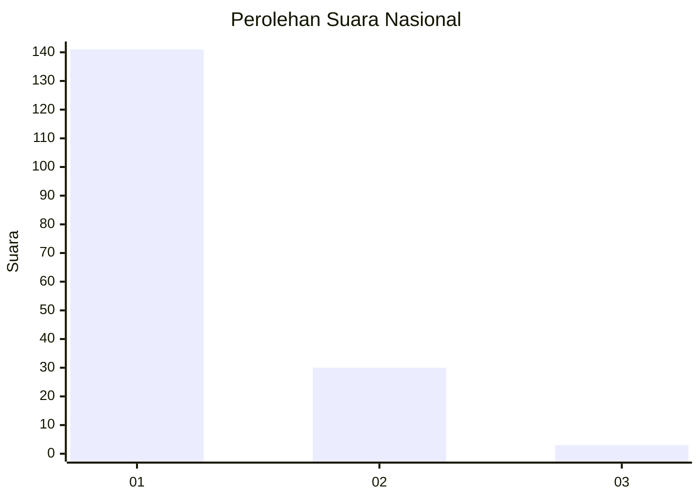
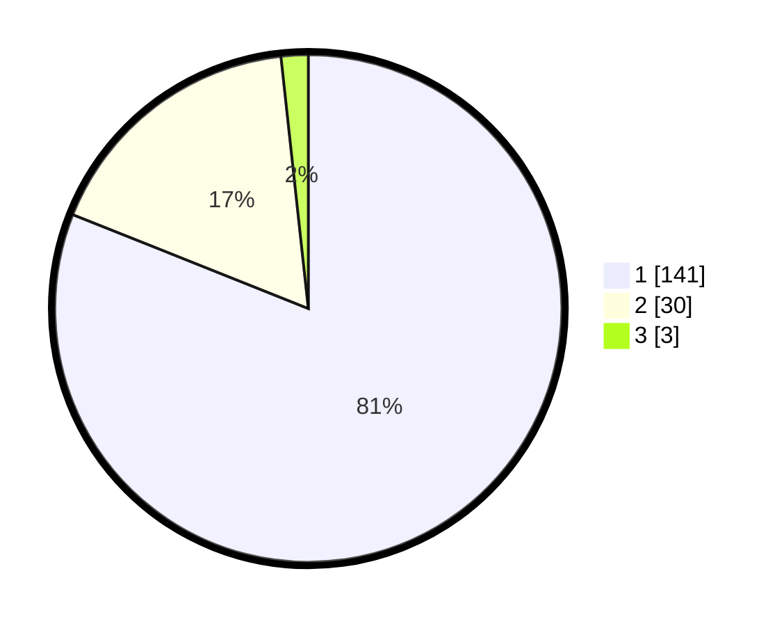

# Hasil

## Grafik

## Tabel

| No. | Nama Paslon    | Suara | Suara (raw) | Persentase |
|:--- |:-------------- | -----:| -----------:| ----------:|
| 1   | ANIES MUHAIMIN | 141   | [141][p-1]  | 81,03      |
| 2   | PRABOWO GIBRAN | 30    | [30][p-2]   | 17,24      |
| 3   | GANJAR MAHFUD  | 3     | [3][p-3]    | 1,72       |

[p-1]: https://github.com/gigit-pemilu/pemilu-2024/blob/main/pilpres/hitung-suara/sub/11-aceh/sub/18-pidie-jaya/sub/01-meureudu/sub/2015-geuleudah/sub/001-tps/sub/paslon-1.txt
[p-2]: https://github.com/gigit-pemilu/pemilu-2024/blob/main/pilpres/hitung-suara/sub/11-aceh/sub/18-pidie-jaya/sub/01-meureudu/sub/2015-geuleudah/sub/001-tps/sub/paslon-2.txt
[p-3]: https://github.com/gigit-pemilu/pemilu-2024/blob/main/pilpres/hitung-suara/sub/11-aceh/sub/18-pidie-jaya/sub/01-meureudu/sub/2015-geuleudah/sub/001-tps/sub/paslon-3.txt

## Foto C Plano

https://sirekap-obj-formc.kpu.go.id/7446/pemilu/ppwp/11/18/01/20/15/1118012015001-20240215-003943--0841ad23-cd74-4b02-b30f-07807978dd26.jpg

https://sirekap-obj-formc.kpu.go.id/7446/pemilu/ppwp/11/18/01/20/15/1118012015001-20240215-004120--4fa53434-6246-455f-b14c-8304a2b7a252.jpg

https://sirekap-obj-formc.kpu.go.id/7446/pemilu/ppwp/11/18/01/20/15/1118012015001-20240215-004238--e921f5b2-83e5-4533-9365-8ef41e1e4df0.jpg

## Metadata

| Key        | Value               |
| ---------- | ------------------- |
| Time Stamp | 2024-02-19 06:16:00 |

